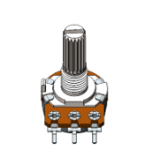
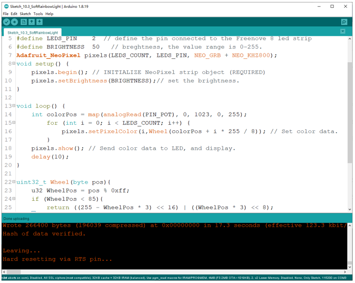

Project 10.3 Soft Rainbow Light
************************************

In this project, we use potentiometer to control Freenove 8 RGB LED Module.

Component List
=============================

.. table::
    :width: 80%
    :align: center
    :class: table-line
    
    +------------------------------+----------------------------------------------+
    | ESP8266 x1                   | USB cable                                    |
    |                              |                                              |
    | |Chapter01_00|               | |Chapter01_01|                               |
    +------------------------------+----------------------------------------------+
    | Breadboard x1                                                               |
    |                                                                             |
    | |Chapter01_02|                                                              |
    +------------------------------+-------------------------+--------------------+
    | Freenove 8 RGB LED Module x1 | Rotary potentiometer x1 | Jumper wire F/M x3 |
    |                              |                         |                    |
    |                              |                         | Jumper wire M/M x7 |
    |                              |                         |                    |
    | |Chapter10_05|               | |Chapter10_06|          | |Chapter10_07|     |
    +------------------------------+-------------------------+--------------------+

.. |Chapter01_00| image:: ../_static/imgs/1_LED/Chapter01_00.png
.. |Chapter01_01| image:: ../_static/imgs/1_LED/Chapter01_01.png
.. |Chapter01_02| image:: ../_static/imgs/1_LED/Chapter01_02.png
.. |Chapter10_05| image:: ../_static/imgs/10_Potentiometer_&_LED/Chapter10_05.png

.. |Chapter10_07| image:: ../_static/imgs/10_Potentiometer_&_LED/Chapter10_07.png

Circuit
=============================

Use pin A0 on the control board to detect the voltage of rotary potentiometer.

.. list-table:: 
   :width: 80%
   :align: center
   :class: table-line

   * -  Schematic diagram
   * -  |Chapter10_08|
   * -  Hardware connection. 
    
        If you need any support, please feel free to contact us via: support@freenove.com
   
   * -  |Chapter10_09|

.. |Chapter10_08| image:: ../_static/imgs/10_Potentiometer_&_LED/Chapter10_08.png
.. |Chapter10_09| image:: ../_static/imgs/10_Potentiometer_&_LED/Chapter10_09.png

Sketch
======================

Sketch_10.3_Soft_Rainbow_Light
-----------------------------------

The following is the program code:

.. literalinclude:: ../../../freenove_Kit/C/Sketches/Sketch_10.3_SoftRainbowLight/Sketch_10.3_SoftRainbowLight.ino
    :linenos: 
    :language: c
    :lines: 1-33
    :dedent:

The overall logical structure of the code is the same as the previous project :ref:`Rainbow Light <c_rainbow>`, except that the starting point of the color in this code is controlled by potentiometer.