##############################################################################
Chapter Potentiometer & LED
##############################################################################

In the previous section, we have finished reading ADC value and converting it into voltage. Now, we will try

to use potentiometer to control the brightness of LED.

Project Soft Light
**********************************

In this project, we will make a soft light. We will use an ADC Module to read ADC values of a potentiometer and map it to duty cycle of the PWM used to control the brightness of a LED. Then you can change the brightness of a LED by adjusting the potentiometer.

Component List
=============================

+----------------------------------+---------------------------------------+
| ESP8266 x1                       |          USB cable                    |
|                                  |                                       |
| |Chapter01_00|                   |          |Chapter01_01|               |
+----------------------------------+---------------------------------------+
| Breadboard x1                                                            |
|                                                                          |
| |Chapter01_02|                                                           |
+----------------------------------+---------------------------------------+
| Rotary potentiometer x1          | Jumper wire M/M x8                    |
|                                  |                                       |
| |Chapter09_00|                   |          |Chapter01_05|               |
+----------------------------------+---------------------------------------+
| LED x1                           | Resistor 220Ω x1                      |
|                                  |                                       |
| |Chapter01_03|                   |          |Chapter01_04|               |
+----------------------------------+---------------------------------------+

.. |Chapter01_00| image:: ../_static/imgs/1_LED/Chapter01_00.png
.. |Chapter01_01| image:: ../_static/imgs/1_LED/Chapter01_01.png
.. |Chapter01_02| image:: ../_static/imgs/1_LED/Chapter01_02.png
.. |Chapter01_03| image:: ../_static/imgs/1_LED/Chapter01_03.png
.. |Chapter01_04| image:: ../_static/imgs/1_LED/Chapter01_04.png
.. |Chapter01_05| image:: ../_static/imgs/1_LED/Chapter01_05.png
.. |Chapter09_00| image:: ../_static/imgs/9_ADC_Converter/Chapter09_00.png

Circuit
=======================

Use pin A0 on control board to detect the voltage of rotary potentiometer, and use pin 4 to control one LED.

.. list-table:: 
   :width: 100%
   :align: center

   * -  Schematic diagram
   * -  |Chapter10_00|
   * -  Hardware connection. 
    
        If you need any support, please feel free to contact us via: support@freenove.com
   
   * -  |Chapter10_01|

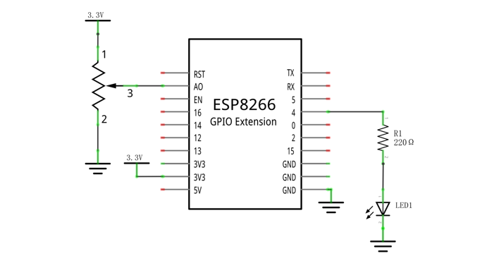
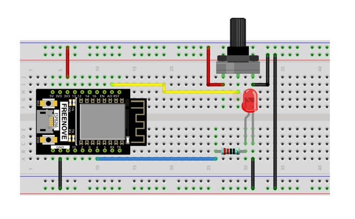

Sketch
=======================

Sketch__Softlight
--------------------------------

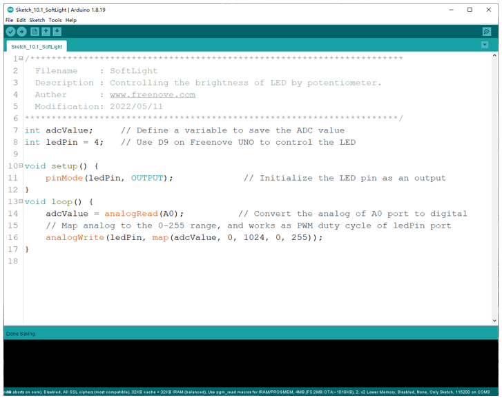

Download the code to ESP8266, by turning the adjustable resistor to change the input voltage of GPIO4, ESP8266 changes the output voltage of GPIO4 according to this voltage value, thus changing the brightness of the LED.

The following is the code:

.. literalinclude:: ../../../freenove_Kit/C/Sketches/Sketch_10.1_SoftLight/Sketch_10.1_SoftLight.ino
    :linenos: 
    :language: c
    :lines: 1-16
    :dedent:

In the code, we get the ADC value of pin A0 and map it to PWM duty cycle of LED pin port. According to

different LED brightness, we can see the changes of voltage easily.

Project Color Light 
***********************************

In this project, a potentiometer is used to control the RGB LED. The RGB LED is bright red when the potentiometer is near the midpoint, green when the potentiometer rotates to the "left" and blue when the potentiometer rotates to the "right".

Component List
================================

+----------------------------------+---------------------------------------+
| ESP8266 x1                       |          USB cable                    |
|                                  |                                       |
| |Chapter01_00|                   |          |Chapter01_01|               |
+----------------------------------+---------------------------------------+
| Breadboard x1                                                            |
|                                                                          |
| |Chapter01_02|                                                           |
+----------------------------------+---------------------------------------+
| Rotary potentiometer x1          | Jumper wire M/M x9                    |
|                                  |                                       |
| |Chapter09_00|                   |          |Chapter01_05|               |
+----------------------------------+---------------------------------------+
| RGBLED x1                        | Resistor 220Ω x3                      |
|                                  |                                       |
| |Chapter05_00|                   |          |Chapter01_04|               |
+----------------------------------+---------------------------------------+

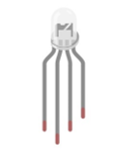

Circuit
=============================

.. list-table:: 
   :width: 100%
   :align: center

   * -  Schematic diagram
   * -  |Chapter10_03|
   * -  Hardware connection. 
    
        If you need any support, please feel free to contact us via: support@freenove.com
   
   * -  |Chapter10_04|

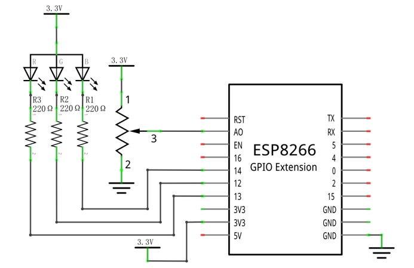
.. |Chapter10_04| image:: ../_static/imgs/10_Potentiometer_&_LED/Chapter10_04.png

Sketch
============================

Download the code to ESP8266, rotate the potentiometers, then the color of RGB LED will change. 

:red:`If you have any concerns, please contact us via:` support@freenove.com

The following is the program code:

.. literalinclude:: ../../../freenove_Kit/C/Sketches/Sketch_10.2_SoftColorfulLight/Sketch_10.2_SoftColorfulLight.ino
    :linenos: 
    :language: c
    :lines: 1-31
    :dedent:

In the code, you can read the potentiometer ADC value, judge the range of ADC value, to control the RGB LED color.

Project Soft Rainbow Light
************************************

In this project, we use potentiometer to control Freenove 8 RGB LED Module.

Component List
=============================

+------------------------------+----------------------------------------------+
| ESP8266 x1                   | USB cable                                    |
|                              |                                              |
| |Chapter01_00|               | |Chapter01_01|                               |
+------------------------------+----------------------------------------------+
| Breadboard x1                                                               |
|                                                                             |
| |Chapter01_02|                                                              |
+------------------------------+-------------------------+--------------------+
| Freenove 8 RGB LED Module x1 | Rotary potentiometer x1 | Jumper wire F/M x3 |
|                              |                         |                    |
|                              |                         | Jumper wire M/M x7 |
|                              |                         |                    |
| |Chapter10_05|               | |Chapter10_06|          | |Chapter10_07|     |
+------------------------------+-------------------------+--------------------+

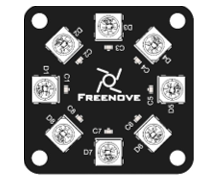
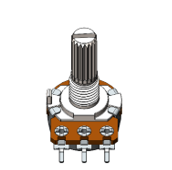
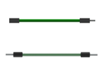

Circuit
=============================

Use pin A0 on the control board to detect the voltage of rotary potentiometer.

.. list-table:: 
   :width: 100%
   :align: center

   * -  Schematic diagram
   * -  |Chapter10_08|
   * -  Hardware connection. 
    
        If you need any support, please feel free to contact us via: support@freenove.com
   
   * -  |Chapter10_09|

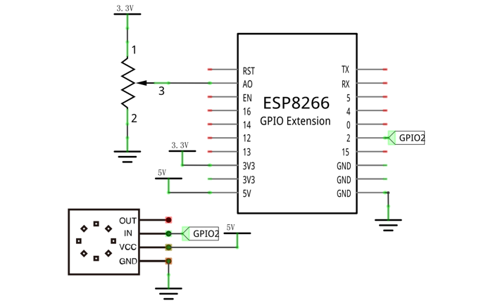
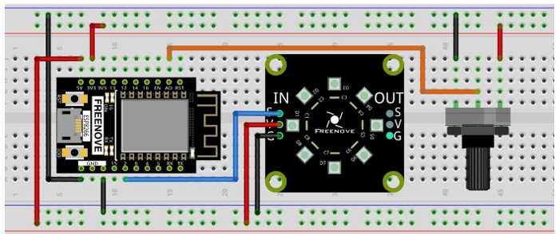

Sketch
======================

Sketch_Soft_Rainbow_Light
-----------------------------------

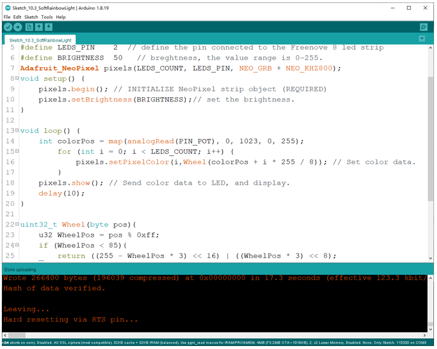

The following is the program code:

.. literalinclude:: ../../../freenove_Kit/C/Sketches/Sketch_10.3_SoftRainbowLight/Sketch_10.3_SoftRainbowLight.ino
    :linenos: 
    :language: c
    :lines: 1-33
    :dedent:

The overall logical structure of the code is the same as the previous project rainbow light, except that the starting point of the color in this code is controlled by potentiometer.