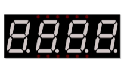
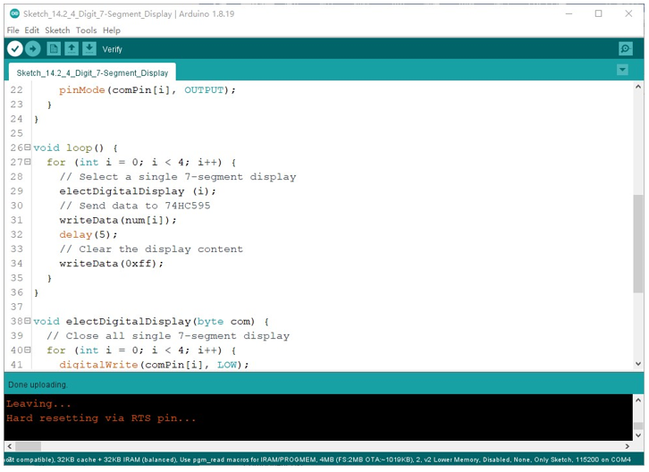
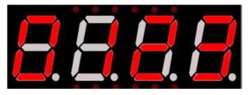

Project 4-Digit 7-Segment Display
******************************************

Now, let's try to control more digit 7-segment display

Component List
===============================

+----------------------------------+---------------------------------------+
| ESP8266 x1                       |          USB cable                    |
|                                  |                                       |
| |Chapter01_00|                   |          |Chapter01_01|               |
+----------------------------------+---------------------------------------+
| Breadboard x1                                                            |
|                                                                          |
| |Chapter01_02|                                                           |
+----------------------------------+---------------------------------------+
| 7-segment display x1             | Jumper wire M/M x17                   |
|                                  |                                       |
| |Chapter14_07|                   |  |Chapter01_05|                       |
+----------------------------------+---------------------------------------+
| 74HC595 x1                       | Resistor 220Ω x8                      |
|                                  |                                       |
| |Chapter13_00|                   |  |Chapter01_04|                       |
+----------------------------------+---------------------------------------+

.. |Chapter01_00| image:: ../_static/imgs/1_LED/Chapter01_00.png
.. |Chapter01_01| image:: ../_static/imgs/1_LED/Chapter01_01.png
.. |Chapter01_02| image:: ../_static/imgs/1_LED/Chapter01_02.png
.. |Chapter01_04| image:: ../_static/imgs/1_LED/Chapter01_04.png
.. |Chapter01_05| image:: ../_static/imgs/1_LED/Chapter01_05.png
.. |Chapter13_00| image:: ../_static/imgs/13_74HC595_&_LED_Bar_Graph/Chapter13_00.png

Component knowledge
================================

4 Digit 7-Segment Display
------------------------------

A 4 Digit 7-segment display integrates four 7-segment displays into one module, therefore it can display more characters. All of the LEDs contained have a common anode and individual cathodes. Its internal structure and pin designation diagram is shown below:

.. image:: ../_static/imgs/14_74HC595_&_7-Segment_Display/Chapter14_08.png
    :align: center

The internal electronic circuit is shown below, and all 8 LED cathode pins of each 7-segment display are connected together.

.. image:: ../_static/imgs/14_74HC595_&_7-Segment_Display/Chapter14_09.png
    :align: center

Display method of 4 digit 7-segment display is similar to 1 digit 7-segment display. The difference between them is that the 4-digit displays each Digit is visible in turn, one by one and not together. We need to first send high level to the common end of the first digit display, and send low level to the remaining three common ends, and then send content to 8 LED cathode pins of the first Digit Display. At this time, the first 7-segment display will show visible content and the remaining three will be OFF.

Similarly, the second, third and fourth 7-segment displays will show visible content in turn by scanning the display. Although the four number characters are displayed in turn separately, this process is so fast that it is imperceptible to the naked eye. This is due to the principle of optical afterglow effect and the vision persistence effect in human sight. This is how we can see all 4 number characters at the same time. However, if each number character is displayed for a longer period, you will be able to see that the number characters are displayed separately. 

Circuit
===========================

.. list-table:: 
   :width: 100%
   :align: center

   * -  Schematic diagram
   * -  |Chapter14_10|
   * -  Hardware connection. 
    
        If you need any support, please feel free to contact us via: support@freenove.com
   
   * -  |Chapter14_11|

.. |Chapter14_10| image:: ../_static/imgs/14_74HC595_&_7-Segment_Display/Chapter14_10.png
.. |Chapter14_11| image:: ../_static/imgs/14_74HC595_&_7-Segment_Display/Chapter14_11.png

Sketch
============================

In this code, we use the 74HC595 IC chip to control the 4-digit 7-segment display, and use the dynamic scanning method to show the changing number characters.

Sketch_4_Dight_7-Segment_Display
------------------------------------------

Compile and upload code to ESP8266, then the digital tube displays as shown.

The following is the program code:

.. literalinclude:: ../../../freenove_Kit/C/Sketches/Sketch_14.2_4_Digit_7-Segment_Display/Sketch_14.2_4_Digit_7-Segment_Display.ino
    :linenos: 
    :language: c
    :lines: 1-54
    :dedent:

First, define the pin of 74HC595 and 7-segment display common end, character encoding.

.. literalinclude:: ../../../freenove_Kit/C/Sketches/Sketch_14.2_4_Digit_7-Segment_Display/Sketch_14.2_4_Digit_7-Segment_Display.ino
    :linenos: 
    :language: c
    :lines: 7-14
    :dedent:

Second, initialize all the pins to output mode.

.. literalinclude:: ../../../freenove_Kit/C/Sketches/Sketch_14.2_4_Digit_7-Segment_Display/Sketch_14.2_4_Digit_7-Segment_Display.ino
    :linenos: 
    :language: c
    :lines: 16-24
    :dedent:

Then, since there are four digital tubes, we need to write a subfunction to control it to turn ON any digital tube. In order not to affect a new display, each time we want to turn ON a digital tube, we need to set the other digital tube OFF.

.. literalinclude:: ../../../freenove_Kit/C/Sketches/Sketch_14.2_4_Digit_7-Segment_Display/Sketch_14.2_4_Digit_7-Segment_Display.ino
    :linenos: 
    :language: c
    :lines: 38-45
    :dedent:

The usage of the writeData function is the same as in the previous two sections, so it won't be covered again here. 

.. literalinclude:: ../../../freenove_Kit/C/Sketches/Sketch_14.2_4_Digit_7-Segment_Display/Sketch_14.2_4_Digit_7-Segment_Display.ino
    :linenos: 
    :language: c
    :lines: 47-54
    :dedent:

In the loop function, because there are four digital tubes, a "for loop" is used to display the values of each one in turn. For example, when i =0, turn ON the first digital tube to display the first value, then turn ON the second digital tube to display the second value, until all four digital tubes display their own values. Because the displaying time from the first number to the fourth number is so short, it may display many times in one second, but our eyes can't keep up with the speed of the digital tube, so we look as if the digital tube is displaying different Numbers at the same time.

.. literalinclude:: ../../../freenove_Kit/C/Sketches/Sketch_14.2_4_Digit_7-Segment_Display/Sketch_14.2_4_Digit_7-Segment_Display.ino
    :linenos: 
    :language: c
    :lines: 26-36
    :dedent:

If you want to display the decimal point, make the highest bit of each array become 0, which can be implemented easily by num[i]&0x7f.

.. literalinclude:: ../../../freenove_Kit/C/Sketches/Sketch_14.2_4_Digit_7-Segment_Display/Sketch_14.2_4_Digit_7-Segment_Display.ino
    :linenos: 
    :language: c
    :lines: 51-51
    :dedent: