##############################################################################
Chapter 18 Servo
##############################################################################

Previously, we learned how to control the speed and rotational direction of a motor. In this chapter, we will learn about servos which are a rotary actuator type motor that can be controlled to rotate to specific angles.

Project 18.1 Servo Sweep
****************************************

First, we need to learn how to make a servo rotate.

Component List
=========================================

.. table::
    :width: 80%
    :align: center
    :class: table-line
    
    +----------------------------------+---------------------------------------+
    | ESP8266 x1                       |  USB cable                            |
    |                                  |                                       |
    | |Chapter01_00|                   |   |Chapter01_01|                      |
    +----------------------------------+---------------------------------------+
    | Breadboard x1                                                            |
    |                                                                          |
    | |Chapter01_02|                                                           |
    +----------------------------------+---------------------------------------+
    | Servo x1                         | Jumper wire M/M x5                    |
    |                                  |                                       |
    | |Chapter18_00|                   |   |Chapter18_01|                      |
    +----------------------------------+---------------------------------------+

.. |Chapter01_00| image:: ../_static/imgs/1_LED/Chapter01_00.png
.. |Chapter01_01| image:: ../_static/imgs/1_LED/Chapter01_01.png
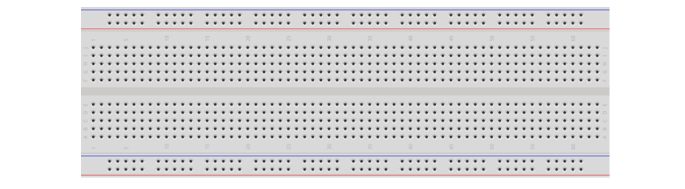
.. |Chapter06_01| image:: ../_static/imgs/6_LEDPixel/Chapter06_01.png

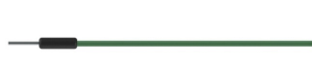

Component knowledge
====================================

Servo
-----------------------------

Servo is a compact package which consists of a DC motor, a set of reduction gears to provide torque, a sensor and control circuit board. Most servos only have a 180-degree range of motion via their "horn". Servos can output higher torque than a simple DC motor alone and they are widely used to control motion in model cars, model airplanes, robots, etc. Servos have three wire leads which usually terminate to a male or female 3-pin plug. Two leads are for electric power: positive (2-VCC, Red wire), negative (3-GND, Brown wire), and the signal line (1-Signal, Orange wire), as represented in the Servo provided in your Kit.

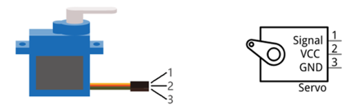

We will use a 50Hz PWM signal with a duty cycle in a certain range to drive the Servo. The lasting time of 0.5ms-2.5ms of PWM single cycle high level corresponds to the servo angle 0 degrees - 180 degree linearly. Part of the corresponding values are as follows:

.. table::
    :align: center
    :class: zebra
    
    +-----------------+-------------+
    | High level time | Servo angle |
    +-----------------+-------------+
    | 0.5ms           | 0 degree    |
    +-----------------+-------------+
    | 1ms             | 45 degree   |
    +-----------------+-------------+
    | 1.5ms           | 0 degree    |
    +-----------------+-------------+
    | 2ms             | 45 degree   |
    +-----------------+-------------+
    | 2.5ms           | 180 degree  |
    +-----------------+-------------+

When you change the servo signal value, the servo will rotate to the designated angle.

Circuit
============================

Use caution when supplying power to the servo, it should be 5V. Make sure you do not make any errors when connecting the servo to the power supply.

.. list-table:: 
   :width: 80%
   :align: center
   :class: table-line

   * -  Schematic diagram
   * -  |Chapter18_03|
   * -  Hardware connection. 
    
        If you need any support, please feel free to contact us via: support@freenove.com
   
   * -  |Chapter18_04|

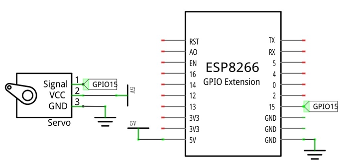
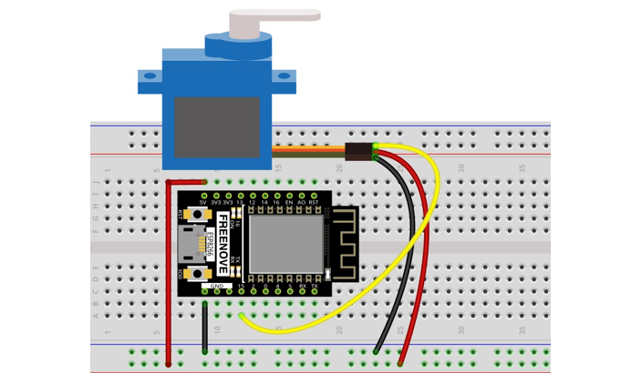

Sketch
===========================

How to install the library
---------------------------

If you haven't installed it yet, please do so before learning. The steps to add third-party Libraries are as follows: open arduino->Sketch->Include library-> Manage libraries.   Enter "Servo" in the search bar and select "Servo" for installation. Refer to the following operations:

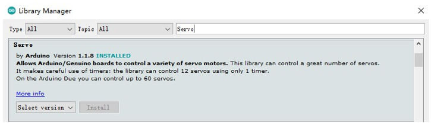

Use the Servo library to control the servo motor and let the servo motor rotate back and forth.

Sketch_18.1_Servo_Sweep
--------------------------------

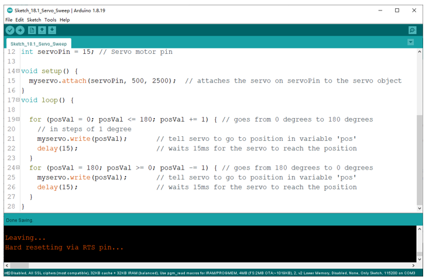

Compile and upload the code to ESP8266, the servo will rotate from 0 degrees to 180 degrees and then reverse the direction to make it rotate from 180 degrees to 0 degrees and repeat these actions in an endless loop.

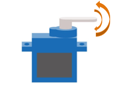

The following is the program code:

.. literalinclude:: ../../../freenove_Kit/C/Sketches/Sketch_18.1_Servo_Sweep/Sketch_18.1_Servo_Sweep.ino
    :linenos: 
    :language: c
    :lines: 1-44
    :dedent:

Servo uses the Servo library, like the following reference to Servo library:

.. literalinclude:: ../../../freenove_Kit/C/Sketches/Sketch_18.1_Servo_Sweep/Sketch_18.1_Servo_Sweep.ino
    :linenos: 
    :language: c
    :lines: 7-7
    :dedent:

Servo library provides the Servo class that controls it. Servo class must be instantiated before using:

.. literalinclude:: ../../../freenove_Kit/C/Sketches/Sketch_18.1_Servo_Sweep/Sketch_18.1_Servo_Sweep.ino
    :linenos: 
    :language: c
    :lines: 9-9
    :dedent:

Set the control servo motor pin, the time range of high level.

.. literalinclude:: ../../../freenove_Kit/C/Sketches/Sketch_18.1_Servo_Sweep/Sketch_18.1_Servo_Sweep.ino
    :linenos: 
    :language: c
    :lines: 13-13
    :dedent:

After initializing the servo, you can control the servo to rotate to a specific angle:

.. literalinclude:: ../../../freenove_Kit/C/Sketches/Sketch_18.1_Servo_Sweep/Sketch_18.1_Servo_Sweep.ino
    :linenos: 
    :language: c
    :lines: 22-22
    :dedent:

Reference
-----------------------

.. py:function:: class Servo 	
    
    Servo class must be instantiated when used, that is, define an object of Servo type, for example:
    
        :blue:`Servo` **myservo** ; 
    
        The function commonly used in the servo class is as follows:
    
        **setPeriodHertz(data):** Set the frequency of the servo motor. 
    
        **attach(pin,low,high):** Initialize the servo, 
    
            pin: the port connected to servo signal line.
    
            low: set the time of high level corresponding to 0 degree.
    
            high: set the time of high level corresponding to 180 degrees.
    
        **write(angle):** Control servo to rotate to the specified angle. 

Project 18.2 Servo Knop
****************************

Use a potentiometer to control the servo motor to rotate at any angle.

Component List
==================================

.. table::
    :width: 80%
    :align: center
    :class: table-line
    
    +-----------------------------------+------------------------------+
    | ESP8266 x1                        | USB cable                    |
    |                                   |                              |
    | |Chapter01_00|                    | |Chapter01_01|               |
    +-----------------------------------+------------------------------+
    | Breadboard x1                                                    |
    |                                                                  |
    | |Chapter01_02|                                                   |
    +----------------+----------------------------+--------------------+
    | Servo x1       | Rotary potentiometer x1    | Jumper wire M/M x10|
    |                |                            |                    |
    | |Chapter18_08| |  |Chapter18_09|            | |Chapter18_10|     |
    +----------------+----------------------------+--------------------+

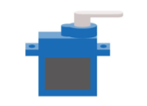
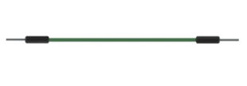
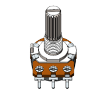

Circuit
==============================

Use caution when supplying power to the servo, it should be 5V. Make sure you do not make any errors when connecting the servo to the power supply.

.. list-table:: 
   :width: 80%
   :align: center
   :class: table-line

   * -  Schematic diagram
   * -  |Chapter18_11|
   * -  Hardware connection. 
    
        If you need any support, please feel free to contact us via: support@freenove.com
   
   * -  |Chapter18_12|

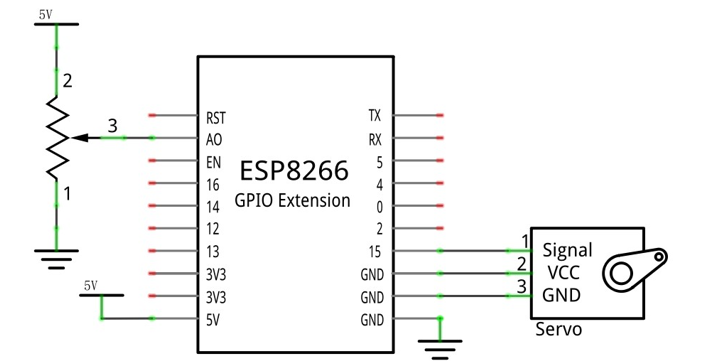
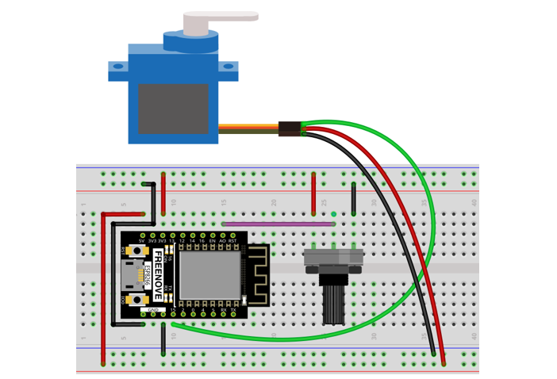

Sketch
==========================

Sketch_18.2_Control_Servo_by_Potentiometer
-----------------------------------------------

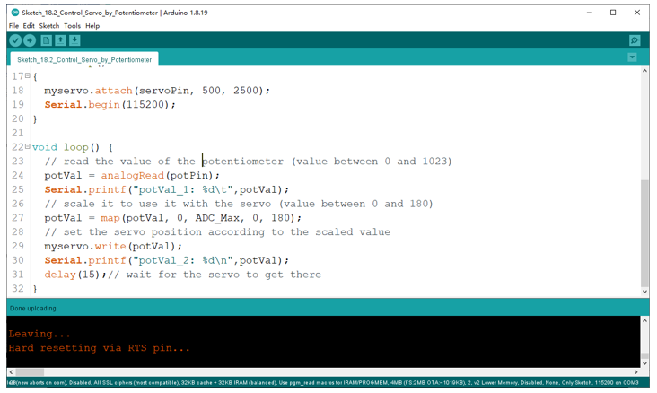

Compile and upload the code to ESP8266, twist the potentiometer back and forth, and the servo motor rotates accordingly.

.. image:: ../_static/imgs/18_Servo/Chapter18_14.png
    :align: center

The following is the program code:

.. literalinclude:: ../../../freenove_Kit/C/Sketches/Sketch_18.2_Control_Servo_by_Potentiometer/Sketch_18.2_Control_Servo_by_Potentiometer.ino
    :linenos: 
    :language: c
    :lines: 1-29
    :dedent:

In this experiment, we obtain the ADC value of the potentiometer and store it in potVal. Use map function to convert it into corresponding angle value and we can control the motor to rotate to a specified angle, and print the value via serial.