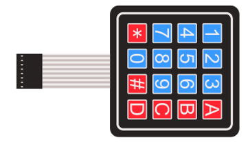
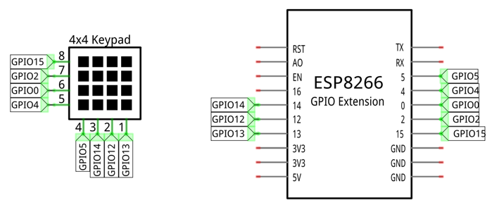
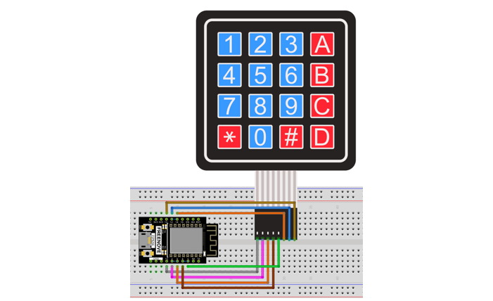

##############################################################################
Chapter 22 Matrix Keypad
##############################################################################

Earlier we learned about a single push button switch. In this chapter, we will learn about matrix keyboards, which integrates a number of push button switches as keys for the purposes of input.

Project Matrix Keypad
************************************

In this project, we will attempt to get every key code on the matrix keypad to work.

Component List
=========================================

.. table::
    :width: 80%
    :align: center
    :class: table-line
    
    +------------------------+-----------------------+
    | ESP8266 x1             |  USB cable            |
    |                        |                       |
    | |Chapter01_00|         |   |Chapter01_01|      |
    +------------------------+-----------------------+
    | Breadboard x1                                  |
    |                                                |
    | |Chapter01_02|                                 |
    +------------------------+-----------------------+
    | 4x4 Matrix Keypad x1   | Jumper wire M/M x8    |
    |                        |                       |
    | |Chapter22_01|         |   |Chapter22_00|      |
    +------------------------+-----------------------+

.. |Chapter01_00| image:: ../_static/imgs/1_LED/Chapter01_00.png
.. |Chapter01_01| image:: ../_static/imgs/1_LED/Chapter01_01.png
.. |Chapter01_02| image:: ../_static/imgs/1_LED/Chapter01_02.png
.. |Chapter06_01| image:: ../_static/imgs/6_LEDPixel/Chapter06_01.png
.. |Chapter22_00| image:: ../_static/imgs/22_Matrix_Keypad/Chapter22_00.png

Component knowledge
==================================

4x4 Matrix Keypad
-----------------------------------

A keypad matrix is a device that integrates a number of keys in one package. As is shown below, a 4x4 keypad matrix integrates 16 keys:

.. image:: ../_static/imgs/22_Matrix_Keypad/Chapter22_02.png
    :align: center

Similar to the integration of a LED matrix, the 4x4 keypad matrix has each row of keys connected with one pin and this is the same for the columns. Such efficient connections reduce the number of processor ports required. The internal circuit of the Keypad Matrix is shown below.

.. image:: ../_static/imgs/22_Matrix_Keypad/Chapter22_03.png
    :align: center

The usage is similar to the LED matrix, using a row or column scanning method to detect the state of each key' s position by column and row. Take column scanning method as an example, send low level to the first 1 column (Pin1), detect level state of row 5, 6, 7, 8 to judge whether the key A, B, C, D are pressed. Then send low level to column 2, 3, 4 in turn to detect whether other keys are pressed. Therefore, you can get the state of all of the keys.

Circuit
========================

Note that the voltage of ultrasonic module is 5V in the circuit.

.. list-table:: 
   :width: 80%
   :align: center
   :class: table-line

   * -  Schematic diagram
   * -  |Chapter22_04|
   * -  Hardware connection
    
        If you need any support, please feel free to contact us via: support@freenove.com
   
   * -  |Chapter22_05|

Sketch
==========================

This code is used to obtain all key codes of the 4x4 matrix keypad, when one of the keys is pressed, the key code will be printed out via serial port.

How to install the library
---------------------------------

We use the third party library Keypad. If you haven't installed it yet, please do so before learning. The steps to add third-party Libraries are as follows: open arduino->Sketch->Include library-> Manage libraries. Enter " Keypad" in the search bar and select " Keypad " for installation.

Refer to the following operations:

Please make sure you have the following Keypad libraries installed, other Keypad libraries may prevent your experiment from working properly.

In addition, you can import Keypad libraries in another way.Open Arduino IDE, click Sketch -> Include Library -> Add .ZIP Library, In the pop-up window, find the file named "./Libraries/ Keypad.zip" which locates in this directory, and click OPEN.

Sketch_22.1_Get_Input_Characters
----------------------------------------

Download the code to ESP8166, open the serial port monitor, set the baud rate to 115200, press the keyboard, the value of the pressed keys will be printed out via the serial port. As shown in the following figure: 

The following is the program code:

.. literalinclude:: ../../../freenove_Kit/C/Sketches/Sketch_22.1_Get_Input_Characters/Sketch_22.1_Get_Input_Characters.ino
    :linenos: 
    :language: c
    :lines: 1-46
    :dedent:

First, add header file, define 4*4 matrix keyboard key value and the matrix keyboard pin. 

.. code-block:: c
    :linenos:

    #include <Keypad.h>
    // define the symbols on the buttons of the keypad
    char keys[4][4] = {
    {'1', '2', '3', 'A'},
    {'4', '5', '6', 'B'},
    {'7', '8', '9', 'C'},
    {'*', '0', '#', 'D'}
    };
    byte rowPins[4] = {5, 14, 12, 13}; // connect to the row pinouts of the keypad
    byte colPins[4] = {15, 2, 0, 4};   // connect to the column pinouts of the keypad

Second, define a matrix keyboard object and associate the keys and pins with it.

.. literalinclude:: ../../../freenove_Kit/C/Sketches/Sketch_22.1_Get_Input_Characters/Sketch_22.1_Get_Input_Characters.ino
    :linenos: 
    :language: c
    :lines: 24-24
    :dedent:

Finally, get the key value and print it out via the serial port.

.. literalinclude:: ../../../freenove_Kit/C/Sketches/Sketch_22.1_Get_Input_Characters/Sketch_22.1_Get_Input_Characters.ino
    :linenos: 
    :language: c
    :lines: 38-46
    :dedent:

Reference
---------------------------------

.. py:function:: class Keypad	You need to add the library each time you use the Keypad.

    **Keypad(char *userKeymap, byte *row, byte *col, byte numRows, byte numCols);**

    Constructor, the parameters are: key code of keyboard, row pin, column pin, the number of rows, the number of columns.

    **char getKey();**

    Get the key code of the pressed key. If no key is pressed, the return value is NULL.

    **void setDebounceTime(uint);**

    Set the debounce time with a default time of 10ms.

    **void setHoldTime(uint);**

    Set the duration for the key to keep stable state after pressed.

    **bool isPressed(char keyChar);**

    Judge whether the key with code "keyChar" is pressed.

    **char waitForKey();**

    Wait for a key to be pressed, and return key code of the pressed key.

    **KeyState getState();**

    Get the state of the keys.

    **bool keyStateChanged();**

    Judge whether there is a change of key state, then return True or False.

For More information about Keypad, please visit: http://playground.arduino.cc/Code/Keypad