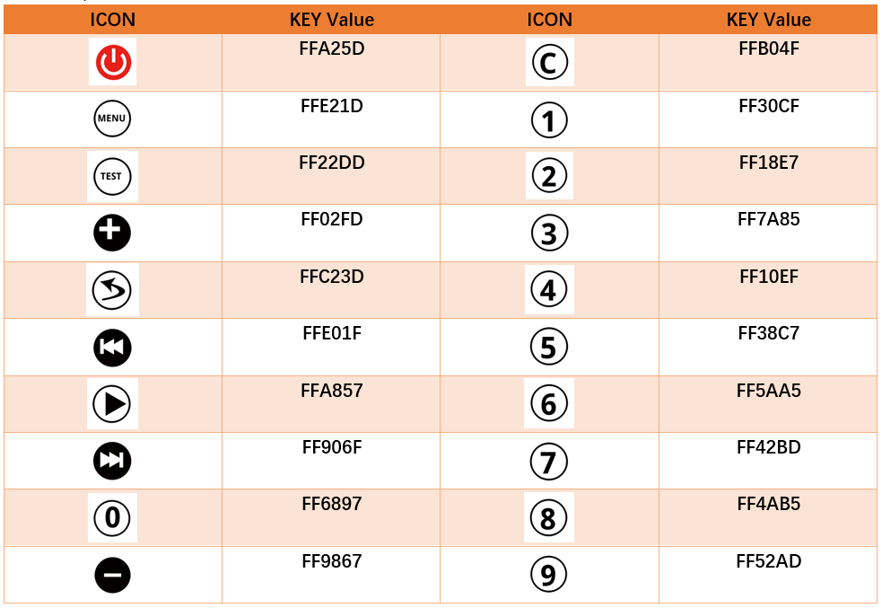
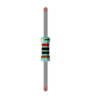
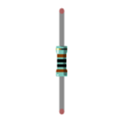
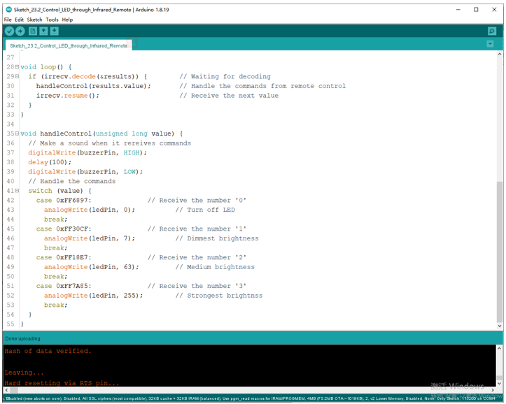

##############################################################################
Chapter 23 Infrared Remote
##############################################################################

In this chapter, we'll learn how to use an infrared remote control, and control a LED.

Project 23.1 Infrared Remote Control
*****************************************************

First, we need to understand how infrared remote control works, then get the command sent from infrared remote control.

Component List
=======================================

.. table::
    :width: 80%
    :align: center
    :class: table-line
    
    +----------------------------------+----------------------------------+
    | ESP8266 x1                       |  USB cable                       |
    |                                  |                                  |
    | |Chapter01_00|                   |   |Chapter01_01|                 |
    +----------------------------------+----------------------------------+
    | Breadboard x1                                                       |
    |                                                                     |
    | |Chapter01_02|                                                      |
    +----------------------+-------------------------+--------------------+
    | Resistor 10kΩ x1     | Infrared Remote x1      | Jumper wire M/M x6 |
    |                      |                         |                    |
    | |Chapter23_02|       |  |Chapter23_01|         |     |Chapter23_00| |
    +----------------------+-------------------------+--------------------+
    | Infrared Remote x1                                                  |
    |                                                                     |
    | (May need CR2025 battery x1, please check the holder)               |
    |                                                                     |
    | |Chapter23_03|                                                      |
    +---------------------------------------------------------------------+

.. |Chapter01_00| image:: ../_static/imgs/1_LED/Chapter01_00.png
.. |Chapter01_01| image:: ../_static/imgs/1_LED/Chapter01_01.png
.. |Chapter01_02| image:: ../_static/imgs/1_LED/Chapter01_02.png

.. |Chapter23_02| image:: ../_static/imgs/23_Infrared_Remote/Chapter23_02.png

Component knowledge
============================

Infrared Remote
----------------------------

An infrared(IR) remote control is a device with a certain number of buttons. Pressing down different buttons will make the infrared emission tube, which is located in the front of the remote control, send infrared ray with different command. Infrared remote control technology is widely used in electronic products such as TV, air conditioning, etc. Thus making it possible for you to switch TV programs and adjust the temperature of the air conditioning when away from them. The remote control we use is shown below:

Infrared receiver
-----------------------------

An infrared(IR) receiver is a component which can receive the infrared light, so we can use it to detect the signal emitted by the infrared remote control. DATA pin here outputs the received infrared signal.

When you use the infrared remote control, the infrared remote control sends a key value to the receiving circuit according to the pressed keys. We can program the ESP8266 to do things like lighting, when a key value is received. 

The following is the key value that the receiving circuit will receive when each key of the infrared remote control is pressed.

Circuit
===============================

.. list-table:: 
   :width: 80%
   :align: center
   :class: table-line

   * -  Schematic diagram
   * -  |Chapter23_19|
   * -  Hardware connection. 
    
        If you need any support, please feel free to contact us via: support@freenove.com
   
   * -  |Chapter23_20|

Sketch
===============================

This sketch uses the infrared receiving tube to receive the value sent form the infrared remote control, and print it out via the serial port.

How to install the library
-------------------------------

We use the third party library IRremoteESP8266. If you haven't installed it yet, please do so first. The steps to add third-party Libraries are as follows: open arduino->Sketch->Include library-> Manage libraries. Enter " IRremoteESP8266" in the search bar and select " IRremoteESP8266" for installation.

Refer to the following operations:

Sketch_23.1_Infrared_Remote_Control
-------------------------------------------

Download the code to ESP8266, open the serial port monitor, set the baud rate to 115200, press the IR remote control, the pressed keys value will be printed out through the serial port. As shown in the following figure: (Note that when the remote control button is pressed for a long time, the infrared receiving circuit receives a continuous high level, that is, it receives a hexadecimal "F")

The following is the program code:

.. literalinclude:: ../../../freenove_Kit/C/Sketches/Sketch_23.1_Infrared_Remote_Control/Sketch_23.1_Infrared_Remote_Control.ino
    :linenos: 
    :language: c
    :lines: 1-30
    :dedent:

First, include header file. Each time you use the infrared library, you need to include the header file at the beginning of the program.

.. literalinclude:: ../../../freenove_Kit/C/Sketches/Sketch_23.1_Infrared_Remote_Control/Sketch_23.1_Infrared_Remote_Control.ino
    :linenos: 
    :language: c
    :lines: 7-10
    :dedent:

Second, define an infrared receive pin and associates it with the receive class. Apply a decode_results to decode the received infrared value.

.. literalinclude:: ../../../freenove_Kit/C/Sketches/Sketch_23.1_Infrared_Remote_Control/Sketch_23.1_Infrared_Remote_Control.ino
    :linenos: 
    :language: c
    :lines: 12-14
    :dedent:

Third, enable infrared reception function, if you do not use this function, you won't receive the value from the infrared remote control.

.. literalinclude:: ../../../freenove_Kit/C/Sketches/Sketch_23.1_Infrared_Remote_Control/Sketch_23.1_Infrared_Remote_Control.ino
    :linenos: 
    :language: c
    :lines: 18-18
    :dedent:

Finally, put the received data into the results class and print out the data through the serial port. Note that you must use resume() to release the infrared receive function every time when you receive data, otherwise you can only use the infrared receive function once and cannot receive the data next time.

.. literalinclude:: ../../../freenove_Kit/C/Sketches/Sketch_23.1_Infrared_Remote_Control/Sketch_23.1_Infrared_Remote_Control.ino
    :linenos: 
    :language: c
    :lines: 23-30
    :dedent:

Reference
----------------------

.. py:function:: class IRrecv	You need to add the library each time you use the Infrared Reception.
    
    **IRrecv irrecv(Pin):** Create a class object used to receive class, and associated with Pin.
    
    **enableIRIn():** Before using the infrared decoding function, enable the infrared receiving function. Otherwise the correct data will not be received.
    
    **decode(&results):** Determine whether the infrared has received data, and if so, return true and store the data in the decode_results class. If no data is received, false is returned.
    
    **resume():** Release the IRremote. Or, the infrared reception and decoding function cannot be used again.
    
For more information about Infrared Remote Control, please visit:

https://github.com/crankyoldgit/IRremoteESP8266/tree/master/src

Project Control LED through Infrared Remote
******************************************************

In this project, we will control the brightness of LED lights through an infrared remote control.

Component List
===============================

+----------------------------------+---------------------------------------+
| ESP8266 x1                       |          USB cable                    |
|                                  |                                       |
| |Chapter01_00|                   |          |Chapter01_01|               |
+----------------------------------+---------------------------------------+
| Breadboard x1                                                            |
|                                                                          |
| |Chapter01_02|                                                           |
+----------------------------------+---------------------------------------+
| Active buzzer x1                 | Jumper wire M/M                       |
|                                  |                                       |
| |Chapter23_10|                   |  |Chapter01_05|                       |
+----------------------+-----------+-------------+-------------------------+
| Resistor 10kΩ x2     | Resistor 1kΩ x1         | Resistor 220Ω x1        |
|                      |                         |                         |
| |Chapter16_02|       |  |Chapter16_03|         |  |Chapter16_04|         |
+----------------------+-------------------------+-------------------------+
| NPN transistor x1    | LED x1                  | Infrared receiver x1    |
|                      |                         |                         |
| (S8050)              |                         |                         |
|                      |                         |                         |
| |Chapter23_13|       |  |Chapter23_11|         |  |Chapter23_12|         |
+----------------------+-------------------------+-------------------------+
| Infrared Remote x1                                                       |
|                                                                          |
| (May need CR2025 battery x1, please check the holder)                    |
|                                                                          |
| |Chapter23_14|                                                           |
+--------------------------------------------------------------------------+

.. |Chapter01_05| image:: ../_static/imgs/1_LED/Chapter01_05.png

.. |Chapter16_04| image:: ../_static/imgs/16_Relay_&_Motor/Chapter16_04.png

Circuit
===============================

.. list-table:: 
   :width: 80%
   :align: center

   * -  Schematic diagram
   * -  |Chapter23_15|
   * -  Hardware connection. 
    
        If you need any support, please feel free to contact us via: support@freenove.com
   
   * -  |Chapter23_16|

Sketch
================================

The sketch controls the brightness of the LED by determining the key value of the infrared received.

Sketch_Control_LED_through_Infrared_Remote
---------------------------------------------------

Compile and upload the code to the ESP8266. When pressing "0", "1", "2", "3" of the infrared remote control, the buzzer will sound once, and the brightness of the LED light will change correspondingly. 

rendering

The following is the program code:

.. literalinclude:: ../../../freenove_Kit/C/Sketches/Sketch_23.2_Control_LED_through_Infrared_Remote/Sketch_23.2_Control_LED_through_Infrared_Remote.ino
    :linenos: 
    :language: c
    :lines: 1-55
    :dedent:

The handleControl() function is used to execute events corresponding to infrared code values. Every time when the function is called, the buzzer sounds once and determine the brightness of the LED based on the infrared key value. If the key value is not "0", "1", "2", "3", the buzzer sounds once, but the brightness of LED will not change.

.. literalinclude:: ../../../freenove_Kit/C/Sketches/Sketch_23.2_Control_LED_through_Infrared_Remote/Sketch_23.2_Control_LED_through_Infrared_Remote.ino
    :linenos: 
    :language: c
    :lines: 35-55
    :dedent:

Each time when the command is received, the function above will be called in the loop() function.

.. literalinclude:: ../../../freenove_Kit/C/Sketches/Sketch_23.2_Control_LED_through_Infrared_Remote/Sketch_23.2_Control_LED_through_Infrared_Remote.ino
    :linenos: 
    :language: c
    :lines: 28-33
    :dedent: