##############################################################################
Chapter 25 Infrared Motion Sensor
##############################################################################

In this chapter, we will learn a widely used sensor, infrared motion sensor.

Project 25.1 Infrared Motion Detector with LED Indicator
***************************************************************

In this project, we will make a motion detector, with the human body infrared pyroelectric sensors.

When someone is in close proximity to the motion detector, it will automatically light up and when there is no one close by, it will be out.

This infrared motion sensor can detect the infrared spectrum (heat signatures) emitted by living humans and animals.

Component List
=============================

.. table::
    :width: 80%
    :align: center
    :class: table-line
    
    +---------------------------+--------------------------+
    | ESP8266 x1                |  USB cable               |
    |                           |                          |
    | |Chapter01_00|            |   |Chapter01_01|         |
    +---------------------------+--------------------------+
    | Breadboard x1                                        |
    |                                                      |
    | |Chapter01_02|                                       |
    +---------------------------+--------------------------+
    | HC SR501 x1               | LED x1                   |
    |                           |                          |
    | |Chapter25_00|            |   |Chapter25_01|         |
    +---------------------------+--------------------------+
    | Jumper wire F/M x3        | Resistor 220Ω x1         |
    |                           |                          |
    | Jumper wire M/M x4        |                          |
    |                           |                          |
    | |Chapter24_10|            |   |Chapter25_02|         |
    +---------------------------+--------------------------+

.. |Chapter01_00| image:: ../_static/imgs/1_LED/Chapter01_00.png
.. |Chapter01_01| image:: ../_static/imgs/1_LED/Chapter01_01.png
.. |Chapter01_02| image:: ../_static/imgs/1_LED/Chapter01_02.png
.. |Chapter24_10| image:: ../_static/imgs/24_Hygrothermograph_DHT11/Chapter24_10.png
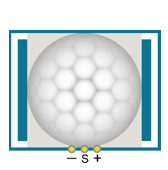

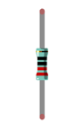

Component knowledge
============================

The following is the diagram of the infrared Motion sensor(HC SR-501):

.. list-table:: 
   :width: 80%
   :align: center
   :class: table-line

   * -  Top
     -  Bottom 
     -  Schematic
   
   * -  |Chapter25_03|
     -  |Chapter25_04|
     -  |Chapter25_05|

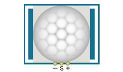
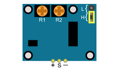
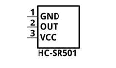

Description: 

Working voltage: 5v-20v(DC) Static current: 65uA.

Automatic Trigger. When a living body enters into the active area of sensor, the module will output high level (3.3V). When the body leaves the sensor’s active detection area, it will output high level lasting for time period T, then output low level(0V). Delay time T can be adjusted by the potentiometer R1.

According to the position of jumper cap, you can choose non-repeatable trigger mode or repeatable mode.

    L: non-repeatable trigger mode. The module output high level after sensing a body, then when the delay time is over, the module will output low level. During high level time, the sensor no longer actively senses bodies.

    H: repeatable trigger mode. The distinction from the L mode is that it can sense a body until that body leaves during the period of high level output. After this, it starts to time and output low level after delaying T time.

Induction block time: the induction will stay in block condition and does not induce external signal at lesser time intervals (less than delay time) after outputting high level or low level 

Initialization time: the module needs about 1 minute to initialize after being powered ON. During this period, it will alternately output high or low level. 

One characteristic of this sensor is when a body moves close to or moves away from the sensor's dome edge, the sensor will work at high sensitivity. When a body moves close to or moves away from the sensor’s dome in a vertical direction, the sensor cannot detect well (please take note of this deficiency). Note: The sensing range (distance before a body is detected) is adjusted by the potentiometer.

We can regard this sensor as a simple inductive switch when in use.

Circuit
===============================

.. list-table:: 
   :width: 80%
   :align: center
   :class: table-line

   * -  Schematic diagram
   * -  |Chapter25_06|
   * -  Hardware connection
    
        If you need any support, please feel free to contact us via: support@freenove.com
   
   * -  |Chapter25_07|

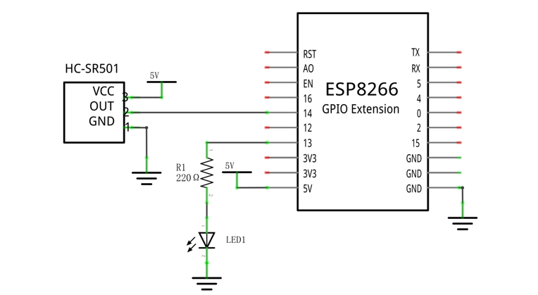
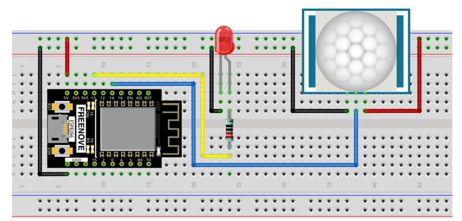

Sketch
==============================

In this project, we will use the infrared motion sensor to trigger a LED, essentially making the infrared motion sensor act as a motion switch. Therefore, the code is very similar to the earlier project "push button switch and LED". The difference is that, when infrared motion sensor detects change, it will output high level; when button is pressed, it will output low level. When the sensor output high level, the LED turns ON, or it will turn OFF.

Sketch_25.1_Infrared_Motion_Sensor
-------------------------------------------

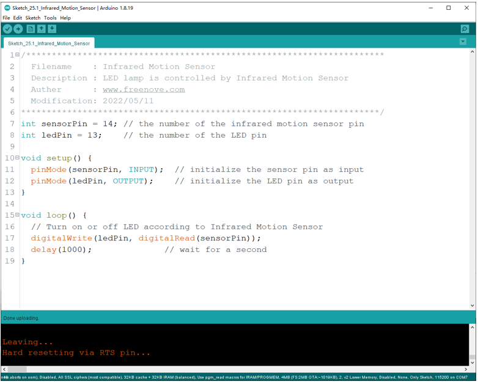

Verify and upload the code, and put the sensor on a stationary table and wait for about a minute. Then try to move away from or move closer to the infrared motion sensor and observe whether the LED turns ON or OFF automatically.

You can rotate the potentiometer on the sensor to adjust the detection effect, or use different modes by changing the jumper.

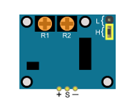

Apart from that, you can also use this sensor to control some other modules to implement different functions by reediting the code, such as the induction lamp, induction door.

.. list-table:: 
   :width: 80%
   :align: center
   :class: table-line

   * -  Move to the Infrared Motion Sensor
   * -  |Chapter25_09|
   * -  Move to the Infrared Motion Sensor
   * -  |Chapter25_10|

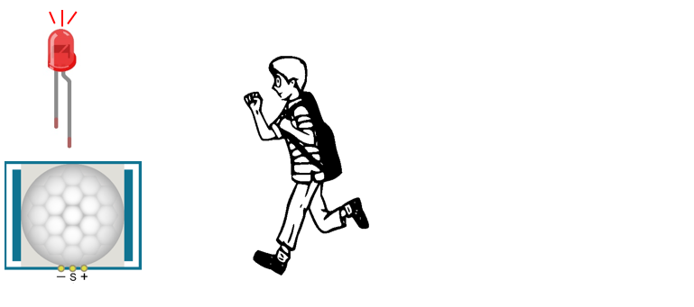
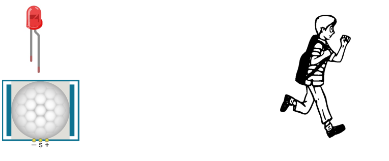

Description:

1. You can choose non repeatable trigger modes or repeatable modes.

    L: nonrepeatable trigger mode. The module output high level after sensing a body, then when the

    delay time is over, the module will output low level. During high level time, the sensor no longer actively

    senses bodies.

    H: repeatable trigger mode. The distinction from the L mode is that it can sense a body until that body

    leaves. After this, it starts to time and output low level after delaying T time.

2. R1 is used to adjust HIGH level last ing time when sensor detect s human motion , 1.2 s 320 s

3. R 2 is used to adjust the maxmum distance the sensor can detect, 3~5m.

Here we connect L and adjust R1 and R2 like below to do this project.

Put you hand close and away from the sensor slowly. Obsever the LED in previous circuit.

It need some time between two detections.

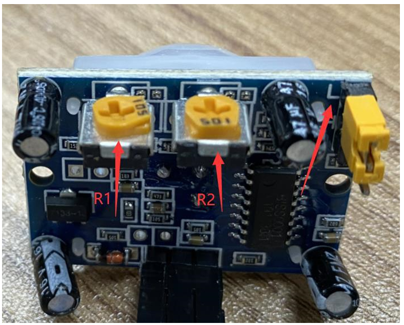