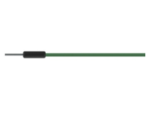
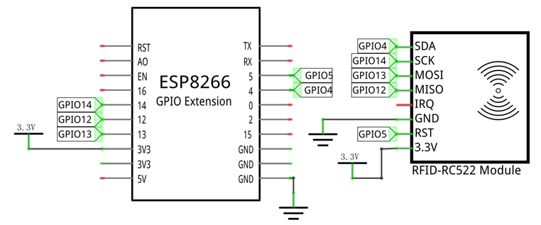
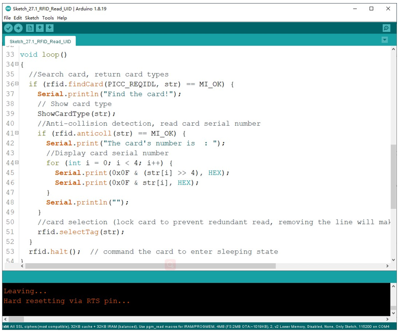
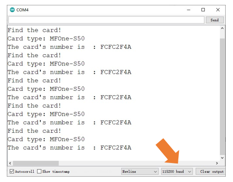
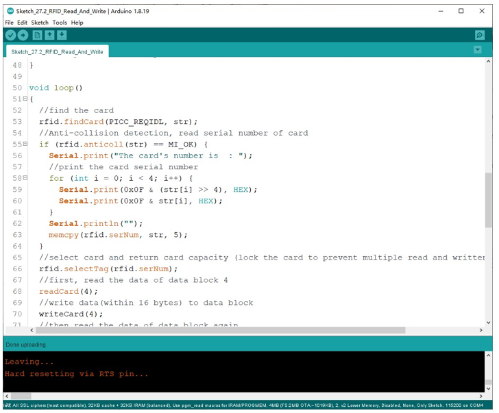
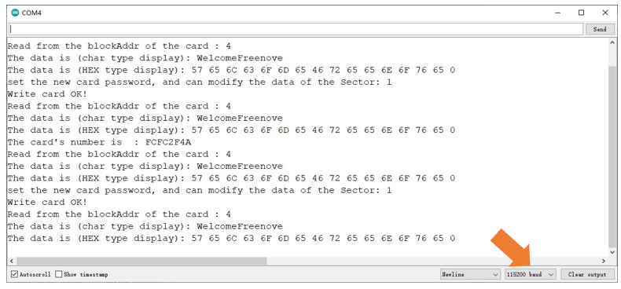

##############################################################################
Chapter RFID
##############################################################################

Now, we will learn to use the RFID (Radio Frequency Identification) wireless communication technology.

Project 27.1RFID read UID
**********************************

In this project, we will read the unique ID number (UID) of the RFID card, recognize the type of the RFID card and display the information through serial port.

Component List
=====================================

+----------------------------------+---------------------------------------+
| ESP8266 x1                       |  USB cable                            |
|                                  |                                       |
| |Chapter01_00|                   |   |Chapter01_01|                      |
+----------------------------------+---------------------------------------+
| Breadboard x1                                                            |
|                                                                          |
| |Chapter01_02|                                                           |
+----------------------------------+---------------------------------------+
| RC522 module x1                  | Jumper wire M/M x8                    |
|                                  |                                       |
| |Chapter27_00|                   |   |Chapter22_00|                      |
+----------------------------------+---------------------------------------+
| Mifare1 S50 Standard card x1     | Mifare1 S50 Non-standard card x1      |
|                                  |                                       |
| |Chapter27_01|                   |   |Chapter27_02|                      |
+----------------------------------+---------------------------------------+

.. |Chapter01_00| image:: ../_static/imgs/1_LED/Chapter01_00.png
.. |Chapter01_01| image:: ../_static/imgs/1_LED/Chapter01_01.png
.. |Chapter01_02| image:: ../_static/imgs/1_LED/Chapter01_02.png
.. |Chapter06_01| image:: ../_static/imgs/6_LEDPixel/Chapter06_01.png

.. |Chapter27_00| image:: ../_static/imgs/27_RFID/Chapter27_00.png
.. |Chapter27_01| image:: ../_static/imgs/27_RFID/Chapter27_01.png
.. |Chapter27_02| image:: ../_static/imgs/27_RFID/Chapter27_02.png

Component knowledge
==================================

RFID
---------------------------------

RFID (Radio Frequency Identification) is a wireless communication technology. A complete RFID system is
generally composed of the responder and reader. Generally, we use tags as responders, and each tag has a
unique code, which is attached to the object to identify the target object. The reader is a device for reading
(or writing) tag information.

Products derived from RFID technology can be divided into three categories: passive RFID products, active
RFID products and semi active RFID products. And Passive RFID products are the earliest, the most mature
and most widely used products in the market among others. It can be seen everywhere in our daily life such
as, the bus card, dining card, bank card, hotel access cards, etc., and all of these belong to close-range contact
recognition. The main operating frequency of Passive RFID products are: 125KHZ (low frequency), 13.56MHZ
(high frequency), 433MHZ (ultrahigh frequency), 915MHZ (ultrahigh frequency). Active and semi active RFID
products work at higher frequencies.

The RFID module we use is a passive RFID product with the operating frequency of 13.56MHz.

MFRC522 RFID Module
---------------------------------

The MFRC522 is a highly integrated reader/writer IC for contactless communication at 13.56MHz.
The MFRC522's internal transmitter is able to drive a reader/writer antenna designed to communicate with
ISO/IEC 14443 A/MIFARE cards and transponders without additional active circuitry. The receiver module
provides a robust and efficient implementation for demodulating and decoding signals from ISO/IEC 14443
A/MIFARE compatible cards and transponders. The digital module manages the complete ISO/IEC 14443A
framing and error detection (parity and CRC) functionality.

This RFID Module uses MFRC522 as the control chip, and SPI (Peripheral Interface Serial) as the reserved
interface.

Technical specs:

+-----------------------+-----------------------------------------------+
| Operating Voltage     | 13-26mA(DC)\3.3V                              |
+-----------------------+-----------------------------------------------+
| Idle current          | 10-13mA(DC)\3.3V                              |
+-----------------------+-----------------------------------------------+
| Sleep current in the  | <80uA                                         |
+-----------------------+-----------------------------------------------+
| Peak current          | <30mA                                         |
+-----------------------+-----------------------------------------------+
| Operating frequency   | 13.56MHz                                      |
+-----------------------+-----------------------------------------------+
|                       | Mifare1 S50、Mifare1 S70、Mifare Ultralight、 |
| Supported card type   |                                               |
|                       | Mifare Pro、Mifare Desfire                    |
+-----------------------+-----------------------------------------------+
| Size                  | 40mmX60mm                                     |
+-----------------------+-----------------------------------------------+
| Operation temperature | 20-80 degrees(Celsius)                        |
+-----------------------+-----------------------------------------------+
| Storage temperature   | 40-85 degrees (Celsius)                       |
+-----------------------+-----------------------------------------------+
| Operation humidity    | 5%-95%(Relative humidity)                     |
+-----------------------+-----------------------------------------------+

Mifare1 S50 Card
-----------------------------

Mifare S50 is often called Mifare Standard with the capacity of 1K bytes. And each card has a 4-bytes global unique identifier number (USN/UID), which can be rewritten 100 thousand times and read infinite times. Its storage period can last for 10 years. The ordinary Mifare1 S50 Card and non-standard Mifare1 S50 Card
equipped for this kit are shown below.

The Mifare S50 capacity (1K byte) is divided into 16 sectors (Sector0-Sector15). Each sector contains 4 data block (Block0-Block3. 64 blocks of 16 sectors will be numbered according absolute address, from 0 to 63). 
And each block contains 16 bytes (Byte0-Byte15), 64*16=1024. As is shown in the following table:

+------------+-----------+--------------------------------------+---------------+--------------------+
| Sector No. | Block No. | Storage area                         | Block type    | Absolute block No. |
+------------+-----------+--------------------------------------+---------------+--------------------+
|            | block 0   | vendor code                          | vendor block  | 0                  |
|            +-----------+--------------------------------------+---------------+--------------------+
|            | block 1   |                                      | data block    | 1                  |
|            +-----------+--------------------------------------+---------------+--------------------+
| sector 0   | block 2   |                                      | data block    | 2                  |
|            +-----------+--------------------------------------+---------------+--------------------+
|            | block 3   | Password A-access control-password B | control block | 3                  |
+------------+-----------+--------------------------------------+---------------+--------------------+
|            | block 0   |                                      | data block    | 4                  |
|            +-----------+--------------------------------------+---------------+--------------------+
| sector 1   | block 1   |                                      | data block    | 5                  |
|            +-----------+--------------------------------------+---------------+--------------------+
|            | block 2   |                                      | data block    | 6                  |
|            +-----------+--------------------------------------+---------------+--------------------+
|            | block 3   | Password A-access control-password B | control block | 7                  |
+------------+-----------+--------------------------------------+---------------+--------------------+
| ...        | ...       | ...                                  | ...           |                    |
+------------+-----------+--------------------------------------+---------------+--------------------+
|            | block 0   |                                      | data block    | 60                 |
|            +-----------+--------------------------------------+---------------+--------------------+
| sector 15  | block 1   |                                      | data block    | 61                 |
|            +-----------+--------------------------------------+---------------+--------------------+
|            | block 2   |                                      | data block    | 62                 |
|            +-----------+--------------------------------------+---------------+--------------------+
|            | block 3   | Password A-access control-password B | control block | 63                 |
+------------+-----------+--------------------------------------+---------------+--------------------+

Each sector has a set of independent password and access control put in its last block, that is, Block 3, which is also known as sector trailer. Sector 0, block 0 (namely absolute address 0) of S50 is used to store the card serial number and vendor code, which has been solidified and can’t be changed. Except the manufacturer and the control block, the rest of the cards are data blocks, which can be used to store data. Data block can be used for two kinds of applications:

(1) used as general data storage and can be operated for reading and writing data.

(2) used as data value, and can be operated for initializing, adding, subtracting and reading the value.

The sector trailer block in each sector is the control block, including a 6-byte password A, a 4-byte access control and a 6-byte password B. For example, the control block of a brand new card is as follows:

+-------------------+----------------+-------------------+
| A0 A1 A2 A3 A4 A5 | FF 07 80 69    | B0 B1 B2 B3 B4 B5 |
+-------------------+----------------+-------------------+
| password A        | access control | password B        |
+-------------------+----------------+-------------------+

The default password of a brand new card is generally 0A1A2A3A4A5 for password A and B0B1B2B3B4B5 for password B, or both the password A and password B are 6 FF. Access control is used to set the access conditions for each block (including the control block itself) in a sector.

Blocks of S50 are divided into data blocks and control blocks. There are four operations, "read", "write", "add value", "subtract value (including transmission and storage)" for data blocks, and there are two operations, "read" and "write" for control blocks.

For more details about how to set data blocks and control blocks, please refer to Datasheet.

By default, after verifying password A or password B, we can do reading or writing operation to data blocks. And after verifying password A, we can do reading or writing operation to control blocks. But password A can never be read, so if you choose to verify password A but forget the password A, the block will never be able to read again. :red:`It is highly recommended that beginners should not try to change the contents of control blocks.`

For Mifare1 S50 card equipped in Freenove RFID Kit, the default password A and B are both FFFFFFFFFFFF. 

Circuit
=============================

The connection of control board and RFID module is shown below.

.. list-table:: 
   :width: 100%
   :align: center

   * -  Schematic diagram
   * -  |Chapter27_03|
   * -  Hardware connection. 
    
        If you need any support, please feel free to contact us via: support@freenove.com
   
   * -  |Chapter27_04|

.. |Chapter27_04| image:: ../_static/imgs/27_RFID/Chapter27_04.png

Sketch
=============================

Sketch_RFID_Read_UID
------------------------------------

Before writing code, we need to import the library needed.

Click "Add .ZIP Library..." and then find RFID.zip in libraries folder (this folder is in the folder unzipped form
the ZIP file we provided). This library make it easy to operate RFID module.

This sketch will read the unique ID number (UID) of the card, recognize the type of the card and display the
information through serial port.

After verifying and uploading the code, open the serial monitor and make a card approach the sensing area
of RFID module. Then serial monitor will display the displacement ID number and the type of the card. If the
induction time is too short, it may lead to incomplete-information display. 

The following is the program code:

.. literalinclude:: ../../../freenove_Kit/C/Sketches/Sketch_27.1_RFID_Read_UID/Sketch_27.1_RFID_Read_UID.ino
    :linenos: 
    :language: c
    :lines: 1-70
    :dedent:

After including the RFID library, we need to construct a RFID class object before using the function in RFID
library. Its constructor needs to be written to two pins, respectively to the SDA pin and the RST pin.

.. literalinclude:: ../../../freenove_Kit/C/Sketches/Sketch_27.1_RFID_Read_UID/Sketch_27.1_RFID_Read_UID.ino
    :linenos: 
    :language: c
    :lines: 21-21
    :dedent:

In setup, initialize the serial port, SPI and RFID.

.. literalinclude:: ../../../freenove_Kit/C/Sketches/Sketch_27.1_RFID_Read_UID/Sketch_27.1_RFID_Read_UID.ino
    :linenos: 
    :language: c
    :lines: 27-29
    :dedent:

In loop(), use findCard() waiting for the card approaching. Once it detects card contact, this function will return
MI_OK and save the card type data in parameter str, and then enter the if statement.

.. literalinclude:: ../../../freenove_Kit/C/Sketches/Sketch_27.1_RFID_Read_UID/Sketch_27.1_RFID_Read_UID.ino
    :linenos: 
    :language: c
    :lines: 39-39
    :dedent:

Then use the.anticoll() to read UID of the card and use serial port to print it out.

.. literalinclude:: ../../../freenove_Kit/C/Sketches/Sketch_27.1_RFID_Read_UID/Sketch_27.1_RFID_Read_UID.ino
    :linenos: 
    :language: c
    :lines: 41-49
    :dedent:

Project Read and write
*********************************

In this project, we will do reading and writing operations to the card.

Component List
===================================

Same with last section. 

Circuit
===================================

Same with last section.

Sketch
=====================================

Sketch_RFID_Read_And_Write
----------------------------------------

In this sketch, first read the data in particular location of the S50 M1 Card, then write data in that position and read it out. Display these data through the serial port.

After verifying and uploading the code, open the serial port monitor and make a card approach the sensing
area of RFID module, then the serial port monitoring window will display displacement ID numbers of the
card, the type of this card and the contents (before and after writing operation) of data block. If the induction time is too short, it may lead to incomplete information display. 

The following is the program code:

.. literalinclude:: ../../../freenove_Kit/C/Sketches/Sketch_27.2_RFID_Read_And_Write/Sketch_27.2_RFID_Read_And_Write.ino
    :linenos: 
    :language: c
    :lines: 1-110
    :dedent:

In the sub function of writeCard() and readCard(), we must first verify the password A, and then use the
corresponding sub function to read and write. Here we do reading and writing operations to data block 0
(absolute NO.4) of the first sector.

.. literalinclude:: ../../../freenove_Kit/C/Sketches/Sketch_27.2_RFID_Read_And_Write/Sketch_27.2_RFID_Read_And_Write.ino
    :linenos: 
    :language: c
    :lines: 79-79
    :dedent:

In loop(), compare the contents of the data block NO.4 after written to the original contents.

.. literalinclude:: ../../../freenove_Kit/C/Sketches/Sketch_27.2_RFID_Read_And_Write/Sketch_27.2_RFID_Read_And_Write.ino
    :linenos: 
    :language: c
    :lines: 67-72
    :dedent: