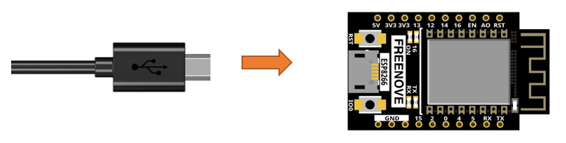
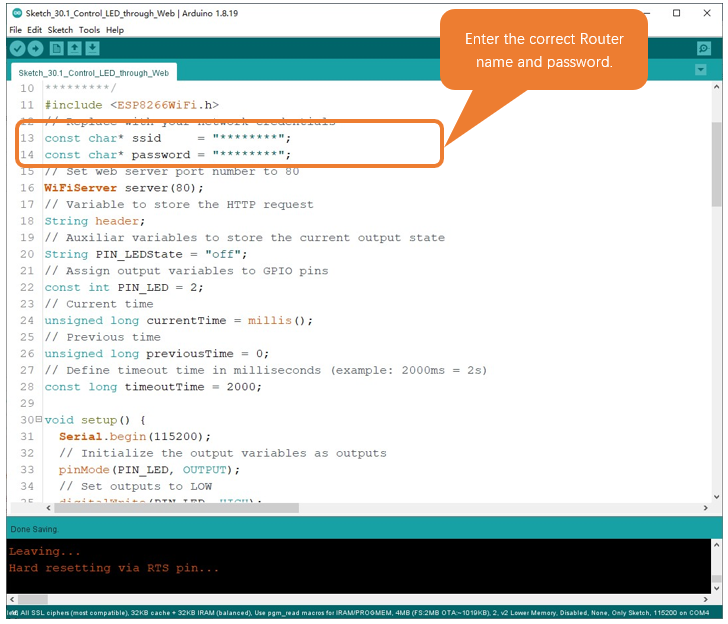

##############################################################################
Chapter Smart home
##############################################################################

In this chapter, we will use ESP8266 to make a simple smart home.We will learn how to control LED lights through web pages.

Project Control_LED_through_Web
*******************************************

In this project, we need to build a Web Service and then use ESP8266 to control the LED through the Web browser of the phone or PC.Through this example, you can remotely control the appliances in your home to achieve smart home.

Component List
===========================

.. list-table:: 
   :width: 100%
   :align: center

   * -  ESP8266 x1
     -  USB cable
   
   * -  |Chapter00_00|
     -  |Chapter00_01| 

.. |Chapter00_00| image:: ../_static/imgs/0_LED/Chapter00_00.png
.. |Chapter00_01| image:: ../_static/imgs/0_LED/Chapter00_01.png

Component knowledge
==============================

HTML
---------------------------

HyperText Markup Language (HTML) is a standard Markup Language for creating web pages.It includes a set of tags that unify documents on the network and connect disparate Internet resources into a logical whole.HTML text is descriptive text composed of HTML commands that describe text, graphics, animations, sounds, tables, links, etc.The extension of the HTML file is HTM or HTML.Hyper Text is a way to organize information.It uses hyperlinks to associate words and charts in Text with other information media.These related information media may be in the same Text, other files, or files located on a remote computer.This way of organizing information connects the information resources distributed in different places, which is convenient for people to search and retrieve information.

The nature of the Web is hypertext Markup Language (HTML), which can be combined with other Web technologies (e.g., scripting languages, common gateway interfaces, components, etc.) to create powerful Web pages. Thus, HYPERtext Markup Language (HTML) is the foundation of World Wide Web (Web) programming, that is, the World Wide Web is based on hypertext.   Hypertext Markup Language is called hypertext Markup language because the text contains so-called "hyperlink" points.

You can build your own WEB site using HTML, which runs on the browser and is parsed by the browser.

Example analysis is shown in the figure below:

**<!DOCTYPE html>:** Declare it as an HTML5 document

**<html>:** Is the root element of an HTML page

**<head>:** Contains meta data for the document, such as &lt; meta charset="utf-8"&gt; Define the web page encoding format to UTF-8.

**<title>:** Notesthe title of the document

**<body>:** Contains visible page content

**<h1>:** Define a big heading

**
:** Define a paragraph

For more information, please visit: https://developer.mozilla.org/en-US/docs/Web/HTML

Circuit
============================

Connect Freenove ESP8266 to the computer using USB cable.

Sketch
===========================

Sketch_Control_LED_through_Web
---------------------------------------

Download the code to ESP8266, open the serial port monitor, set the baud rate to 115200 and you can use it to measure the distance between the ultrasonic module and the object. As shown in the following figure: 

When ESP8266 successfully connects to "ssid_Router", serial monitor will print out the IP address assigned to ESP8266 by the router. Access http://192.168.1.49 in a computer browser on the LAN. As shown in the following figure:

You can click the corresponding button to control the LED on and off.

The following is the program code:

.. literalinclude:: ../../../freenove_Kit/C/Sketches/Sketch_30.1_Control_LED_through_Web/Sketch_30.1_Control_LED_through_Web.ino
    :linenos: 
    :language: c
    :lines: 1-115
    :dedent:

Include the WiFi Library header file of ESP8266.

.. literalinclude:: ../../../freenove_Kit/C/Sketches/Sketch_30.1_Control_LED_through_Web/Sketch_30.1_Control_LED_through_Web.ino
    :linenos: 
    :language: c
    :lines: 7-7
    :dedent:

Enter correct router name and password.

.. literalinclude:: ../../../freenove_Kit/C/Sketches/Sketch_30.1_Control_LED_through_Web/Sketch_30.1_Control_LED_through_Web.ino
    :linenos: 
    :language: c
    :lines: 9-10
    :dedent:

Set ESP8266 in Station mode and connect it to your router.

.. literalinclude:: ../../../freenove_Kit/C/Sketches/Sketch_30.1_Control_LED_through_Web/Sketch_30.1_Control_LED_through_Web.ino
    :linenos: 
    :language: c
    :lines: 35-35
    :dedent:

Check whether ESP8266 has connected to router successfully every 0.5s.

.. literalinclude:: ../../../freenove_Kit/C/Sketches/Sketch_30.1_Control_LED_through_Web/Sketch_30.1_Control_LED_through_Web.ino
    :linenos: 
    :language: c
    :lines: 36-39
    :dedent:

Serial monitor prints out the IP address assigned to ESP8266.

.. literalinclude:: ../../../freenove_Kit/C/Sketches/Sketch_30.1_Control_LED_through_Web/Sketch_30.1_Control_LED_through_Web.ino
    :linenos: 
    :language: c
    :lines: 44-44
    :dedent:

Click the button on the web page to control the LED light on and off.

.. literalinclude:: ../../../freenove_Kit/C/Sketches/Sketch_30.1_Control_LED_through_Web/Sketch_30.1_Control_LED_through_Web.ino
    :linenos: 
    :language: c
    :lines: 71-79
    :dedent: