##############################################################################
Chapter Play music
##############################################################################

In this chapter, we use ESP8266 to output audio signals and play music through ESP8266. Direct audio output through the speaker, this will have significant distortion.

Project Play_music
********************************

In this project, we use ESP8266 to play local music. When we press the button, the music plays again after a certain amount of time.

Component List
=========================

+---------------------+--------------------------------------+
| ESP8266 x1          | Micro USB Wire x1                    |
|                     |                                      |
| |Chapter00_00|      | |Chapter00_01|                       |
+---------------------+--------------------------------------+
| Jumper wire M/M x13 | Speaker*1                            |
|                     |                                      |
| |Chapter31_00|      | |Chapter31_01|                       |
+---------------------+-------------------+------------------+
| NPN transistorx1    | Push button x1    | Diode x1         |
|                     |                   |                  |
| (S8050)             |                   |                  |
|                     |                   |                  |
| |Chapter31_02|      | |Chapter31_03|    | |Chapter31_04|   |
+---------------------+-------------------+------------------+
| Resistor 1kΩ x1     | Resistor 10kΩx2   | Capacitor 10ufx1 |
|                     |                   |                  |
| |Chapter31_05|      | |Chapter31_06|    | |Chapter31_07|   |
+---------------------+-------------------+------------------+

.. |Chapter00_00| image:: ../_static/imgs/0_LED/Chapter00_00.png
.. |Chapter00_01| image:: ../_static/imgs/0_LED/Chapter00_01.png

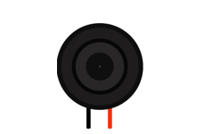
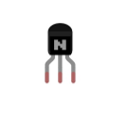
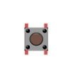
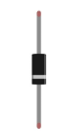
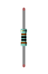
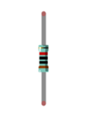
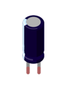
 
Circuit
========================

:red:`In this section, you need to perform operations in the following sequence: Upload audio data in the first step, upload code in the second step, disconnect the power supply in the third step, connect hardware in the fourth step as follows, and connect power supply in the fifth step.  Make sure you do this in order to avoid permanent damage to your hardware.`

.. list-table:: 
   :width: 100%
   :align: center

   * -  Schematic diagram
   * -  |Chapter31_08|
   * -  Hardware connection. 
    
        If you need any support, please feel free to contact us via: support@freenove.com
   
   * -  |Chapter31_09|

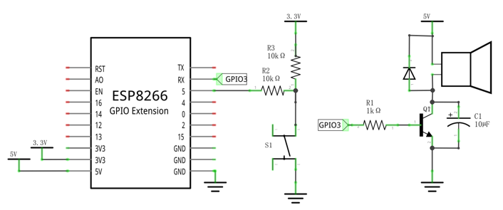
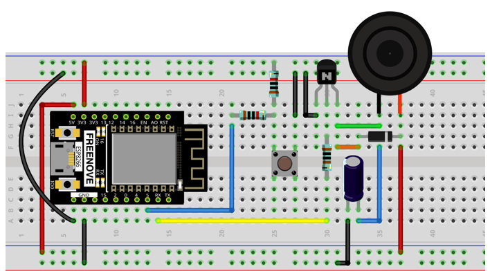

Sketch
========================

How to install the library
----------------------------------

This code is used to play music.We use the third-party library ESP8266Audio.If you haven't already installed it, install it now.The steps to add third-party libraries are as follows:The first way,Open Arduino ->Sketch->Include library -> Manage library.Type ESP8266Audio in the search bar and select ESP8266Audio to install.

Refer to the following operations:

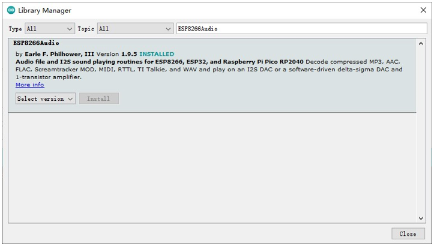

The second way, open Arduino IDE, click Sketch -> Include Library -> Add .ZIP Library, In the pop-up window, find the file named "./Libraries/ESP8266Audio.Zip" which locates in this directory, and click OPEN.

Install the Arduino IDE plug-in Arduino-ESP8266Fs-Plugin
----------------------------------------------------------------

In this tutorial, find a folder named "./Sketches/ Sketch_31.1_play_music/tools" under that directory and copy that folder into the Arduino IDE environment directory.

The details are as follows:

First, open the software platform arduino, and then click File in Menus and select Preferences.

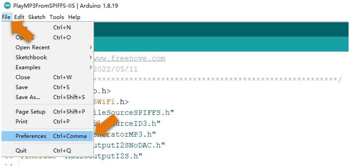

Find the Arduino IDE environment directory location.

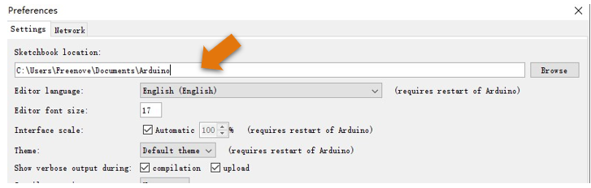

Copy "tools" folder to this directory. 

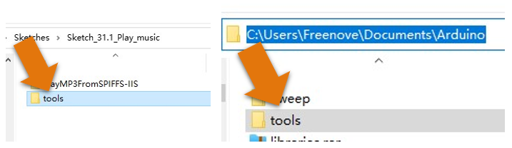

Finally, restart the Arduino IED

Upload music
------------------------

Before uploading the music file, in the path ". /Sketches/Sketch_31.1_Play_music/PlayMP3/data" folder, save the music file that needs to be uploaded and make sure the file content is not empty.

If you do not have a" data" folder, you need to create a" data" folder and put MP3 or WAV files in the "data" folder. In addition, the audio file size cannot exceed the selected FlashSize. 

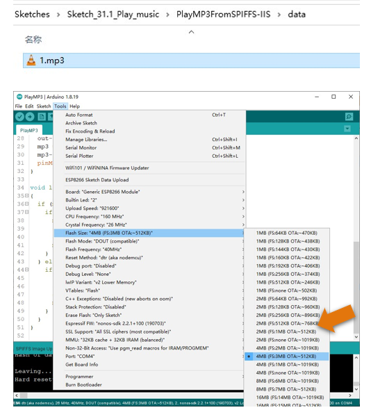

ESP8266's CPU frequency is set to 160MHZ. 

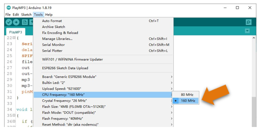

Because the file size is large, set the upload speed to 921600.

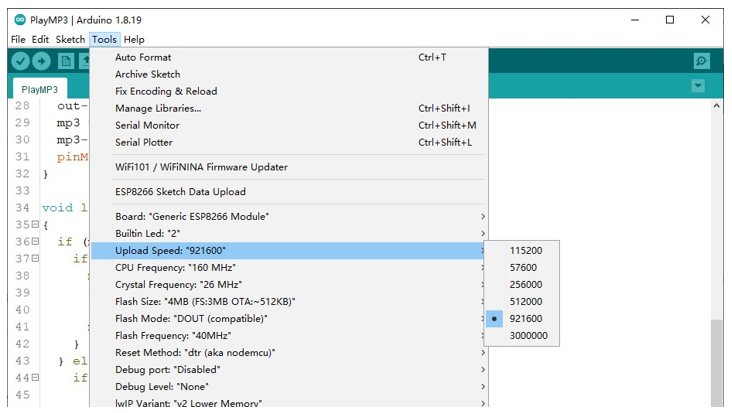

Open the Arduino software platform, click Tools in Menu, and choose ESP8266 Sketch Data Upload. If this tool does not appear, you can restart the Arduino IDE and try again.

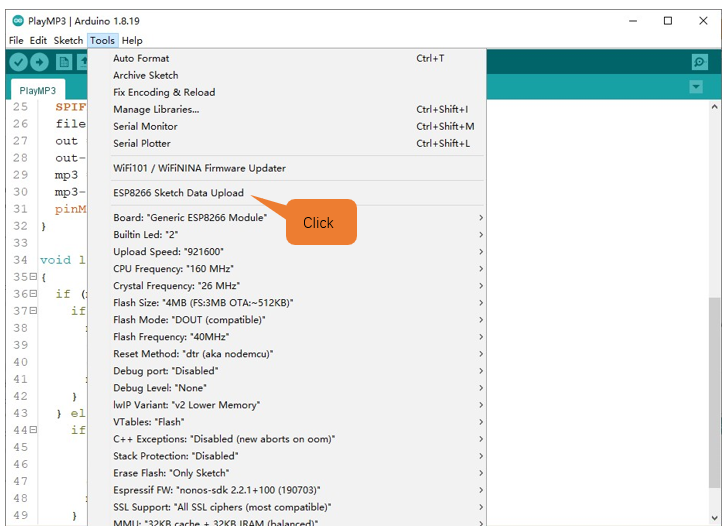

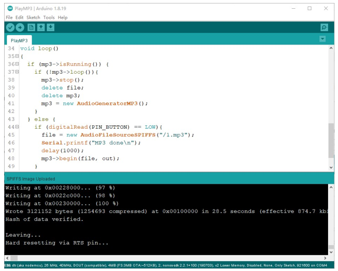

After uploading, upload the code to the ESP8266 development. 

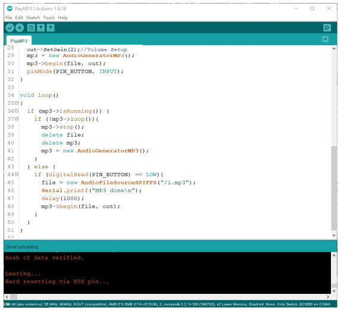

Upload following sketch:

**Freenove_Ultimate_Starter_Kit_for_ESP8266\\C\\Sketch_31.1_Play_music\\PlayMP3**

Sketch_Play_music
-------------------------------

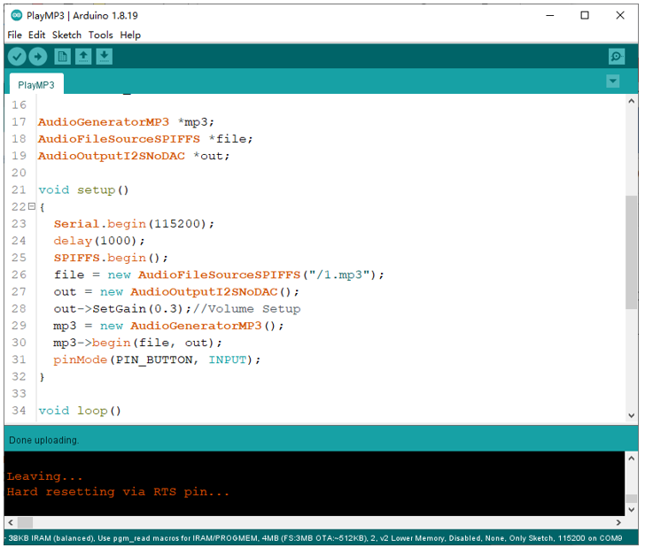

After uploading the code, wait a moment and you will hear the music playing.Press the button and play the music again.

If no music is played, check whether the hardware circuit is properly connected.If the circuit is properly connected, check that the audio file has been uploaded and that the audio name matches the name in the code.

The following is the program code:

.. literalinclude:: ../../../freenove_Kit/C/Sketches/Sketch_31.1_Play_music/PlayMP3/PlayMP3.ino
    :linenos: 
    :language: c
    :lines: 1-51
    :dedent:

Check whether the file has finished playing in the main loop function.

.. code-block:: c

    if (mp3->isRunning()) { 
        if (!mp3->loop()){    
        mp3->stop();      
        delete file;
        delete mp3;
        mp3 = new AudioGeneratorMP3();
        }
    }

Play the music again after the button is pressed. 

.. literalinclude:: ../../../freenove_Kit/C/Sketches/Sketch_31.1_Play_music/PlayMP3/PlayMP3.ino
    :linenos: 
    :language: c
    :lines: 44-49
    :dedent:

It is important to note that the name of the uploaded audio file should correspond to the name on the code, changing the name to "1.mp3" in this tutorial. If you upload an audio file with a different name, please change the name in the code.Otherwise, ESP8266 will not play the music.

.. code-block:: c

    audioLogger = &Serial;
    file = new AudioFileSourceSPIFFS("/1.mp3");
    id3 = new AudioFileSourceID3(file);