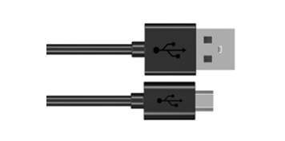
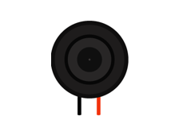

##############################################################################
Chapter Play music with audio decoder
##############################################################################

In the previous section, we used the ESP8266 to output the audio signal, obviously with some distortion in the sound quality.In this section, you will enjoy higher quality music with the help of the ES7148 chip.

Project Play_music_with_audio_decoder
**************************************************

In this project,we will use ES7148 chip to transcode and output audio data.

Component List
============================

+-----------------------------+-------------------+
| ESP8266 x1                  | Micro USB Wire x1 |
|                             |                   |
|  |Chapter00_00|             | |Chapter00_01|    |
+-----------------------------+-------------------+
| Audio Converter & Amplifier | Speaker*1         |
|                             |                   |
|  |Chapter32_00|             | |Chapter31_01|    |
+-----------------------------+-------------------+
| Jumper wire F/M x5                              |
|                                                 |
| Jumper wire M/M x2                              |
|                                                 |
|  |Chapter32_01|                                 |
+-------------------------------------------------+

.. |Chapter00_00| image:: ../_static/imgs/0_LED/Chapter00_00.png

Component knowledge
===========================

The front view of Audio Converter & Amplifier module.

.. list-table:: 
   :width: 100%
   :align: center

   * -  front view
     -  schematic diagram

   * -  |Chapter32_02|
     -  |Chapter32_03|   

Interface description for Audio Converter & Amplifier module

+-----+------+-------------------------------------+
| Pin | Name | Introductions                       |
+-----+------+-------------------------------------+
| 1   | SCK  | System clock input                  |
+-----+------+-------------------------------------+
| 2   | BCK  | Audio data bit clock input          |
+-----+------+-------------------------------------+
| 3   | DIN  | Audio data input                    |
+-----+------+-------------------------------------+
| 4   | LCK  | Audio data word clock input         |
+-----+------+-------------------------------------+
| 5   | VCC  | Power input, 3.3V~5.0V              |
+-----+------+-------------------------------------+
| 6   | GND  | Power Ground                        |
+-----+------+-------------------------------------+
| 7   | L    | External audio left channel input   |
+-----+------+-------------------------------------+
| 8   | G    | Power Ground                        |
+-----+------+-------------------------------------+
| 9   | R    | External audio right channel input  |
+-----+------+-------------------------------------+
| 10  | G    | Power Ground                        |
+-----+------+-------------------------------------+
| 11  | R+   | Positive pole of right channel horn |
+-----+------+-------------------------------------+
| 12  | R-   | Negative pole of right channel horn |
+-----+------+-------------------------------------+
| 13  | L+   | Positive pole of left channel horn  |
+-----+------+-------------------------------------+
| 14  | L-   | Negative pole of left channel horn  |
+-----+------+-------------------------------------+

Speaker interface: Connect left channel speaker and right channel speaker. Group L: L+ & L-; Group R: R+& R-. The two interfaces of the speaker can be connected to the interfaces of group L or group R. But when one interface is connected to group L, the other cannot be connected to group R. Doing so may cause the module to malfunction.

Headphone interface: the interface to connect the headphones.

I2S input interface: connect to the device with I2S. Used to transcode audio data into DAC audio signals.

External audio input interface: connect to external audio equipment. Used to amplify externally input audio signals.

Power interface: connect to external power supply. External power supply selection range: 3.3V-5.0V.

Circuit
=======================

:red:`In this section, you need to perform operations in the following sequence: Upload audio data in the first step, upload code in the second step, disconnect the power supply in the third step, connect hardware in the fourth step as follows, and connect power supply in the fifth step.  Make sure you do this in order to avoid permanent damage to your hardware.`

.. list-table:: 
   :width: 100%
   :align: center

   * -  Schematic diagram
   * -  |Chapter32_05|
   * -  Hardware connection. 
    
        If you need any support, please feel free to contact us via: support@freenove.com
   
   * -  |Chapter32_06|

Sketch
====================

How to install the library
----------------------------------

This code is used to play music.We use the third-party library ESP8266Audio.If you haven't already installed it, install it now.The steps to add third-party libraries are as follows:The first way,Open Arduino ->Sketch->Include library -> Manage library.Type ESP8266Audio in the search bar and select ESP8266Audio to install.

Refer to the following operations:

The second way, open Arduino IDE, click Sketch -> Include Library -> Add .ZIP Library, In the pop-up window, find the file named "./Libraries/ESP8266Audio.Zip" which locates in this directory, and click OPEN.

Install the Arduino IDE plug-in Arduino-ESP8266Fs-Plugin

In this tutorial, find a folder named "./Sketches/ Sketch_31.1_play_music/tools" under that directory and copy that folder into the Arduino IDE environment directory.

The details are as follows:

First, open the software platform arduino, and then click File in Menus and select Preferences.

Find the Arduino IDE environment directory location.

Copy "tools" folder to this directory. 

Finally, restart the Arduino IED

Upload music
----------------------

Before uploading the music file, in the path ". /Sketches/ Sketch_31.1_play_music/ playmp3fromSpiffs-IIS \data" folder, save the music file that needs to be uploaded and make sure the file content is not empty.

If you do not have a" data" folder, you need to create a" data" folder and put MP3 or WAV files in the "data" folder. In addition, the audio file size cannot exceed the selected FlashSize. 

ESP8266's CPU frequency is set to 160MHZ. 

Because the file size is large, set the upload speed to 921600.

Open the Arduino software platform, click Tools in Menu, and choose ESP8266 Sketch Data Upload. If this tool does not appear, you can restart the Arduino IDE and try again.

After uploading, upload the code to the ESP8266 development.

Upload following sketch:

**Freenove_Ultimate_Starter_Kit_for_ESP8266\\C\\Sketch_32.1_Play_music_with_audio_decoder**

**\\PlayMP3FromSPIFFS-IIS**

Sketch_Play_music_with_audio_decoder
----------------------------------------------

After uploading the code, wait a moment and you will hear the music playing. 

If no music is played, check whether the hardware circuit is properly connected.If the circuit is properly connected, check that the audio file has been uploaded and that the audio name matches the name in the code.

The following is the program code:

.. literalinclude:: ../../../freenove_Kit/C/Sketches/Sketch_32.1_Play_music_with_audio_decoder/PlayMP3FromSPIFFS-IIS/PlayMP3FromSPIFFS-IIS.ino
    :linenos: 
    :language: c
    :lines: 1-76
    :dedent:

Check whether the file has finished playing in the main loop function.

.. literalinclude:: ../../../freenove_Kit/C/Sketches/Sketch_32.1_Play_music_with_audio_decoder/PlayMP3FromSPIFFS-IIS/PlayMP3FromSPIFFS-IIS.ino
    :linenos: 
    :language: c
    :lines: 68-76
    :dedent:

It is important to note that the name of the uploaded audio file should correspond to the name on the code, changing the name to "1.mp3" in this tutorial. If you upload an audio file with a different name, please change the name in the code.Otherwise, ESP8266 will not play the music.

.. literalinclude:: ../../../freenove_Kit/C/Sketches/Sketch_32.1_Play_music_with_audio_decoder/PlayMP3FromSPIFFS-IIS/PlayMP3FromSPIFFS-IIS.ino
    :linenos: 
    :language: c
    :lines: 57-59
    :dedent: