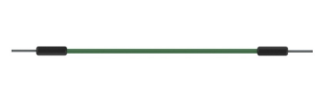
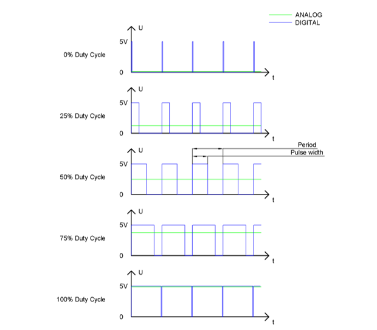
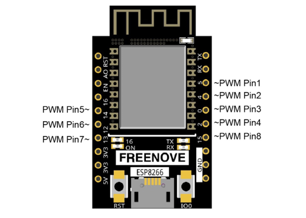
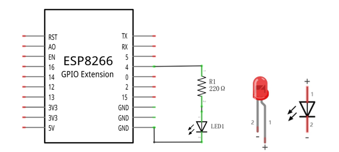
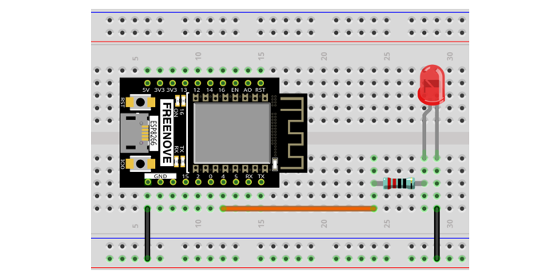

##############################################################################
Chapter Analog & PWM
##############################################################################

In previous study, we have known that one button has two states: pressed and released, and LED has light-on/off state, then how to enter a middle state? How to output an intermediate state to let LED "semi bright"?  That's what we're going to learn.

First, let's learn how to control the brightness of a LED.

Project Breathing LED
************************************

Breathing light, that is, LED is turned from off to on gradually, and gradually from on to off, just like "breathing". So, how to control the brightness of a LED?  We will use PWM to achieve this target.

Component List
==================================

+-------------------------+------------------------------+
| ESP8266 x1              | USB cable                    |
|                         |                              |
| |Chapter01_00|          | |Chapter01_01|               |
+-------------------------+------------------------------+
| Breadboard x1                                          |
|                                                        |
| |Chapter01_02|                                         |
+----------------+------------------+--------------------+
| LED x1         | Resistor 220Ω x1 | Jumper wire M/M x3 |
|                |                  |                    |
| |Chapter01_03| | |Chapter01_04|   | |Chapter01_05|     |
+----------------+------------------+--------------------+

.. |Chapter01_00| image:: ../_static/imgs/1_LED/Chapter01_00.png
.. |Chapter01_01| image:: ../_static/imgs/1_LED/Chapter01_01.png
.. |Chapter01_02| image:: ../_static/imgs/1_LED/Chapter01_02.png
.. |Chapter01_03| image:: ../_static/imgs/1_LED/Chapter01_03.png
.. |Chapter01_04| image:: ../_static/imgs/1_LED/Chapter01_04.png

Related knowledge
=============================

Analog & Digital
-------------------------

An analog signal is a continuous signal in both time and value. On the contrary, a digital signal or discrete-time signal is a time series consisting of a sequence of quantities. Most signals in life are analog signals. A familiar example of an analog signal would be how the temperature throughout the day is continuously changing and could not suddenly change instantaneously from 0℃ to 10℃. However, digital signals can instantaneously change in value. This change is expressed in numbers as 1 and 0 (the basis of binary code). 

Their differences can more easily be seen when compared when graphed as below.

.. image:: ../_static/imgs/4_Analog_&_PWM/Chapter04_00.png
    :align: center

In practical application, we often use binary as the digital signal, that is a series of 0’s and 1’s. Since a binary signal only has two values (0 or 1), it has great stability and reliability. Lastly, both analog and digital signals can be converted into the other.

PWM
--------------------------------------------

PWM, Pulse-Width Modulation, is a very effective method for using digital signals to control analog circuits. Common processors cannot directly output analog signals. PWM technology makes it very convenient to achieve this conversion (translation of digital to analog signals)

PWM technology uses digital pins to send certain frequencies of square waves, that is, the output of high levels and low levels, which alternately last for a while. The total time for each set of high levels and low levels is generally fixed, which is called the period (Note: the reciprocal of the period is frequency). The time of high level outputs are generally called "pulse width", and the duty cycle is the percentage of the ratio of pulse duration, or pulse width (PW) to the total period (T) of the waveform.

The longer the outputs of high levels last, the longer the duty cycle and the higher the corresponding voltage in the analog signal will be. The following figures show how the analog signal voltages vary between 0V-5V (high level is 5V) corresponding to the pulse width 0%-100%:

ESP8266 and PWM 
------------------------------------

The ESP8266 PWM controller has 8 independent channels, each of which can independently control frequency, duty cycle, and even accuracy. Unlike traditional PWM pins, the PWM output pins of ESP8266 are configurable and they can be configured to PWM.

The ESP8266 supports PWM pins as follows:

The longer the PWM duty cycle is, the higher the output power will be. Now that we understand this

relationship, we can use PWM to control the brightness of an LED or the speed of DC motor and so on.

Circuit
===========================

This circuit is the same as the one in engineering Blink.

.. list-table:: 
   :width: 100%
   :align: center

   * -  Schematic diagram
   * -  |Chapter04_03|
   * -  Hardware connection 
     
        If you need any support, please feel free to contact us via: support@freenove.com

   * -  |Chapter04_04|

Sketch
============================

This project is designed to make PWM output GPIO4 with pulse width increasing from 0% to 100%, and then reducing from 100% to 0% gradually.

Upload following sketch:

**Freenove_Ultimate_Starter_Kit_for_ESP8266\C\Sketches\Sketch_04.1_BreathingLight**

Sketch_BreathingLight
------------------------------

Download the code to ESP8266, and you'll see that LED is turned from on to off and then from off to on gradually like breathing.

The following is the program code:

.. literalinclude:: ../../../freenove_Kit/C/Sketches/Sketch_04.1_BreathingLight/Sketch_04.1_BreathingLight.ino
    :linenos: 
    :language: c
    :lines: 1-27
    :dedent:

In the loop(), There are two "for" loops. The first makes the ledPin output PWM from 0% to 100% and the second makes the ledPin output PWM from 100% to 0%. This allows the LED to gradually light and extinguish.

.. literalinclude:: ../../../freenove_Kit/C/Sketches/Sketch_04.1_BreathingLight/Sketch_04.1_BreathingLight.ino
    :linenos: 
    :language: c
    :lines: 19-26
    :dedent:

You can also adjust the rate of the state change of LED by changing the parameters of the delay() function in the "for" loop.

Reference
-----------------------

.. py:function:: analogWrite(pin, value);	
    
    Arduino IDE provides the function, analogWrite(pin, value), which can make ports directly output PWM waves.
    
    In the function called analogWrite(pin, value), the parameter "pin" specifies the port used to output PWM wave.In ESP8266,The range of value is 0-1023, which represents the duty cycle of 0%-100%.
    
    In order to use this function, we need to set the port to output mode.

.. py:function:: map(value, fromLow, fromHigh, toLow, toHigh)	
    
    This function is used to remap a value, which will return a new value whose percentage in the range of toLow-toHigh is equal to the percentage of "value" in the range of fromLow-fromHigh. 
    
    For example, 1 is the maximum in the range of 0-1 and the maximum value in the scope of 0-2 is 2, that is, the result value of map (1, 0, 1, 0, 2) is 2.
    
For more related functions, please refer to https://www.arduino.cc/reference/en/

Project Meteor Flowing Light
*************************************

After learning about PWM, we can use it to control LED bar graph and realize a cooler flowing light.

The component list, circuit, and hardware are exactly consistent with the project Flowing Light.

Circuit
==============================

.. list-table:: 
   :width: 100%
   :align: center

   * -  Schematic diagram
   * -  |Chapter04_07|
   * -  Hardware connection 
     
        If you need any support, please feel free to contact us via: support@freenove.com

   * -  |Chapter04_08|

:red:`If LED bar does not work, try to rotate it for 180°. The label is random.`

Sketch
==============================

Meteor flowing light will be implemented with PWM.

Upload following sketch:

**Freenove_Ultimate_Starter_Kit_for_ESP8266\C\Sketches\Sketch_04.2_FlowingLight2**

Sketch_FlowingLight2
---------------------------------

Download the code to ESP8266, and LED bar graph will gradually light up and out from left to right, then light up and out from right to left.

The following is the program code: 

.. literalinclude:: ../../../freenove_Kit/C/Sketches/Sketch_04.2_FlowingLight2/Sketch_04.2_FlowingLight2.ino
    :linenos: 
    :language: c
    :lines: 1-28
    :dedent:

Defined 10 GPIO and 30 pulse width values.

.. literalinclude:: ../../../freenove_Kit/C/Sketches/Sketch_04.2_FlowingLight2/Sketch_04.2_FlowingLight2.ino
    :linenos: 
    :language: c
    :lines: 7-11
    :dedent:

In loop(), a nested for loop is used to control the pulse width of the PWM, and LED bar graph moves one grid after each 1 is added in the first for loop, gradually changing according to the values in the array duties. As shown in the table below, the value of the second row is the value in the array duties, and the 10 green squares in each row below represent the 10 LEDs on the LED bar graph. Every 1 is added to I, the value of the LED bar graph will move to the right by one grid, and when it reaches the end, it will move from the end to the starting point, achieving the desired effect.

In the code, two nested for loops are used to achieve this effect.

.. literalinclude:: ../../../freenove_Kit/C/Sketches/Sketch_04.2_FlowingLight2/Sketch_04.2_FlowingLight2.ino
    :linenos: 
    :language: c
    :lines: 19-30
    :dedent: