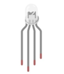
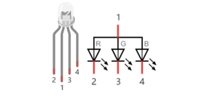
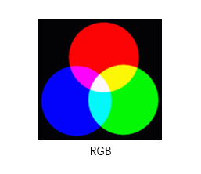
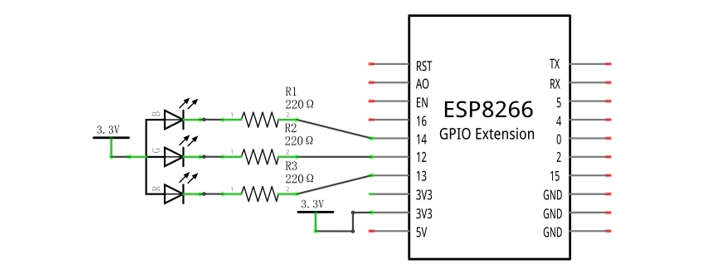
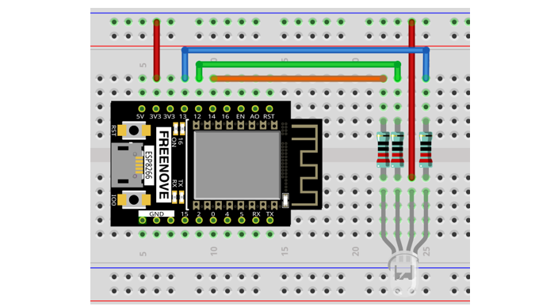
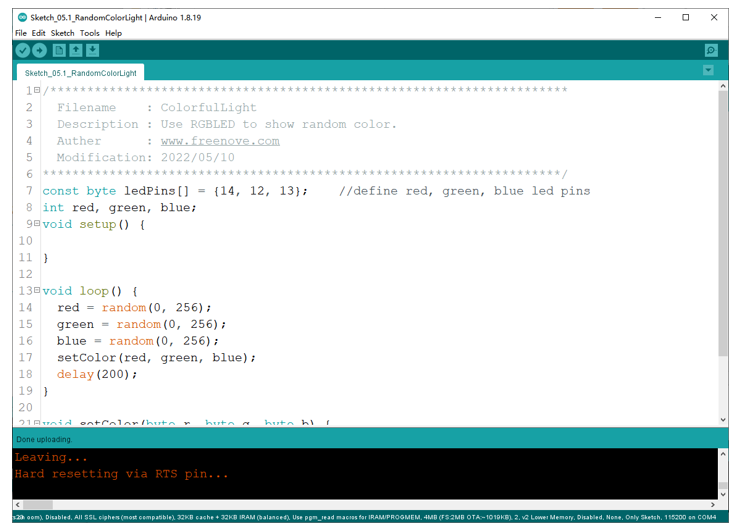
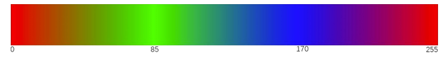
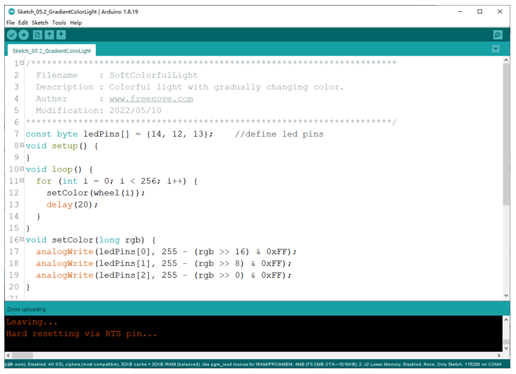

##############################################################################
Chapter RGB LED
##############################################################################

In this chapter, we will learn how to control a RGB LED. It can emit different colors of light. Next, we will use RGB LED to make a multicolored light.

Project Random Color Light
***********************************

In this project, we will make a multicolored LED. And we can control RGB LED to switch different colors automatically.

Component List
=========================

+-------------------------+------------------------------+
| ESP8266 x1              | USB cable                    |
|                         |                              |
| |Chapter01_00|          | |Chapter01_01|               |
+-------------------------+------------------------------+
| Breadboard x1                                          |
|                                                        |
| |Chapter01_02|                                         |
+----------------+------------------+--------------------+
| RGBLED x1      | Resistor 220Ω x3 | Jumper wire M/M x5 |
|                |                  |                    |
| |Chapter05_00| | |Chapter01_04|   | |Chapter01_05|     |
+----------------+------------------+--------------------+

.. |Chapter01_00| image:: ../_static/imgs/1_LED/Chapter01_00.png
.. |Chapter01_01| image:: ../_static/imgs/1_LED/Chapter01_01.png
.. |Chapter01_02| image:: ../_static/imgs/1_LED/Chapter01_02.png

.. |Chapter01_04| image:: ../_static/imgs/1_LED/Chapter01_04.png
.. |Chapter01_05| image:: ../_static/imgs/1_LED/Chapter01_05.png

Related knowledge
======================

RGB LED has integrated 3 LEDs that can respectively emit red, green and blue light. And it has 4 pins. The long pin (1) is the common port, that is, 3 LED 's positive or negative port. The RGB LED with common positive port and its symbol is shown below. We can make RGB LED emit various colors of light by controlling these 3 LEDs to emit light with different brightness.

Red, green, and blue are known as three primary colors. When you combine these three primary-color lights with different brightness, it can produce almost all kinds of visible lights. Computer screens, single pixel of cell phone screen, neon, and etc. are working under this principle.

If we use three 8-bit PWMs to control the RGB LED, in theory, we can create 28*28*28=16777216 (16 million) colors through different combinations.

Circuit
===========================

This circuit is the same as the one in engineering Blink.

.. list-table:: 
   :width: 100%
   :align: center

   * -  Schematic diagram
   * -  |Chapter05_03|
   * -  Hardware connection 
     
        If you need any support, please feel free to contact us via: support@freenove.com

   * -  |Chapter05_04|

Sketch
============================

We need to create three PWM channels and use random duty cycle to make random RGB LED color.

Upload following sketch:

**Freenove_Ultimate_Starter_Kit_for_ESP8266\\C\\Sketch_05.1_ColorfulLight**

Sketch_ColorfulLight
-----------------------------

With the code downloaded to ESP8266, RGB LED begins to display random colors.

:red:`If you have any concerns, please contact us via:` support@freenove.com

The following is the program code:

.. literalinclude:: ../../../freenove_Kit/C/Sketches/Sketch_05.1_RandomColorLight/Sketch_05.1_RandomColorLight.ino
    :linenos: 
    :language: c
    :lines: 1-24
    :dedent:

Define RGB LED pins

.. literalinclude:: ../../../freenove_Kit/C/Sketches/Sketch_05.1_RandomColorLight/Sketch_05.1_RandomColorLight.ino
    :linenos: 
    :language: c
    :lines: 7-7
    :dedent:

In setColor(), this function controls the output color of RGB LED by the given color value. Because the circuit uses a common anode, the LED lights up when the GPIO outputs low power. Therefore, in PWM, low level is the active level, so 255 minus the given value is necessary.

.. literalinclude:: ../../../freenove_Kit/C/Sketches/Sketch_05.1_RandomColorLight/Sketch_05.1_RandomColorLight.ino
    :linenos: 
    :language: c
    :lines: 20-24
    :dedent:

In loop(), get three random Numbers and set them as color values.

.. literalinclude:: ../../../freenove_Kit/C/Sketches/Sketch_05.1_RandomColorLight/Sketch_05.1_RandomColorLight.ino
    :linenos: 
    :language: c
    :lines: 13-17
    :dedent:

The related function of software PWM can be described as follows:

.. py:function:: long random(min, max);	

    This function will return a random number(min --- max-1).

Project Gradient Color Light
*****************************************

In the previous project, we have mastered the usage of RGB LED, but the random display of colors is rather stiff. This project will realize a fashionable light with soft color changes.

Component list and the circuit are exactly the same as the random color light.

Using a color model, the color changes from 0 to 255 as shown below.  

In this code, the color model will be implemented and RGB LED will change colors along the model.

Sketch
================================

Upload following sketch:

**Freenove_Ultimate_Starter_Kit_for_ESP8266\\C\\Sketch_05.2_SoftColorfulLight**

Sketch_SoftColorfulLight
------------------------------------

With the code downloaded to ESP8266, RGB LED begins to display random colors.

:red:`If you have any concerns, please contact us via: support@freenove.com`

The following is the program code:

.. literalinclude:: ../../../freenove_Kit/C/Sketches/Sketch_05.2_GradientColorLight/Sketch_05.2_GradientColorLight.ino
    :linenos: 
    :language: c
    :lines: 1-33
    :dedent:

In setColor(), a variable represents the value of RGB, and a hexadecimal representation of color is a common representation, such as 0xAABBCC, where AA represents the red value, BB represents the green value, and CC represents the blue value. The use of a variable can make the transmission of parameters more convenient, in the split, only a simple operation can take out the value of each color channel

.. literalinclude:: ../../../freenove_Kit/C/Sketches/Sketch_05.2_GradientColorLight/Sketch_05.2_GradientColorLight.ino
    :linenos: 
    :language: c
    :lines: 16-20
    :dedent:

In setColor(), a variable represents the value of RGB, and a hexadecimal representation of color is a common representation, such as 0xAABBCC, where AA represents the red value, BB represents the green value, and CC represents the blue value. The use of a variable can make the transmission of parameters more convenient, in the split, only a simple operation can take out the value of each color channel