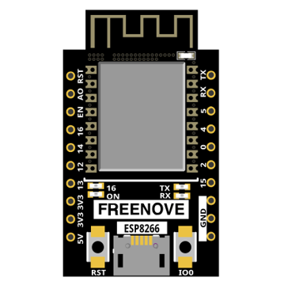
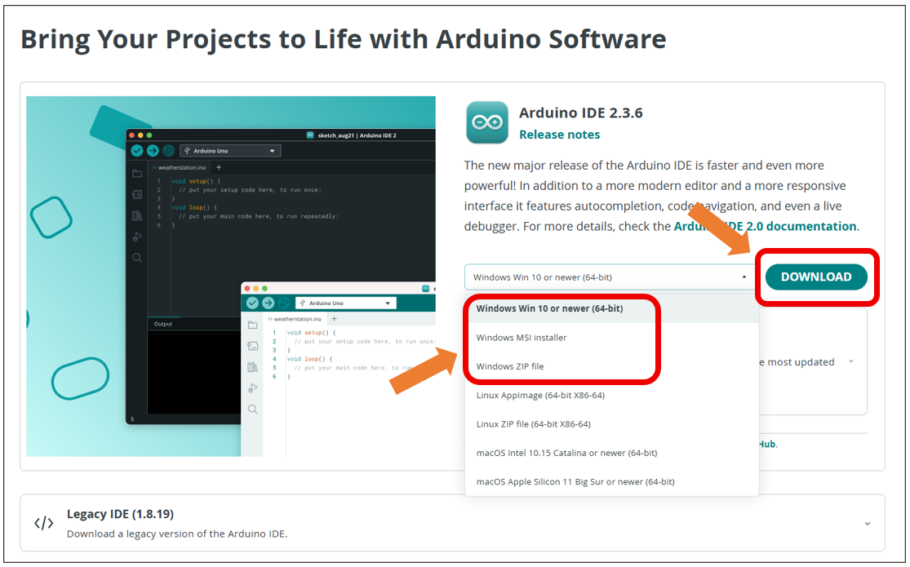
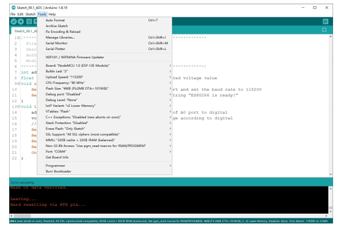

##############################################################################
Preface
##############################################################################

ESP8266 is a micro control unit with integrated Wi-Fi launched by Espressif, which features strong properties and integrates rich peripherals. It can be designed and studied as an ordinary Single Chip Micyoco(SCM) chip, or connected to the Internet and used as an Internet of Things device.

ESP8266 can be developed using the Arduino platform, which will definitely make it easier for people who have learned arduino to master. Moreover, the code of ESP8266 is completely open-source, so beginners can quickly learn how to develop and design IOT smart household products including smart curtains, fans, lamps and clocks.

Generally, ESP8266 projects consist of code and circuits. Don't worry even if you've never learned code and circuits, because we will gradually introduce the basic knowledge of C programming language and electronic circuits, from easy to difficult. Our products contain all the electronic components and modules needed to complete these projects. It's especially suitable for beginners.

We divide each project into four parts, namely Component List, Component Knowledge, Circuit and Code. Component List helps you to prepare material for the experiment more quickly. Component Knowledge allows you to quickly understand new electronic modules or components, while Circuit helps you understand the operating principle of the circuit. And Code allows you to easily master the use of ESP8266 and accessory kit. After finishing all the projects in this tutorial, you can also use these components and modules to make products such as smart household, smart cars and robots to transform your creative ideas into prototypes and new and innovative products.

In addition, if you have any difficulties or questions with this tutorial or toolkit, feel free to ask for our quick and free technical support through support@freenove.com 

ESP8266
**************************************

ESP8266 has PCB on-board antenna. The PCB on-board antenna is an integrated antenna in the chip module itself, so it is convenient to carry and design.

PCB on-board antenna

.. image:: ../_static/imgs/Preface/Preface00.png
    :align: center

In this tutorial, the ESP8266 development board is designed based on the PCB on-board antenna-packaged ESP8266 module. The following tutorials will be based on the ESP8266 development board.

ESP8266 development board

The hardware interfaces of ESP8266 are distributed as follows:

.. image:: ../_static/imgs/Preface/Preface02.png
    :align: center

Compare the left and right images. We've boxed off the resources on the ESP8266 in different colors to facilitate your understanding of the ESP8266 development board.

.. list-table:: 
   :align: center
   :class: table-line
   :header-rows: 1

   * -  Box color 
     -  Corresponding resources introduction
   
   * -  |Preface03|
     -  **GPIO pin**
   
   * -  |Preface04|
     -  **LED indicator**
   
   * -  |Preface05|
     -  **Reset button, Boot mode selection button**
   
   * -  |Preface06|
     -  **USB port**

.. |Preface03| image:: ../_static/imgs/Preface/Preface03.png
.. |Preface04| image:: ../_static/imgs/Preface/Preface04.png

.. |Preface06| image:: ../_static/imgs/Preface/Preface06.png

.. table::
    :align: center
    :class: zebra
    
    +-----+----------+-----------------------------------------------------------------------+
    | NO. | Pin Name | Functional Description                                                |
    +=====+==========+=======================================================================+
    | 1   | RST      | Reset Pin, Active Low                                                 |
    +-----+----------+-----------------------------------------------------------------------+
    | 2   | ADC      | AD conversion, Input voltage range 0~3.3V, the value range is 0~1024. |
    +-----+----------+-----------------------------------------------------------------------+
    | 3   | EN       | Chip Enabled Pin, Active High                                         |
    +-----+----------+-----------------------------------------------------------------------+
    | 4   | IO16     | Connect with RST pin to wake up Deep Slee                             |
    +-----+----------+-----------------------------------------------------------------------+
    | 5   | IO14     | GPIO14; HSPI_CLK                                                      |
    +-----+----------+-----------------------------------------------------------------------+
    | 6   | IO12     | GPIO12; HSPI_MISO                                                     |
    +-----+----------+-----------------------------------------------------------------------+
    | 7   | IO13     | GPIO13; HSPI_MOSI; UART0_CTS                                          |
    +-----+----------+-----------------------------------------------------------------------+
    | 8   | VCC      | Module power supply pin, Voltage 3.0V ~ 3.6V                          |
    +-----+----------+-----------------------------------------------------------------------+
    | 9   | GND      | GND                                                                   |
    +-----+----------+-----------------------------------------------------------------------+
    | 10  | IO15     | GPIO15; MTDO; HSPICS; UART0                                           |
    +-----+----------+-----------------------------------------------------------------------+
    | 11  | IO2      | GPIO2; UART1_TXD                                                      |
    +-----+----------+-----------------------------------------------------------------------+
    | 12  | IO0      | GPIO0; UART1_RXD                                                      |
    +-----+----------+-----------------------------------------------------------------------+
    | 13  | IO4      | GPIO4                                                                 |
    +-----+----------+-----------------------------------------------------------------------+
    | 14  | IO5      | GPIO5;IR_R                                                            |
    +-----+----------+-----------------------------------------------------------------------+
    | 15  | RXD      | UART0_RXD; GPIO3                                                      |
    +-----+----------+-----------------------------------------------------------------------+
    | 16  | TXD      | UART0_TXD; GPIO1                                                      |
    +-----+----------+-----------------------------------------------------------------------+

Description of the ESP8266 series module boot mode:

.. table::
    :align: center
    :class: zebra
    
    +---------------+-----------+------+--------+-------+-------+------+
    | Mode          | CH_PD(EN) | RST  | GPIO15 | GPIO0 | GPIO2 | TXD0 |
    +===============+===========+======+========+=======+=======+======+
    | Download mode | high      | high | low    | low   | high  | high |
    +---------------+-----------+------+--------+-------+-------+------+
    | Running mode  | high      | high | low    | high  | high  | high |
    +---------------+-----------+------+--------+-------+-------+------+

Notes: Some of the pins inside the module have been pulled or pulled down.

For more information, please visit: 

If you want to learn more about this, you can read the following files:

" **Freenove_Ultimate_Starter_Kit_for_ESP8266/Datasheet/esp-12s_datasheet_en.pdf** "

CH340
******************************

ESP8266 uses CH340 to download codes. So before using it, we need to install CH340 driver in our computers.

Windows
============================

Check whether CH340 has been installed
---------------------------------------------

1. Connect your computer and ESP8266 with a USB cable.

2. Turn to the main interface of your computer, select "This PC" and right-click to select "Manage".

3. Click "Device Manager". If your computer has installed CH340, you can see"USB-SERIAL CH340 (COMx)". And you can click :ref:`here <programming>` to move to the next step.

Installing CH340
-------------------------------

1. First, download CH340 driver, click http://www.wch-ic.com/search?q=CH340&t=downloads to download the appropriate one based on 

your operating system.

If you would not like to download the installation package, you can open 

" **Freenove_Ultimate_Starter_Kit_for_ESP8266/CH340** ", we have prepared the installation package.
 

2.	Open the folder "Freenove_Ultimate_Starter_Kit_for_ESP8266/CH340/Windows/"

3.	Double click " **CH341SER.EXE** ".

  
4.	Click "INSTALL" and wait for the installation to complete.

  
5.	Install successfully. Close all interfaces.

  
6.	When ESP8266 is connected to computer, select "This PC", right-click to select "Manage" and click "Device Manager" in the newly pop-up dialog box, and you can see the following interface.

  
7.	So far, CH340 has been installed successfully. Close all dialog boxes.

MAC
=====================================

First, download CH340 driver, click http://www.wch-ic.com/search?q=CH340&t=downloads to download the appropriate one based on your operating system.

If you would not like to download the installation package, you can open 

" **Freenove_Ultimate_Starter_Kit_for_ESP8266/CH340** ", we have prepared the installation package.

Second, open the folder " **Freenove_Ultimate_Starter_Kit_for_ESP8266/CH340/MAC/** "

Third, click Continue.

Fourth, click Install.

  
Then, waiting Finsh.

  
Finally, restart your PC.

.. image:: ../_static/imgs/Preface/Preface22.png
    :align: center

If you still haven't installed the CH340 by following the steps above, you can view readme.pdf to install it.

.. _programming:

Programming Software
***********************************

Arduino Software (IDE) is used to write and upload the code for Arduino Board.

First, install Arduino Software (IDE): visit https://www.arduino.cc/en/software/

.. image:: ../_static/imgs/ArduinoIDE/Preface03.png
    :align: center
    :width: 99%
    :class: image-border

Select and download corresponding installer based on your operating system. If you are a Windows user, please select the "Windows" to download and install the driver correctly.

After the downloading completes, run the installer. For Windows users, there may pop up an installation dialog box of driver during the installation process. When it is popped up, please allow the installation.

After installation is completed, an shortcut will be generated in the desktop.

.. image:: ../_static/imgs/ArduinoIDE/Preface05.png
    :align: center

Run it. The interface of the software is as follows:

.. image:: ../_static/imgs/ArduinoIDE/Preface06.png
    :align: center

Programs written with Arduino IDE are called sketches. These sketches are written in a text editor and are saved with the file extension.ino. The editor has features for cutting/pasting and for searching/replacing text. The console displays text output by the Arduino IDE, including complete error messages and other information. The bottom right-hand corner of the window displays the configured board and serial port. The toolbar buttons allow you to verify and upload programs, open the serial monitor, and access the serial plotter.

.. table::
    :align: center
    :class: table-line
    :width: 80%
    
    +-------------+---------------------------------------------------------------------+
    | |Preface07| | Verify                                                              |
    |             |                                                                     |
    |             | Checks your code for errors compiling it.                           |
    +-------------+---------------------------------------------------------------------+
    | |Preface08| | Upload                                                              |
    |             |                                                                     |
    |             | Compiles your code and uploads it to the configured board.          |
    +-------------+---------------------------------------------------------------------+
    | |Preface09| | Debug                                                               |
    |             |                                                                     |
    |             | Troubleshoot code errors and monitor program running status.        |
    +-------------+---------------------------------------------------------------------+
    | |Preface10| | Serial Plotter                                                      |
    |             |                                                                     |
    |             | Real-time plotting of serial port data charts.                      |
    +-------------+---------------------------------------------------------------------+
    | |Preface11| | Serial Monitor                                                      |
    |             |                                                                     |
    |             | Used for debugging and communication between devices and computers. |
    +-------------+---------------------------------------------------------------------+

.. |Preface07| image:: ../_static/imgs/ArduinoIDE/Preface07.png
.. |Preface08| image:: ../_static/imgs/ArduinoIDE/Preface08.png
.. |Preface09| image:: ../_static/imgs/ArduinoIDE/Preface09.png
.. |Preface10| image:: ../_static/imgs/ArduinoIDE/Preface10.png

Environment Configuration
***********************************

First, open the software platform arduino, and then click File in Menus and select Preferences.

  
Second, click on the symbol behind "Additional Boards Manager URLs"

  
Third, fill in https://arduino.esp8266.com/stable/package_esp8266com_index.json in the new window, click OK, and click OK on the Preferences window again.

  
Fourth, click Tools in Menus, select Board:"ArduinoUno", and then select "Boards Manager".

.. image:: ../_static/imgs/Preface/Preface37.png
    :align: center
  
Fifth, input "esp8266" in the window below, and press Enter. click "Install" to install.

  
When finishing installation, click Tools in the Menus again and select Board: "NodeMCU 1.0(ESP-12E Module)", and then you can see information of ESP8266 click "NodeMCU 1.0(ESP-12E Module)" so that the ESP8266 programming development environment is configured.

  
In our tutorial, we chose "NodeMCU 1.0(ESP-12E Module)" as the development board Module.This choice will facilitate learning and understanding of ESP8266.Of course, you can choose "Generic ESP8266 Module". Select "Generic ESP8266 Module" to apply to all Generic ESP8266 modules.Of course, this setup will have some more common configuration.

When you select "Generic ESP8266 Module", the interface is as follows:

  
Select the module typehe module.Here you can choose the appropriate module based on your requirements.

  
Module Onboard LED, in our ESP8266 development board, has an onboard LED of 2.

  
Upload Speed The maximum value is 921600.By default, Upload Speed is 115200.You can choose according to your needs.

.. image:: ../_static/imgs/Preface/Preface43.png
    :align: center
  
ESP8266's CPU frequency standard is 80MHz, which can be changed to 160MHz.

Most ESP8266 modules use 26 MHz crystals, but some have other values. 

Choose the appropriate Flash size based on your ESP8266 module type.   In our ESP8266 development board, we chose 4MB (FS: 3MB OTA: ~512KB).

Here we need to select Flash mode.On our ESP8266 development board, choose "DIO" mode or "DOUT" mode for better compatibility.If the ESP8266 module is abnormal, check whether the ESP8266 module works in the two modes.

Flash works in DOUT, DIO, QOUT, and QIO modes. 

1. DOUT: Address is input in 1-line mode and data is output in 2-line mode. 

2. DIO: Address is input in 2-line mode and data is output in 2-line mode. 

3. QOUT: Address is input in 1-line mode and data is output in 4-line mode. 

4. QIO: Address is input in 4-line mode and data is output in 4-line mode. 

If you need to use the QIO mode, ensure that the Flash supports the QIO mode. 

The flash chip connected to most chips operates at 40MHz clock speed, but you can try a lower value if the device fails to boot.The highest flash clock speed of 80MHz will provide the best performance, but can cause crashes if the flash or board design cannot achieve this speed.

If you select NodeMCU 1.0(ESP-12E Module), the following interface is displayed:

Here, you can see that this is similar to "Generic ESP8266 Module" in that the omitted parts are configured with default values.If you have problems working through this tutorial, try using the "Generic ESP8266 Module" configuration.

If you need any support, please feel free to contact us via: support@freenove.com