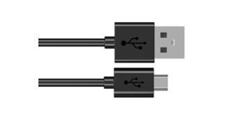

##############################################################################
Chapter 2 Snake Game
##############################################################################

We have learned how control 2D and 3D figures. Now, we will use ESP8266 board to play the classic snake game. There are both 2D and 3D version.

Project Snake Game
******************************

First, let's play a 2D snake game.

Component list
==============================

.. table::
    :align: center
    :width: 80%
    :class: table-line

    +----------------------------------+---------------------------------------+
    | ESP8266 x1                       |          USB cable                    |
    |                                  |                                       |
    | |Chapter01_00|                   |          |Chapter01_01|               |
    +----------------------------------+---------------------------------------+
    | Breadboard x1                                                            |
    |                                                                          |
    | |Chapter01_02|                                                           |
    +---------------------+----------------------+-----------------------------+
    | Push button x4      |  Resistor 10kΩ x4    | Jumper wire M/M x5          |
    |                     |                      |                             |
    | |Chapter02_00|      |   |Chapter02_01|     |   |Chapter02_02|            |
    +---------------------+----------------------+-----------------------------+

.. |Chapter01_00| image:: ../_static/imgs/1_LED/Chapter01_00.png

.. |Chapter01_02| image:: ../_static/imgs/1_LED/Chapter01_02.png
.. |Chapter02_00| image:: ../_static/imgs/2_Snake_Game/Chapter02_00.png
.. |Chapter02_01| image:: ../_static/imgs/2_Snake_Game/Chapter02_01.png

Circuit
===============================

.. list-table:: 
   :width: 80%
   :align: center
   :class: table-line

   * -  Schematic diagram
   * -  |Chapter02_03|
   * -  Hardware connection. 
    
        If you need any support, please feel free to contact us via: support@freenove.com
   
   * -  |Chapter02_04|

Buttons from left to right indicate right, left, down, and up respectively.

Sketch
=============================

Sketch Snake_Game
----------------------------------------

Use Processing to open 

**Freenove_Ultimate_Starter_Kit_for_ESP8266\\Processing\\Processing\\Box_3D\\Box_3D.pde, and click Run.**

If the connection succeeds, the follow will be shown:

Press the space bar on keyboard to start the game:

Press the corresponding button to control the snake's movements. The game rules are the same as the classic snake game:

When the game fails, press space bar to restart the game:

Additionally, you can restart the game by pressing the space bar at any time.

Project Snake Game 3D
***************************************

Now, let's experience the 3D version game.

Component list
============================

The same as last section.

Circuit
============================

The same as last section.

Sketch
===============================

Sketch Snake_Game_3D
---------------------------

Use Processing to open 

Freenove_Ultimate_Starter_Kit_for_ESP8266\\Processing\\Processing\\Snake_Game_3D\\Snake_Game_3D.pde and click Run.

If the connection succeeds, the follow will be shown:

Press the space bar on keyboard to start the game:

Press the corresponding button to control the snake's movements. The game rules are the same as the classic snake game:

The rest operation is the same as the 2D version.