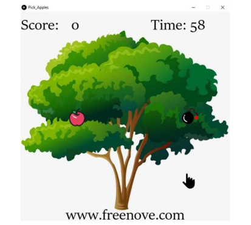
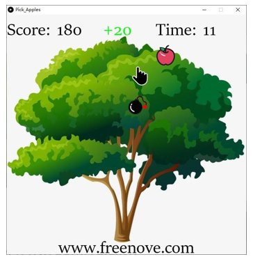
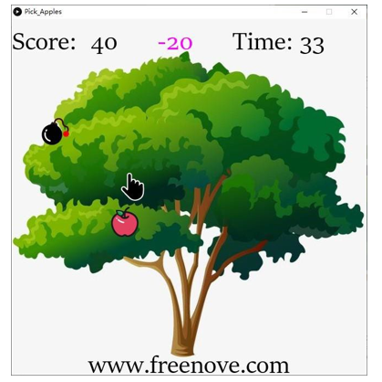
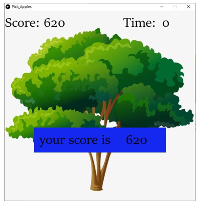

##############################################################################
Chapter 3 Pick Apples
##############################################################################

In this chapter, we prepare pick apples game.You can pick apples with four buttons.

Project 3.1 Pick Apples
************************************

Now, let's use Processing and ESP8266 board to achieve the game.

Component list
================================

.. table::
    :align: center
    :width: 80%
    :class: table-line

    +----------------------------------+---------------------------------------+
    | ESP8266 x1                       |          USB cable                    |
    |                                  |                                       |
    | |Chapter01_00|                   |          |Chapter01_01|               |
    +----------------------------------+---------------------------------------+
    | Breadboard x1                                                            |
    |                                                                          |
    | |Chapter01_02|                                                           |
    +---------------------+----------------------+-----------------------------+
    | Push button x4      |  Resistor 10kΩ x4    | Jumper wire M/M x5          |
    |                     |                      |                             |
    | |Chapter02_00|      |   |Chapter02_01|     |   |Chapter02_02|            |
    +---------------------+----------------------+-----------------------------+

.. |Chapter01_00| image:: ../_static/imgs/1_LED/Chapter01_00.png
.. |Chapter01_01| image:: ../_static/imgs/1_LED/Chapter01_01.png
.. |Chapter01_02| image:: ../_static/imgs/1_LED/Chapter01_02.png
.. |Chapter02_00| image:: ../_static/imgs/2_Snake_Game/Chapter02_00.png
.. |Chapter02_01| image:: ../_static/imgs/2_Snake_Game/Chapter02_01.png
.. |Chapter02_02| image:: ../_static/imgs/2_Snake_Game/Chapter02_02.png

Circuit
===============================

.. list-table:: 
   :width: 80%
   :align: center
   :class: table-line

   * -  Schematic diagram
   * -  |Chapter02_03|
   * -  Hardware connection. 
    
        If you need any support, please feel free to contact us via: support@freenove.com
   
   * -  |Chapter02_04|

.. |Chapter02_03| image:: ../_static/imgs/2_Snake_Game/Chapter02_03.png
.. |Chapter02_04| image:: ../_static/imgs/2_Snake_Game/Chapter02_04.png

Buttons from left to right indicate down, up, right, and left.

Sketch
================================

Sketch Pick Apples
-----------------------------

Use Processing to open 

**Freenove_Ultimate_Starter_Kit_for_ESP8266\\Processing\\Processing\\Pick_Apples\\Pick_Apples.pde**

, and click Run.

If the connection succeeds, the follow will be shown:

You can control the game with the corresponding buttons. When the palm picked the apple, score +20.

If the palm touches the bomb, the score is -20.

At the same time, you need to pick as many apples as possible before the countdown is over.

When the game fails, press space bar to restart the game:

Additionally, you can restart the game by pressing the space bar at any time.