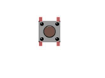
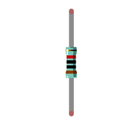
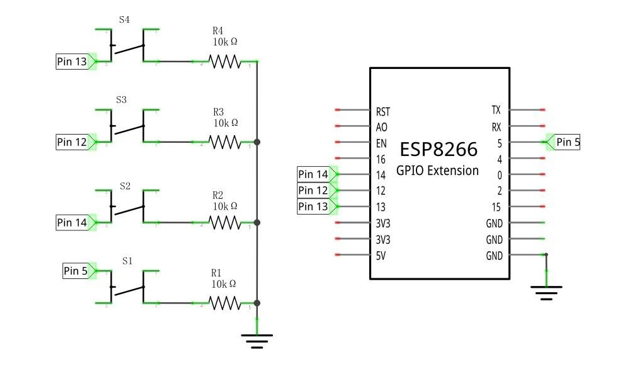

##############################################################################
Chapter Pong Game
##############################################################################

We have experienced single-player game snake before. Now, let's use ESP8266 board to play classic two- player pong game. You will experience both 2D and 3D version.

Project Pong Game
**********************************

First, let's experience the 2D version game.

Component list
==================================

+----------------------------------+---------------------------------------+
| ESP8266 x1                       |          USB cable                    |
|                                  |                                       |
| |Chapter01_00|                   |          |Chapter01_01|               |
+----------------------------------+---------------------------------------+
| Breadboard x1                                                            |
|                                                                          |
| |Chapter01_02|                                                           |
+---------------------+----------------------+-----------------------------+
| Push button x4      |  Resistor 10kΩ x4    | Jumper wire M/M x5          |
|                     |                      |                             |
| |Chapter02_00|      |   |Chapter02_01|     |   |Chapter02_02|            |
+---------------------+----------------------+-----------------------------+

.. |Chapter01_00| image:: ../_static/imgs/1_LED/Chapter01_00.png
.. |Chapter01_01| image:: ../_static/imgs/1_LED/Chapter01_01.png
.. |Chapter01_02| image:: ../_static/imgs/1_LED/Chapter01_02.png

.. |Chapter02_02| image:: ../_static/imgs/2_Snake_Game/Chapter02_02.png

Circuit
===============================

.. list-table:: 
   :width: 100%
   :align: center

   * -  Schematic diagram
   * -  |Chapter04_00|
   * -  Hardware connection. 
    
        If you need any support, please feel free to contact us via: support@freenove.com
   
   * -  |Chapter04_01|

The left-to-right buttons represent player 2 left, Player 2 right, Player 1 right, and Player 1 left.

Sketch
=================================

Sketch Pong_Game
-------------------------------------

Use Processing to open

**Freenove_Ultimate_Starter_Kit_for_ESP8266\Processing\Processing\Pong_Game\Pong_Game.pde, and click Run.**

If the connection succeeds, the follow will be shown:

Now you can try to control the racket motion by pressing the corresponding button. Press space bar to start the game:

Use button to control the movement of paddle to block the ball back. The game rules are the same as classic pong game:

The game will be over when one side reachs three points. Pressing the space bar can restart the game:

.. image:: ../_static/imgs/4_Pong_Game/Chapter04_05.png
    :align: center

Additionally, you can restart the game by pressing the space bar at any time.

Project Pong Game 3D
*********************************

Now, let's experience the 3D version game.

Component list
========================

The same as last section.

Circuit
==========================

The same as last section.

Sketch
============================

Sketch Pong_Game_3D
------------------------------

Use Processing to open 

**Freenove_Ultimate_Starter_Kit_for_ESP8266\\Processing\\Processing\\Pong_Game_3D\\Pong_Game_3D.pde, and click Run.**

If the connection succeeds, the follow will be shown:

Now you can try to control the racket motion by pressing the corresponding button. Press space bar to start the game:

Use button to control the movement of paddle to block the ball back. The game rules are the same as classic pong game:

.. image:: ../_static/imgs/4_Pong_Game/Chapter04_08.png
    :align: center

The rest operation is the same as the 2D version.