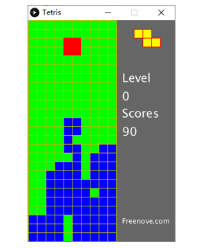

##############################################################################
Chapter 5 Tetris
##############################################################################

In this chapter, we prepare a tetris game for you. You can play the game by pressing the buttons.

Project Tetris
******************************

Now, let's use Processing and ESP8266 board to achieve the tetris game.

Component list
=============================

.. table::
    :align: center
    :width: 80%
    :class: table-line

    +----------------------------------+---------------------------------------+
    | ESP8266 x1                       |          USB cable                    |
    |                                  |                                       |
    | |Chapter01_00|                   |          |Chapter01_01|               |
    +----------------------------------+---------------------------------------+
    | Breadboard x1                                                            |
    |                                                                          |
    | |Chapter01_02|                                                           |
    +---------------------+----------------------+-----------------------------+
    | Push button x4      |  Resistor 10kΩ x4    | Jumper wire M/M x5          |
    |                     |                      |                             |
    | |Chapter02_00|      |   |Chapter02_01|     |   |Chapter02_02|            |
    +---------------------+----------------------+-----------------------------+

.. |Chapter01_00| image:: ../_static/imgs/1_LED/Chapter01_00.png
.. |Chapter01_01| image:: ../_static/imgs/1_LED/Chapter01_01.png
.. |Chapter01_02| image:: ../_static/imgs/1_LED/Chapter01_02.png
.. |Chapter02_00| image:: ../_static/imgs/2_Snake_Game/Chapter02_00.png
.. |Chapter02_01| image:: ../_static/imgs/2_Snake_Game/Chapter02_01.png
.. |Chapter02_02| image:: ../_static/imgs/2_Snake_Game/Chapter02_02.png

Circuit
===============================

Use Pin5, Pin14, Pin12, Pin13 port on ESP8266 board to control the movement of the block.

.. list-table:: 
   :width: 80%
   :align: center
   :class: table-line

   * -  Schematic diagram
   * -  |Chapter05_00|
   * -  Hardware connection. 
    
        If you need any support, please feel free to contact us via: support@freenove.com
   
   * -  |Chapter05_01|

Sketch
==========================

Sketch Tetris
-------------------------

Use Processing to open

**Freenove_Ultimate_Starter_Kit_for_ESP8266\Processing\Processing\Tetris.pde\Tetris.pde**

,and click Run.

If the connection succeeds, the follow will be shown:

Now you can try using the buttons to control the falling block. Press the space bar to pause the game.

When the game is over, you can press the space bar to play the game again. Press ESC to exit the game.

