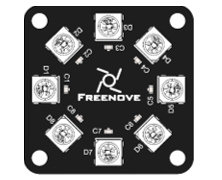
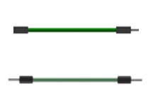
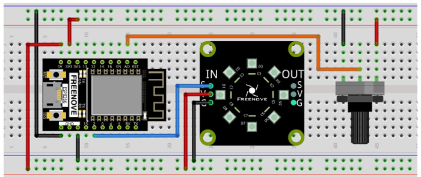

Project Soft Rainbow Light
************************************

In this project, we use potentiometer to control Freenove 8 RGB LED Module.

Component List
=============================

+------------------------------+----------------------------------------------+
| ESP8266 x1                   | USB cable                                    |
|                              |                                              |
| |Chapter01_00|               | |Chapter01_01|                               |
+------------------------------+----------------------------------------------+
| Breadboard x1                                                               |
|                                                                             |
| |Chapter01_02|                                                              |
+------------------------------+-------------------------+--------------------+
| Freenove 8 RGB LED Module x1 | Rotary potentiometer x1 | Jumper wire F/M x3 |
|                              |                         |                    |
|                              |                         | Jumper wire M/M x7 |
|                              |                         |                    |
| |Chapter10_05|               | |Chapter10_06|          | |Chapter10_07|     |
+------------------------------+-------------------------+--------------------+

.. |Chapter10_06| image:: ../_static/imgs/10_Potentiometer_&_LED/Chapter10_06.png

Circuit
=============================

Use pin A0 on the control board to detect the voltage of rotary potentiometer.

.. list-table:: 
   :width: 100%
   :align: center

   * -  Schematic diagram
   * -  |Chapter10_08|
   * -  Hardware connection. 
    
        If you need any support, please feel free to contact us via: support@freenove.com
   
   * -  |Chapter10_09|

.. |Chapter10_08| image:: ../_static/imgs/10_Potentiometer_&_LED/Chapter10_08.png

Code
======================

Open "Thonny", click "This computer" -> "D:" -> "Micropython_Codes" -> "10.3_Soft_Rainbow_Light" and double click "Soft_Rainbow_Light.py".

Soft_Rainbow_Light
-----------------------------

Click "Run current script". Rotate the handle of potentiometer and the color of the lights will change.

.. image:: ../_static/imgs/10_Potentiometer_&_LED/Chapter10_14.png
    :align: center

:red:`If you have any concerns, please contact us via:` support@freenove.com

The following is the program code:

.. literalinclude:: ../../../freenove_Kit/Python/Python_Codes/10.3_Soft_Rainbow_Light/Soft_Rainbow_Light.py
    :linenos: 
    :language: python
    :lines: 1-38
    :dedent:

The logic of the code is basically the same as the previous project :ref:`Rainbow Light <rainbow>`. The difference is that in this code, the starting point of the color is controlled by the potentiometer.