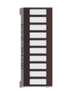
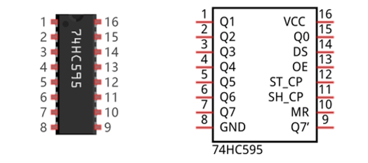
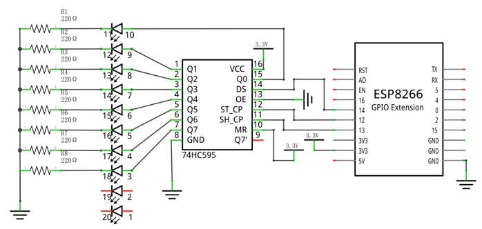
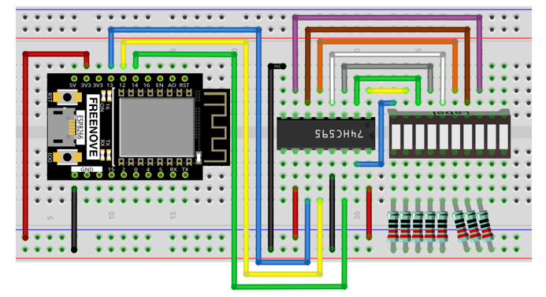

.. _Led_bar:

##############################################################################
Chapter 74HC595 & LED Bar Graph
##############################################################################

We have used LED bar graph to make a flowing water light, in which 10 GPIO ports of ESP8266 is occupied. More GPIO ports mean that more peripherals can be connected to ESP8266, so GPIO resource is very precious. Can we make flowing water light with less GPIO? In this chapter, we will learn a component, 74HC595, which can achieve the target.

Project Flowing Water Light
****************************************

Now let's learn how to use the 74HC595 IC chip to make a flowing water light using less GPIO.

Component List
=============================

+----------------------------------+---------------------------------------+
| ESP8266 x1                       |          USB cable                    |
|                                  |                                       |
| |Chapter01_00|                   |          |Chapter01_01|               |
+----------------------------------+---------------------------------------+
| Breadboard x1                                                            |
|                                                                          |
| |Chapter01_02|                                                           |
+----------------------------------+---------------------------------------+
| LED Bar Graph x1                 | Jumper wire M/M x17                   |
|                                  |                                       |
| |Chapter13_09|                   |  |Chapter01_05|                       |
+----------------------------------+---------------------------------------+
| 74HC595 x1                       | Resistor 220Ω x8                      |
|                                  |                                       |
| |Chapter13_00|                   |  |Chapter01_04|                       |
+----------------------------------+---------------------------------------+

.. |Chapter01_00| image:: ../_static/imgs/1_LED/Chapter01_00.png
.. |Chapter01_01| image:: ../_static/imgs/1_LED/Chapter01_01.png
.. |Chapter01_02| image:: ../_static/imgs/1_LED/Chapter01_02.png
.. |Chapter01_04| image:: ../_static/imgs/1_LED/Chapter01_04.png
.. |Chapter01_05| image:: ../_static/imgs/1_LED/Chapter01_05.png
.. |Chapter13_00| image:: ../_static/imgs/13_74HC595_&_LED_Bar_Graph/Chapter13_00.png

Related knowledge
=============================

74HC595
------------------------------

A 74HC595 chip is used to convert serial data into parallel data. A 74HC595 chip can convert the serial data of one byte into 8 bits, and send its corresponding level to each of the 8 ports correspondingly. With this characteristic, the 74HC595 chip can be used to expand the IO ports of a ESP8266. At least 3 ports are required to control the 8 ports of the 74HC595 chip.

The ports of the 74HC595 chip are described as follows:

+----------+-------------+-------------------------------------------------------------------------------------------------------+
| Pin name | GPIO number | Description                                                                                           |
+==========+=============+=======================================================================================================+
| Q0-Q7    | 15, 1-7     | Parallel data output                                                                                  |
+----------+-------------+-------------------------------------------------------------------------------------------------------+
| VCC      | 16          | The positive electrode of power supply, the voltage is 2~6V                                           |
+----------+-------------+-------------------------------------------------------------------------------------------------------+
| GND      | 8           | The negative electrode of power supply                                                                |
+----------+-------------+-------------------------------------------------------------------------------------------------------+
| DS       | 14          | Serial data Input                                                                                     |
+----------+-------------+-------------------------------------------------------------------------------------------------------+
|          |             | Enable output,                                                                                        |
|          |             |                                                                                                       |
| OE       | 13          | When this pin is in high level, Q0-Q7 is in high resistance state                                     |
|          |             |                                                                                                       |
|          |             | When this pin is in low level, Q0-Q7 is in output mode                                                |
+----------+-------------+-------------------------------------------------------------------------------------------------------+
| ST_CP    | 12          | Parallel Update Output: when its electrical level is rising, it will update the parallel data output. |
+----------+-------------+-------------------------------------------------------------------------------------------------------+
| SH_CP    | 11          | Serial shift clock: when its electrical level is rising, serial data input register will do a shift.  |
+----------+-------------+-------------------------------------------------------------------------------------------------------+
| MR       | 10          | Remove shift register: When this pin is in low level, the content in shift register will be cleared.  |
+----------+-------------+-------------------------------------------------------------------------------------------------------+
| Q7'      | 9           | Serial data output: it can be connected to more 74HC595 in series.                                    |
+----------+-------------+-------------------------------------------------------------------------------------------------------+

For more detail, please refer to the datasheet on the 74HC595 chip.

Circuit
===========================

.. list-table:: 
   :width: 100%
   :align: center

   * -  Schematic diagram
   * -  |Chapter13_02|
   * -  Hardware connection. 
    
        If you need any support, please feel free to contact us via: support@freenove.com
   
   * -  |Chapter13_03|

Sketch
==============================

In this project, we will make a flowing water light with a 74HC595 chip to learn about its functions.

Move the program folder "Freenove_Ultimate_Starter_Kit_for_ESP8266/Python/Python_Codes" to disk(D) in advance with the path of "D:/Micropython_Codes".

Open "Thonny", click "This computer" -> "D:" -> "Micropython_Codes" -> "13.1_Flowing_Water_Light". Select "my74HC595.py", right click your mouse to select "Upload to /", wait for "my74HC595.py"to be uploaded to ESP8266 and then double click "Flowing_Water_Light.py". 

Flowing_Water_Light
------------------------------

Click "Run current script" and you will see that Bar Graph LED starts with the flowing water pattern flashing from left to right and then back from right to left. If it displays nothing, maybe the LED Bar is connected upside down, please unplug it and then re-plug it reversely.

:red:`If you have any concerns, please contact us via: support@freenove.com`

The following is the program code:

.. literalinclude:: ../../../freenove_Kit/Python/Python_Codes/13.1_Flowing_Water_Light/Flowing_Water_Light.py
    :linenos: 
    :language: python
    :lines: 1-19
    :dedent:

Import time and my74HC595 modules.

.. literalinclude:: ../../../freenove_Kit/Python/Python_Codes/13.1_Flowing_Water_Light/Flowing_Water_Light.py
    :linenos: 
    :language: python
    :lines: 1-2
    :dedent:

Assign pins for ESP8266 to connect to 74HC595.

.. literalinclude:: ../../../freenove_Kit/Python/Python_Codes/13.1_Flowing_Water_Light/Flowing_Water_Light.py
    :linenos: 
    :language: python
    :lines: 4-4
    :dedent:

The first for loop makes LED Bar display separately from left to right while the second for loop make it display separately from right to left.

.. literalinclude:: ../../../freenove_Kit/Python/Python_Codes/13.1_Flowing_Water_Light/Flowing_Water_Light.py
    :linenos: 
    :language: python
    :lines: 10-19
    :dedent:

Reference
---------------------------

.. py:function:: Class Chip74HC595	
    
    Before each use of the object **Chip74HC595** , make sure my74HC595.py has been uploaded to "/" of ESP8266, and then add the statement " **from my74HC595 import Chip74HC595** " to the top of the python file. 
    
    **Chip74HC595():** An object. By default, 74HC595's DS pin is connected to Pin(14) of ESP8266, ST_CP pin is connected to ESP8266’s Pin(12) and OE pin is connected to ESP’s Pin(5). If you need to modify the pins, just do the following operations.
    
    **chip=Chip74HC595() or chip=Chip74HC595(14,12,13,5)**
    
    **shiftOut(direction, data):** Write data to 74HC595.
    
        **direction:** 1/0. "1" presents that high-order byte will be sent first while "0" presents that low-order byte will be sent first. 
    
        **data:** The content that is sent, which is one-byte data.
    
    **clear():** Clear the latch data of 74HC595.