##############################################################################
Chapter Relay & Motor
##############################################################################

In this chapter, we will learn a kind of special switch module, relay module.

Project Relay & Motor
*************************************

In this project, we will use a push button switch indirectly to control the motor via a relay.

Component List
===============================

+----------------------------------+---------------------------------------+
| ESP8266 x1                       |          USB cable                    |
|                                  |                                       |
| |Chapter01_00|                   |          |Chapter01_01|               |
+----------------------------------+---------------------------------------+
| Breadboard x1                                                            |
|                                                                          |
| |Chapter01_02|                                                           |
+----------------------------------+---------------------------------------+
| Breadboard Power module x1       | Jumper wire M/M                       |
|                                  |                                       |
| |Chapter16_01|                   |  |Chapter01_05|                       |
+----------------------+-----------+-------------+-------------------------+
| Resistor 10kΩ x2     | Resistor 1kΩ x1         | Resistor 220Ω x1        |
|                      |                         |                         |
| |Chapter16_02|       |  |Chapter16_03|         |     |Chapter16_04|      |
+----------------------+-------------------------+-------------------------+
| NPN transistor x1    | Relay x1                | Motor x1                |
|                      |                         |                         |
| |Chapter16_05|       |  |Chapter16_06|         |     |Chapter16_07|      |
+----------------------+-------------------------+-------------------------+
| Push button x1       | LED x1                  | Diode x1                |
|                      |                         |                         |
| |Chapter16_08|       |  |Chapter16_09|         |     |Chapter16_10|      |
+----------------------+-------------------------+-------------------------+
| 9V battery (prepared by yourself) & battery line                         |
|                                                                          |
| |Chapter16_11|                                                           |
+--------------------------------------------------------------------------+

.. |Chapter01_00| image:: ../_static/imgs/1_LED/Chapter01_00.png
.. |Chapter01_01| image:: ../_static/imgs/1_LED/Chapter01_01.png
.. |Chapter01_02| image:: ../_static/imgs/1_LED/Chapter01_02.png
.. |Chapter01_05| image:: ../_static/imgs/1_LED/Chapter01_05.png
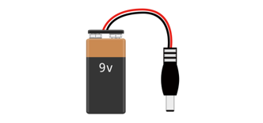
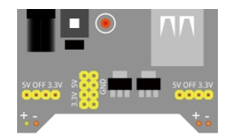
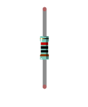
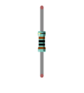
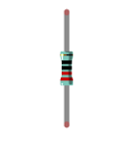
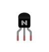
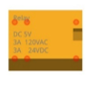

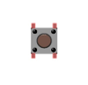
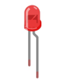
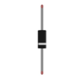
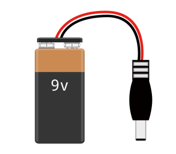

Component knowledge
=================================

Relay
------------------------

A relay is a safe switch which can use low power circuit to control high power circuit. It consists of electromagnet and contacts. The electromagnet is controlled by low power circuit and contacts are used in high power circuit. When the electromagnet is energized, it will attract contacts.

The following is a schematic diagram of a common relay and the feature and circuit symbol of a 5V relay used in this project:

.. list-table:: 
   :width: 100%
   :align: center

   * -  Diagram 
     -  Feature
     -  Symbol
   
   * -  |Chapter16_12|
     -  |Chapter16_13|
     -  |Chapter16_14|

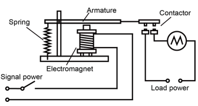
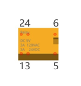
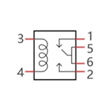

Pin 5 and pin 6 are connected to each other inside. When the coil pins 3 and 4 get connected to 5V power supply, pin 1 will be disconnected to pin 5&6 and pin 2 will be connected to pin 5&6. So pin 1 is called close end, pin 2 is called open end.

Inductor
----------------------

The symbol of Inductance is "L" and the unit of inductance is the "Henry" (H). Here is an example of how this can be encountered: 1H=1000mH, 1mH=1000μH.

An inductor is an energy storage device that converts electrical energy into magnetic energy. Generally, it consists of winding coil, with a certain amount of inductance. Inductors hinder the change of current passing through it.  When the current passing through it increases, it will attempt to hinder the increasing trend of current; and when the current passing through it decreases, it will attempt to hinder the decreasing trend of current. So the current passing through inductor is not transient.

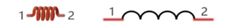

The reference circuit for relay is as follows. The coil of relays can be equivalent to that of inductors, when the transistor disconnects power supply of the relay, the current in the coil of the relay can't stop immediately, causing an impact on power supply. So a parallel diode will get connected to both ends of relay coil pin in reversing direction, then the current will pass through diode, avoiding the impact on power supply. 

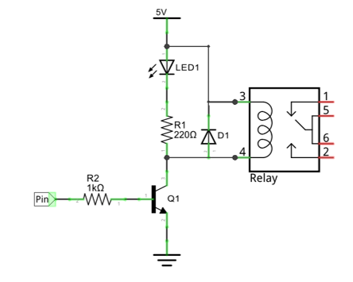

Motor
-----------------------

A motor is a device that converts electrical energy into mechanical energy. Motor consists of two parts: stator and rotor. When motor works, the stationary part is stator, and the rotating part is rotor. Stator is usually the outer case of motor, and it has terminals to connect to the power. Rotor is usually the shaft of motor, and can drive other mechanical devices to run. Diagram below is a small DC motor with two pins.

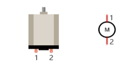

When a motor gets connected to the power supply, it will rotate in one direction. Reverse the polarity of power supply, then the motor rotates in opposite direction.

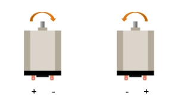

Circuit
=======================

In circuit of this project, the power pin of the 74HC595 IC chip is connected to 3.3V. It can also be connected to 5V to make LED matrix brighter.

.. list-table:: 
   :width: 100%
   :align: center

   * -  Schematic diagram
   * -  |Chapter16_19|
   * -  Hardware connection. 
    
        If you need any support, please feel free to contact us via: support@freenove.com
   
   * -  |Chapter16_20|

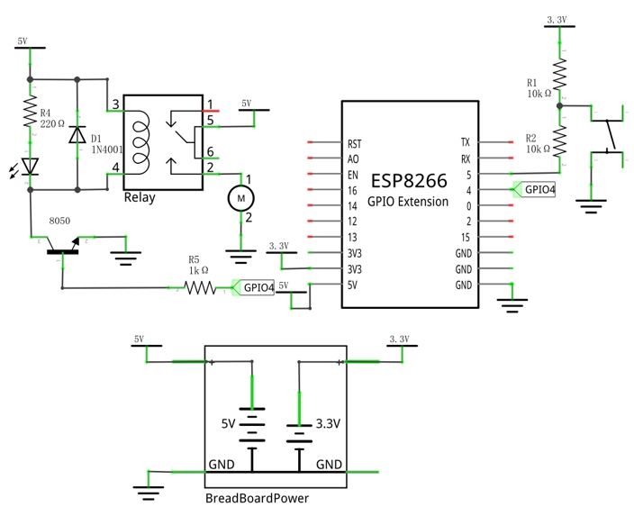
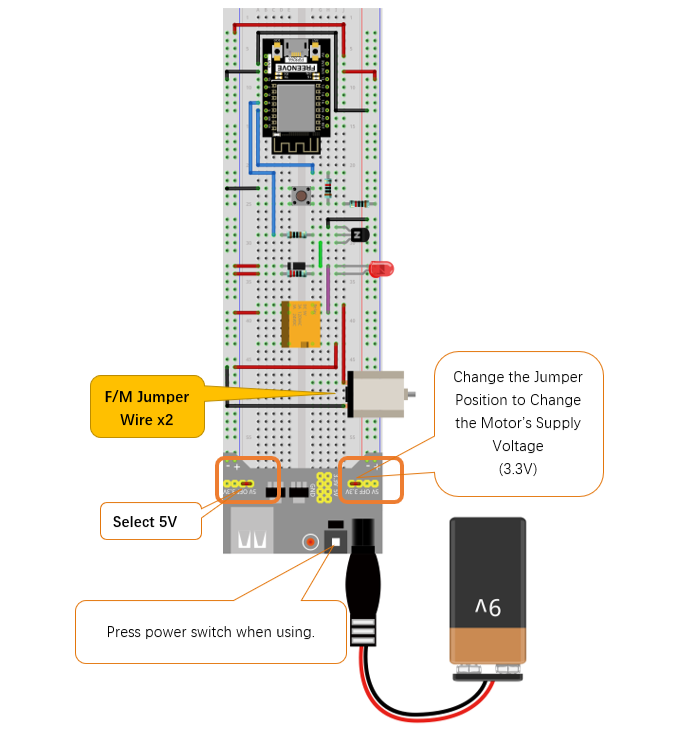

.. note::
    
    the motor circuit uses A large current, about 0.2-0.3A without load. We recommend that you use a 9V battery to power your system.

Code  
==========================

Use buttons to control the relays and motors.

Move the program folder "Freenove_Ultimate_Starter_Kit_for_ESP8266/Python/Python_Codes" to disk(D) in advance with the path of "D:/Micropython_Codes".

Open "Thonny", click "This computer" -> "D:" -> "Micropython_Codes" -> "16.1_Relay_And_Motor" and double click "Relay_And_Motor.py". 

Relay_And_Motor
---------------------------

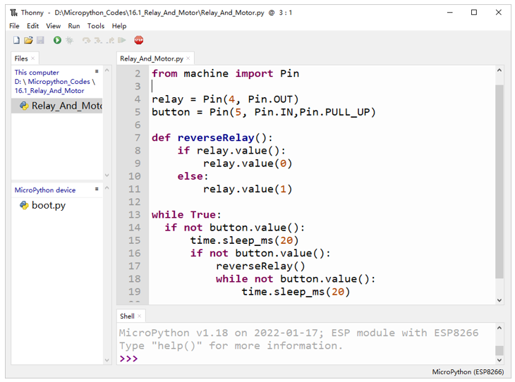

Click "Run current script". When the DC Motor is connected to a power supply, it will rotate in one direction. If you reverse the polarity of the power supply, the DC Motor will rotate in opposite direction.

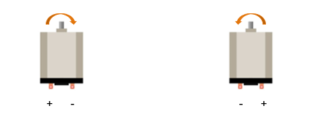

The following is the program code:

.. literalinclude:: ../../../freenove_Kit/Python/Python_Codes/16.1_Relay_And_Motor/Relay_And_Motor.py
    :linenos: 
    :language: python
    :lines: 1-19
    :dedent:

This section of code is basically the same as that of project Tablelamp. If you don't understand the program, you can click :ref:`here <table_lamp>` to go back to the Tablelamp and study again.