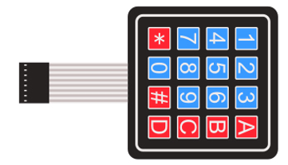
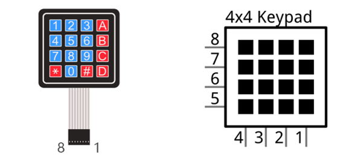
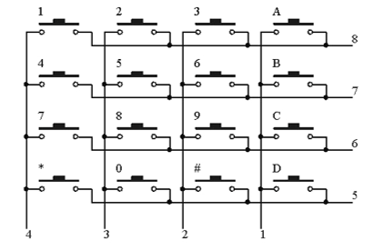
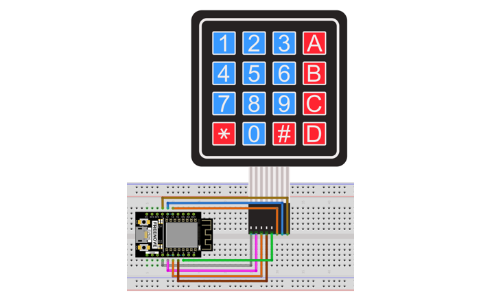
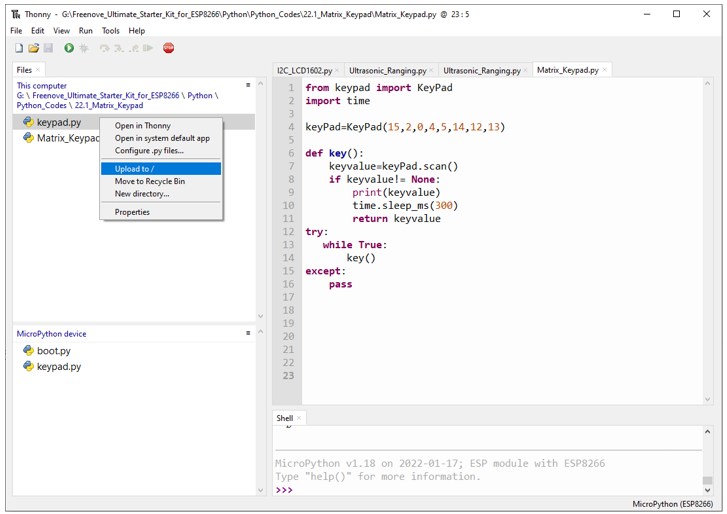
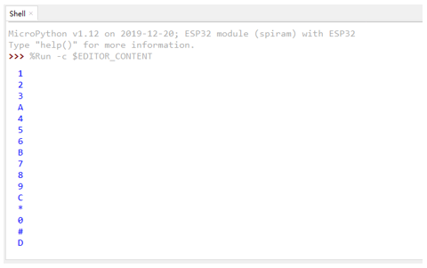

##############################################################################
Chapter 22 Matrix Keypad
##############################################################################

Earlier we learned about a single push button switch. In this chapter, we will learn about matrix keyboards, which integrates a number of push button switches as keys for the purposes of input.

Project 22.1 Matrix Keypad
************************************

In this project, we will attempt to get every key code on the matrix keypad to work.

Component List
=========================================

.. table::
    :align: center
    :class: table-line
    :width: 80%
    
    +----------------------------------+---------------------------------------+
    | ESP8266 x1                       |  USB cable                            |
    |                                  |                                       |
    | |Chapter01_00|                   |   |Chapter01_01|                      |
    +----------------------------------+---------------------------------------+
    | Breadboard x1                                                            |
    |                                                                          |
    | |Chapter01_02|                                                           |
    +----------------------------------+---------------------------------------+
    | 4x4 Matrix Keypad x1             | Jumper wire M/M x8                    |
    |                                  |                                       |
    | |Chapter22_01|                   |   |Chapter22_00|                      |
    +----------------------------------+---------------------------------------+

.. |Chapter01_00| image:: ../_static/imgs/1_LED/Chapter01_00.png
.. |Chapter01_01| image:: ../_static/imgs/1_LED/Chapter01_01.png
.. |Chapter01_02| image:: ../_static/imgs/1_LED/Chapter01_02.png
.. |Chapter06_01| image:: ../_static/imgs/6_LEDPixel/Chapter06_01.png
.. |Chapter22_00| image:: ../_static/imgs/22_Matrix_Keypad/Chapter22_00.png

Component knowledge
==================================

4x4 Matrix Keypad
-----------------------------------

A keypad matrix is a device that integrates a number of keys in one package. As is shown below, a 4x4 keypad matrix integrates 16 keys:

Similar to the integration of a LED matrix, the 4x4 keypad matrix has each row of keys connected with one pin and this is the same for the columns. Such efficient connections reduce the number of processor ports required. The internal circuit of the Keypad Matrix is shown below.

The method of usage is similar to the Matrix LED, by using a row or column scanning method to detect the state of each key’s position by column and row. Take column scanning method as an example, send low level to the first 1 column (Pin1), detect level state of row 5, 6, 7, 8 to judge whether the key A, B, C, D are pressed. Then send low level to column 2, 3, 4 in turn to detect whether other keys are pressed. By this means, you can get the state of all of the keys.

Circuit
========================

.. list-table:: 
   :width: 80%
   :align: center
   :class: table-line

   * -  Schematic diagram
   * -  |Chapter22_04|
   * -  Hardware connection. 
    
        If you need any support, please feel free to contact us via: support@freenove.com
   
   * -  |Chapter22_05|

.. |Chapter22_04| image:: ../_static/imgs/22_Matrix_Keypad/Chapter22_04.png

Code
==========================

This code is used to obtain all key codes of the 4x4 Matrix Keypad, when one of the keys is pressed, the key code will be printed out via serial port.

Move the program folder "**Freenove_Ultimate_Starter_Kit_for_ESP8266/Python/Python_Codes**" to disk(D) in advance with the path of "**D:/Micropython_Codes**".

Open "Thonny", click "This computer" -> "D:" -> "Micropython_Codes" ->  "22.1_Matrix_Keypad". Select"keypad.py", right click your mouse to select "Upload to /", wait for "keypad.py" to be uploaded to ESP8266 and then double click "Matrix_Keypad.py". 

22.1_Matrix_Keypad
-------------------------------

Click "Run current script", push the key board and the key value will be printed in "Shell". As shown in the illustration below:

The following is the program code:

.. literalinclude:: ../../../freenove_Kit/Python/Python_Codes/22.1_Matrix_Keypad/Matrix_Keypad.py
    :linenos: 
    :language: python
    :lines: 1-16
    :dedent:

Import keypad module.

.. literalinclude:: ../../../freenove_Kit/Python/Python_Codes/22.1_Matrix_Keypad/Matrix_Keypad.py
    :linenos: 
    :language: python
    :lines: 1-1
    :dedent:

Associate the keypad module to ESP8266 pins. 

.. literalinclude:: ../../../freenove_Kit/Python/Python_Codes/22.1_Matrix_Keypad/Matrix_Keypad.py
    :linenos: 
    :language: python
    :lines: 4-4
    :dedent:

Call function keypad.scan() of the keypad module. When the keypad module detects that the key is pressed, it returns the value of the pressed key; when no key is pressed, the return value is None. 

.. literalinclude:: ../../../freenove_Kit/Python/Python_Codes/22.1_Matrix_Keypad/Matrix_Keypad.py
    :linenos: 
    :language: python
    :lines: 6-11
    :dedent:

Reference
---------------------

.. py:function:: Class keypad
    
    Before each use of the object **KeyPad** , please make sure **keypad.py** has been uploaded to "/" of ESP8266 and then add the statement " **from keypad import KeyPad** " to the top of python file.
    
    **KeyPad(row1,row2,row3,row4,col1,col2,col3,col4):** Intialize keypad module and associate its pins with ESP8266.
    
    **scan():** Non-blocking keypad scan function. If no key is pressed, it returns None; Otherwise, it returns the valued of the pressed key.