##############################################################################
Chapter Hygrothermograph DHT11
##############################################################################

In this chapter, we will learn about a commonly used sensor called a Hygrothermograph DHT11.

Project Hygrothermograph
************************************

Hygrothermograph is an important tool in our lives to give us data on the temperature and humidity in our environment. In this project, we will use the ESP8266 to read temperature and humidity data of the DHT11 Module.

Component List
=======================================

+----------------------------------+---------------------------------------+
| ESP8266 x1                       |  USB cable                            |
|                                  |                                       |
| |Chapter01_00|                   |   |Chapter01_01|                      |
+----------------------------------+---------------------------------------+
| Breadboard x1                                                            |
|                                                                          |
| |Chapter01_02|                                                           |
+----------------------+-------------------------+-------------------------+
| Resistor 10kΩ x1     | Infrared Remote x1      | Jumper wire M/M x6      |
|                      |                         |                         |
| |Chapter24_02|       |  |Chapter24_01|         |     |Chapter24_00|      |
+----------------------+-------------------------+-------------------------+

.. |Chapter01_00| image:: ../_static/imgs/1_LED/Chapter01_00.png
.. |Chapter01_01| image:: ../_static/imgs/1_LED/Chapter01_01.png
.. |Chapter01_02| image:: ../_static/imgs/1_LED/Chapter01_02.png
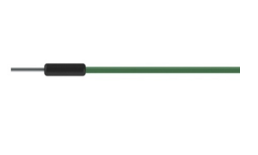
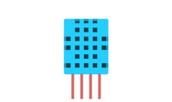
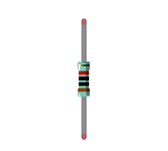

Component knowledge
================================

The temperature & humidity sensor DHT11 is a compound temperature & humidity sensor, and the output digital signal has been calibrated by its manufacturer.

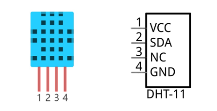

DHT11 uses customized single-line communication protocol, so we can use the library to read data more conveniently.

After being powered up, it will initialize in 1s. Its operating voltage is within the range of 3.3V-5.5V.

The SDA pin is a data pin, which is used to communicate with other devices. 

The NC pin (Not Connected Pin) is a type of pin found on various integrated circuit packages. Those pins have no functional purpose to the outside circuit (but may have an unknown functionality during manufacture and test). Those pins should not be connected to any of the circuit connections.

Circuit
===============================

.. list-table:: 
   :width: 100%
   :align: center

   * -  Schematic diagram
   * -  |Chapter24_04|
   * -  Hardware connection. 
    
        If you need any support, please feel free to contact us via: support@freenove.com
   
   * -  |Chapter24_21|

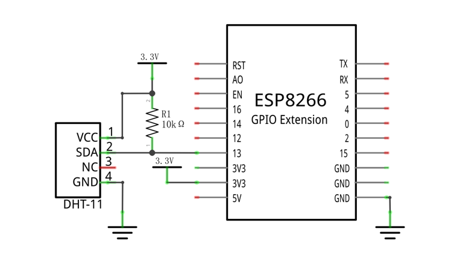
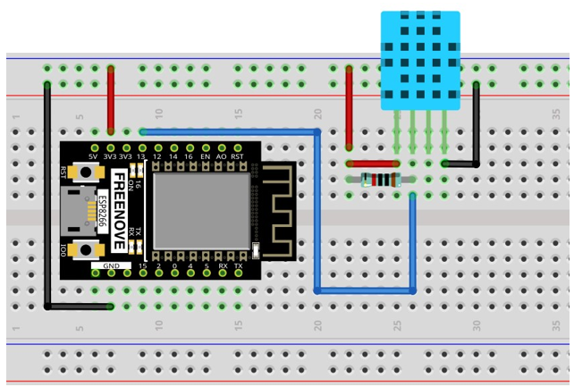

Code
===============================

Move the program folder "Freenove_Ultimate_Starter_Kit_for_ESP8266/Python/Python_Codes" to disk(D) in advance with the path of "D:/Micropython_Codes".

Open "Thonny", click "This computer" -> "D:" -> "Micropython_Codes" -> "24.1_Hygrothermograph" and double click  "Hygrothermograph.py".

Hygrothermograph
---------------------------

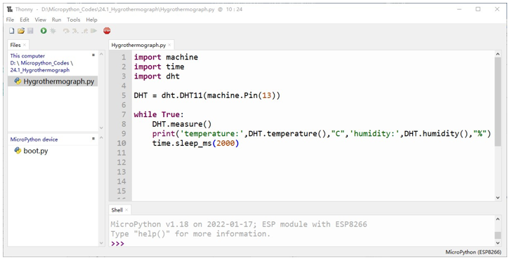

Click "Run current script". If your DHT11 is connected incorrectly, the following information will be printed in "Shell".

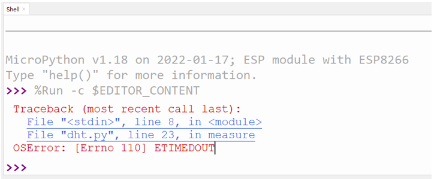

Make sure your circuit is correctly connected and you will see the following messages printed in "Shell".

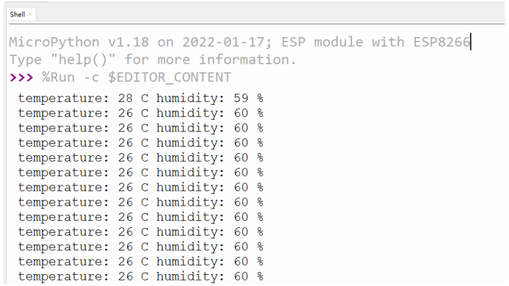

The following is the program code:

.. literalinclude:: ../../../freenove_Kit/Python/Python_Codes/24.1_Hygrothermograph/Hygrothermograph.py
    :linenos: 
    :language: python
    :lines: 1-10
    :dedent:

Import machine, time and dht modules.

.. literalinclude:: ../../../freenove_Kit/Python/Python_Codes/24.1_Hygrothermograph/Hygrothermograph.py
    :linenos: 
    :language: python
    :lines: 1-3
    :dedent:

Associate DHT11 with Pin(13).

.. literalinclude:: ../../../freenove_Kit/Python/Python_Codes/24.1_Hygrothermograph/Hygrothermograph.py
    :linenos: 
    :language: python
    :lines: 5-5
    :dedent:

Start DHT11 to measure data once.

.. literalinclude:: ../../../freenove_Kit/Python/Python_Codes/24.1_Hygrothermograph/Hygrothermograph.py
    :linenos: 
    :language: python
    :lines: 8-8
    :dedent:

Call the built-in function of DHT to obtain temperature and humidity data and print them in "Shell".

.. literalinclude:: ../../../freenove_Kit/Python/Python_Codes/24.1_Hygrothermograph/Hygrothermograph.py
    :linenos: 
    :language: python
    :lines: 9-9
    :dedent:

Obtain temperature and humidity data once per second and print them out.

.. literalinclude:: ../../../freenove_Kit/Python/Python_Codes/24.1_Hygrothermograph/Hygrothermograph.py
    :linenos: 
    :language: python
    :lines: 7-10
    :dedent:

Reference
-------------------------

.. py:function:: Class dht	
    
    Before each use of object **dht** , please add the statement " **import dht** " to the top of python file.
    
    **DHT11():** Object of DHT11
    
    **DHT12():** Object of DHT12
    
    **DHT11.measure():** Start DHT11 to measure temperature and humidity data once. 
    
    **DHT11.temperature():** Return temperature data obtained by DHT11. 
    
    **DHT11.humidity():** Return humidity data obtained by DHT11.
    
    **DHT12.measure():** Start DHT12 to measure temperature and humidity data once
    
    **DHT12.temperature():** Return temperature data obtained by DHT12.
    
    **DHT12.humidity():** Return humidity data obtained by DHT12.

Project Hygrothermograph
**************************************

In this project, we use L2C-LCD1602 to display data collected by DHT11.

Component List
=============================

+----------------------------------+---------------------------------------+
| ESP8266 x1                       |  USB cable                            |
|                                  |                                       |
| |Chapter01_00|                   |   |Chapter01_01|                      |
+----------------------------------+---------------------------------------+
| Breadboard x1                                                            |
|                                                                          |
| |Chapter01_02|                                                           |
+----------------------------------+---------------------------------------+
| LCD1602 Module x1                | Resistor 10kΩ x1                      |
|                                  |                                       |
| |Chapter24_08|                   |   |Chapter24_09|                      |
+----------------------------------+---------------------------------------+
| Jumper wire F/M x4               | DHT11 x1                              |
|                                  |                                       |
| Jumper wire M/M x8               |                                       |
|                                  |                                       |
| |Chapter24_10|                   |   |Chapter24_11|                      |
+----------------------------------+---------------------------------------+

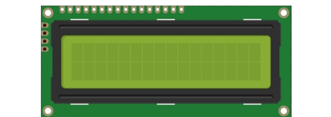
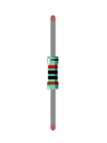
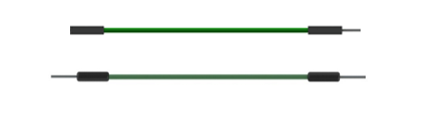
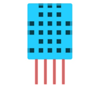

Circuit
===============================

.. list-table:: 
   :width: 100%
   :align: center

   * -  Schematic diagram
   * -  |Chapter24_12|
   * -  Hardware connection. 
    
        If you need any support, please feel free to contact us via: support@freenove.com
   
   * -  |Chapter24_13|

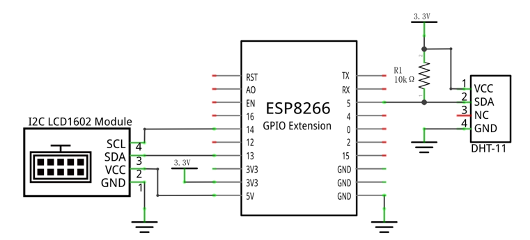
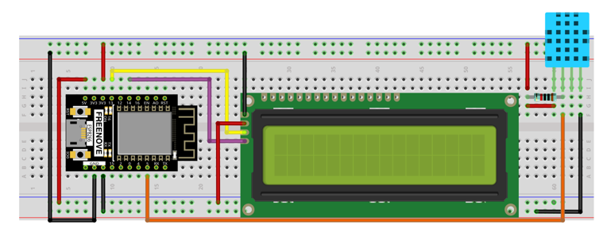

Code
==========================

Open "Thonny", click "This computer" -> "D:" -> "Micropython_Codes" -> 24.2_Hygrothermograph". Select "I2C_LCD.py" and "LCD_API.py", right click your mouse to select "Upload to /", wait for "I2C_LCD.py" and "LCD_API.py" to be uploaded to ESP8266 and then double click "Hygrothermograph.py".

Hygrothermograph
-------------------

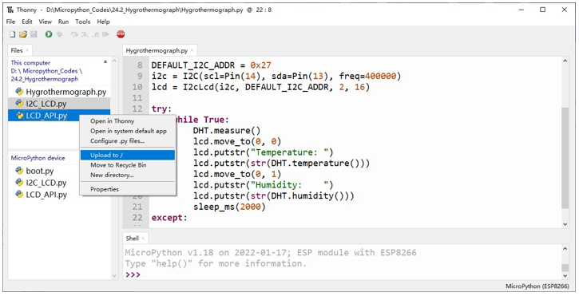

Click "Run current script". The first row of LCD1602 is temperature value and the second row is humidity. Try to "pinch" the DHT11 (without touching the leads) with your index finger and thumb for a brief time, you should see that the displayed value on LCD1602 changes.

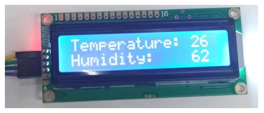

The following is the program code:

.. literalinclude:: ../../../freenove_Kit/Python/Python_Codes/24.2_Hygrothermograph/Hygrothermograph.py
    :linenos: 
    :language: python
    :lines: 1-27
    :dedent:

Import DHT11 and I2C LCD1602 modules.

.. literalinclude:: ../../../freenove_Kit/Python/Python_Codes/24.2_Hygrothermograph/Hygrothermograph.py
    :linenos: 
    :language: python
    :lines: 1-4
    :dedent:

Assign Pin(5) to DHT11, Pin(13) and Pin(14) to LCD1602.

.. literalinclude:: ../../../freenove_Kit/Python/Python_Codes/24.2_Hygrothermograph/Hygrothermograph.py
    :linenos: 
    :language: python
    :lines: 6-7
    :dedent:

Obtain data of Hygrothermograph every second and display them on LCD1602. The first line displays temperature and the second line displays humidity. Refresh display data every 2 seconds.

.. literalinclude:: ../../../freenove_Kit/Python/Python_Codes/24.2_Hygrothermograph/Hygrothermograph.py
    :linenos: 
    :language: python
    :lines: 17-25
    :dedent: