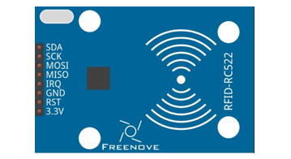
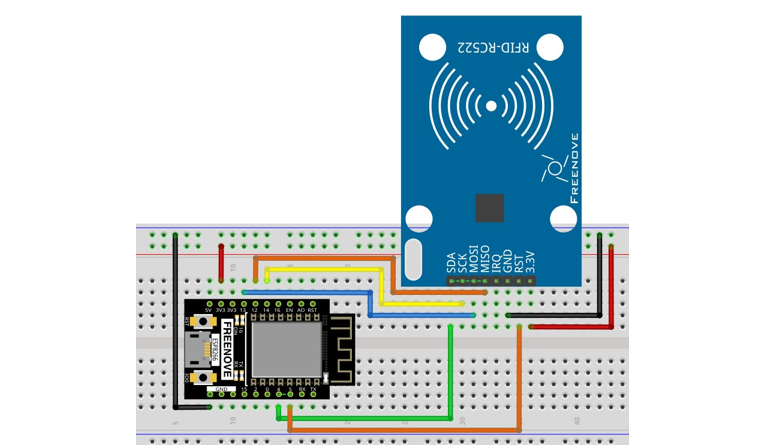
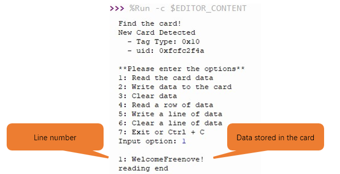

##############################################################################
Chapter RFID
##############################################################################

Now, we will learn to use the RFID (Radio Frequency Identification) wireless communication technology.

Project 27.1RFID read UID
**********************************

In this project, we will read the unique ID number (UID) of the RFID card, recognize the type of the RFID card and display the information through serial port.

Component List
=====================================

+----------------------------------+---------------------------------------+
| ESP8266 x1                       |  USB cable                            |
|                                  |                                       |
| |Chapter01_00|                   |   |Chapter01_01|                      |
+----------------------------------+---------------------------------------+
| Breadboard x1                                                            |
|                                                                          |
| |Chapter01_02|                                                           |
+----------------------------------+---------------------------------------+
| RC522 module x1                  | Jumper wire M/M x8                    |
|                                  |                                       |
| |Chapter27_00|                   |   |Chapter22_00|                      |
+----------------------------------+---------------------------------------+
| Mifare1 S50 Standard card x1     | Mifare1 S50 Non-standard card x1      |
|                                  |                                       |
| |Chapter27_01|                   |   |Chapter27_02|                      |
+----------------------------------+---------------------------------------+

.. |Chapter01_00| image:: ../_static/imgs/1_LED/Chapter01_00.png
.. |Chapter01_01| image:: ../_static/imgs/1_LED/Chapter01_01.png
.. |Chapter01_02| image:: ../_static/imgs/1_LED/Chapter01_02.png
.. |Chapter06_01| image:: ../_static/imgs/6_LEDPixel/Chapter06_01.png
.. |Chapter22_00| image:: ../_static/imgs/22_Matrix_Keypad/Chapter22_00.png

Component knowledge
==================================

RFID
---------------------------------

RFID (Radio Frequency Identification) is a wireless communication technology. A complete RFID system is
generally composed of the responder and reader. Generally, we use tags as responders, and each tag has a
unique code, which is attached to the object to identify the target object. The reader is a device for reading
(or writing) tag information.

Products derived from RFID technology can be divided into three categories: passive RFID products, active
RFID products and semi active RFID products. And Passive RFID products are the earliest, the most mature
and most widely used products in the market among others. It can be seen everywhere in our daily life such
as, the bus card, dining card, bank card, hotel access cards, etc., and all of these belong to close-range contact
recognition. The main operating frequency of Passive RFID products are: 125KHZ (low frequency), 13.56MHZ
(high frequency), 433MHZ (ultrahigh frequency), 915MHZ (ultrahigh frequency). Active and semi active RFID
products work at higher frequencies.

The RFID module we use is a passive RFID product with the operating frequency of 13.56MHz.

MFRC522 RFID Module
---------------------------------

The MFRC522 is a highly integrated reader/writer IC for contactless communication at 13.56MHz.
The MFRC522's internal transmitter is able to drive a reader/writer antenna designed to communicate with
ISO/IEC 14443 A/MIFARE cards and transponders without additional active circuitry. The receiver module
provides a robust and efficient implementation for demodulating and decoding signals from ISO/IEC 14443
A/MIFARE compatible cards and transponders. The digital module manages the complete ISO/IEC 14443A
framing and error detection (parity and CRC) functionality.

This RFID Module uses MFRC522 as the control chip, and SPI (Peripheral Interface Serial) as the reserved
interface.

Technical specs:

+-----------------------+-----------------------------------------------+
| Operating Voltage     | 13-26mA(DC)\3.3V                              |
+-----------------------+-----------------------------------------------+
| Idle current          | 10-13mA(DC)\3.3V                              |
+-----------------------+-----------------------------------------------+
| Sleep current in the  | <80uA                                         |
+-----------------------+-----------------------------------------------+
| Peak current          | <30mA                                         |
+-----------------------+-----------------------------------------------+
| Operating frequency   | 13.56MHz                                      |
+-----------------------+-----------------------------------------------+
|                       | Mifare1 S50、Mifare1 S70、Mifare Ultralight、 |
| Supported card type   |                                               |
|                       | Mifare Pro、Mifare Desfire                    |
+-----------------------+-----------------------------------------------+
| Size                  | 40mmX60mm                                     |
+-----------------------+-----------------------------------------------+
| Operation temperature | 20-80 degrees(Celsius)                        |
+-----------------------+-----------------------------------------------+
| Storage temperature   | 40-85 degrees (Celsius)                       |
+-----------------------+-----------------------------------------------+
| Operation humidity    | 5%-95%(Relative humidity)                     |
+-----------------------+-----------------------------------------------+

Mifare1 S50 Card
-----------------------------

Mifare S50 is often called Mifare Standard with the capacity of 1K bytes. And each card has a 4-bytes global unique identifier number (USN/UID), which can be rewritten 100 thousand times and read infinite times. Its storage period can last for 10 years. The ordinary Mifare1 S50 Card and non-standard Mifare1 S50 Card
equipped for this kit are shown below.

The Mifare S50 capacity (1K byte) is divided into 16 sectors (Sector0-Sector15). Each sector contains 4 data block (Block0-Block3. 64 blocks of 16 sectors will be numbered according absolute address, from 0 to 63). 
And each block contains 16 bytes (Byte0-Byte15), 64*16=1024. As is shown in the following table:

+------------+-----------+--------------------------------------+---------------+--------------------+
| Sector No. | Block No. | Storage area                         | Block type    | Absolute block No. |
+------------+-----------+--------------------------------------+---------------+--------------------+
|            | block 0   | vendor code                          | vendor block  | 0                  |
|            +-----------+--------------------------------------+---------------+--------------------+
|            | block 1   |                                      | data block    | 1                  |
|            +-----------+--------------------------------------+---------------+--------------------+
| sector 0   | block 2   |                                      | data block    | 2                  |
|            +-----------+--------------------------------------+---------------+--------------------+
|            | block 3   | Password A-access control-password B | control block | 3                  |
+------------+-----------+--------------------------------------+---------------+--------------------+
|            | block 0   |                                      | data block    | 4                  |
|            +-----------+--------------------------------------+---------------+--------------------+
| sector 1   | block 1   |                                      | data block    | 5                  |
|            +-----------+--------------------------------------+---------------+--------------------+
|            | block 2   |                                      | data block    | 6                  |
|            +-----------+--------------------------------------+---------------+--------------------+
|            | block 3   | Password A-access control-password B | control block | 7                  |
+------------+-----------+--------------------------------------+---------------+--------------------+
| ...        | ...       | ...                                  | ...           |                    |
+------------+-----------+--------------------------------------+---------------+--------------------+
|            | block 0   |                                      | data block    | 60                 |
|            +-----------+--------------------------------------+---------------+--------------------+
| sector 15  | block 1   |                                      | data block    | 61                 |
|            +-----------+--------------------------------------+---------------+--------------------+
|            | block 2   |                                      | data block    | 62                 |
|            +-----------+--------------------------------------+---------------+--------------------+
|            | block 3   | Password A-access control-password B | control block | 63                 |
+------------+-----------+--------------------------------------+---------------+--------------------+

Each sector has a set of independent password and access control put in its last block, that is, Block 3, which is also known as sector trailer. Sector 0, block 0 (namely absolute address 0) of S50 is used to store the card serial number and vendor code, which has been solidified and can’t be changed. Except the manufacturer and the control block, the rest of the cards are data blocks, which can be used to store data. Data block can be used for two kinds of applications:

(1) used as general data storage and can be operated for reading and writing data.

(2) used as data value, and can be operated for initializing, adding, subtracting and reading the value.

The sector trailer block in each sector is the control block, including a 6-byte password A, a 4-byte access control and a 6-byte password B. For example, the control block of a brand new card is as follows:

+-------------------+----------------+-------------------+
| A0 A1 A2 A3 A4 A5 | FF 07 80 69    | B0 B1 B2 B3 B4 B5 |
+-------------------+----------------+-------------------+
| password A        | access control | password B        |
+-------------------+----------------+-------------------+

The default password of a brand new card is generally 0A1A2A3A4A5 for password A and B0B1B2B3B4B5 for password B, or both the password A and password B are 6 FF. Access control is used to set the access conditions for each block (including the control block itself) in a sector.

Blocks of S50 are divided into data blocks and control blocks. There are four operations, "read", "write", "add value", "subtract value (including transmission and storage)" for data blocks, and there are two operations, "read" and "write" for control blocks.

For more details about how to set data blocks and control blocks, please refer to Datasheet.

By default, after verifying password A or password B, we can do reading or writing operation to data blocks. And after verifying password A, we can do reading or writing operation to control blocks. But password A can never be read, so if you choose to verify password A but forget the password A, the block will never be able to read again. :red:`It is highly recommended that beginners should not try to change the contents of control blocks.`

For Mifare1 S50 card equipped in Freenove RFID Kit, the default password A and B are both FFFFFFFFFFFF. 

Circuit
=============================

The connection of control board and RFID module is shown below.

.. list-table:: 
   :width: 100%
   :align: center

   * -  Schematic diagram
   * -  |Chapter27_03|
   * -  Hardware connection. 
    
        If you need any support, please feel free to contact us via: support@freenove.com
   
   * -  |Chapter27_04|

.. |Chapter27_03| image:: ../_static/imgs/27_RFID/Chapter27_03.png

Code
=============================

In this project, we will read the unique ID number (UID) of the RFID card, recognize the type of the RFID card and display the information through serial port.

Move the program folder "Freenove_Ultimate_Starter_Kit_for_ESP8266/Python/Python_Codes" to disk(D) in advance with the path of "D:/Micropython_Codes".

Open "Thonny", click "This computer" -> "D:" -> "Micropython_Codes" -> "27.1_Infrared_Motion_Detector" and then double click"Infrared_Motion_Detector.py". 

Open "Thonny", click "This computer" -> "D:" -> "Micropython_Codes" -> "27.1_RFID_Read_UID". Select

"mfrc522.py", right click to select "Upload to /", wait for "mfrc522.py" to be uploaded to ESP8266
and then double click "RFID_Read_UID.py".

RFID_Read_UID
------------------------

Click "Run current script", put the white or blue magnetic card near the RFID module, and Pico will print out
the read information such as card type, card UID and card address data to "Shell". Press the "RST" button on the ESP8266 development board and exit the program. You can also click "Run current script" again.

If your "Shell" output is incorrect, check that the hardware connection is correct and press the "RST" button on the ESP8266 development board and click "Run current script" again.

If you need any support, please feel free to contact us via: support@freenove.com

The following is the program code:

.. literalinclude:: ../../../freenove_Kit/Python/Python_Codes/27.1_RFID_Read_UID/RFID_Read_UID.py
    :linenos: 
    :language: python
    :lines: 1-26
    :dedent:

Import Pin, SoftSPI and MFRC522 modules 

.. literalinclude:: ../../../freenove_Kit/Python/Python_Codes/27.1_RFID_Read_UID/RFID_Read_UID.py
    :linenos: 
    :language: python
    :lines: 1-2
    :dedent:

Set SPI Pins and associate them with RFID-RC522 module, and then set MFRC522 module.

.. literalinclude:: ../../../freenove_Kit/Python/Python_Codes/27.1_RFID_Read_UID/RFID_Read_UID.py
    :linenos: 
    :language: python
    :lines: 4-9
    :dedent:

Call the request() function to determine whether the RFID module detects the card. If so, read the model
information of the card. 

.. literalinclude:: ../../../freenove_Kit/Python/Python_Codes/27.1_RFID_Read_UID/RFID_Read_UID.py
    :linenos: 
    :language: python
    :lines: 14-14
    :dedent:

Call anticol1() function to read serial number of the selected card and save the data to the raw_uid variable.

.. literalinclude:: ../../../freenove_Kit/Python/Python_Codes/27.1_RFID_Read_UID/RFID_Read_UID.py
    :linenos: 
    :language: python
    :lines: 17-17
    :dedent:

Call select_tag() function to determine whether the memory information of the card can be read.

Call the auth() function to verify whether the card's password information is correct.

.. code-block:: python

    reader.select_tag(raw_uid)

Read the data of the card.

.. literalinclude:: ../../../freenove_Kit/Python/Python_Codes/27.1_RFID_Read_UID/RFID_Read_UID.py
    :linenos: 
    :language: python
    :lines: 24-24
    :dedent:

The process of reading card information:

First determine whether the RFID module detects the card. If it does, read the model information and UID of
the card, and then determine whether the memory information of the card is readable. If it is readable, first
verify the password of the card. If the password is correct, read the address data of the card, and print out all
the read information to the "Shell".

.. literalinclude:: ../../../freenove_Kit/Python/Python_Codes/27.1_RFID_Read_UID/RFID_Read_UID.py
    :linenos: 
    :language: python
    :lines: 13-24
    :dedent:

Reference
-------------------------

.. py:function:: Class  MFRC 522()	
    
    Before each use of mfrcC522 module, please add the statement "from mfrc522 import MFRC522" to the
    top of the python file.
    
    **MFRC522(spi, cs):** Creat an object MFRC522.
    
        **spi:** imstance of the SoftSPI class.
    
        **cs:** Chip select.
    
    **Default variables in the MFRC522 class:**
    
        MFRC522.OK = 0

        MFRC522.NO_TAG_ERR = 1

        MFRC522.ERR = 2

        MFRC522.CARD_REQIDL = 0x26

        MFRC522.AUTH = 0x60

    **MFRC522.init():** Initialize MFRC522 module.

    **MFRC522.reset():** Reset MFRC522 module.

    **MFRC522.request(mode):** Request to read card data. The function returns a status code and an int. The
    status code is used to check whether a card is being read. The data of the int type is the model data of the card.
    
            **mode:** CARD_REQIDL = 0x26.
    
    **MFRC522.anticol1():** Read the serial number of the card. The function returns a list and a status code. The
    data in the list is the serial number of the card.
    
    **MFRC522.select_tag():** Check whether the memory information of the card can be read.
    
    **MFRC522.auth(mode, addr, sect, serial_number):** The function is used to verify the card password, and
    returns a boolean value. If it is correct, it returns True, if it is wrong, it returns False.
    
        **mode:** AUTH = 0x60.

        **addr:** data address.

        **sect:** password of the card.
    
        **serial_number:** serial number of the card.
    
    **MFRC522.read(addr):** read data in addr address.
    
    **MFRC522.write(addr, data):** Function to write card data. addr is the address of the data to be written and
    data is the data to be written. Returns a status code.
    
    **MFRC522.Read_Data(sect, serial_number):** Read all the data written to the card and print it out.
    
        **sect:** password of the card.
    
        **serial_number:** serial number of the card.
    
    **MFRC522.Write_Data(sect, serial_number, datas):** Write datas data into the card, the original data in the card will be overwritten.
    
    **MFRC522.Clear_Data(sect, serial_number):** Clear the data written to the card.
    
    **MFRC522.Write_Row_Data(sect, serial_number, addr, datas):** Write the datas data to the addr address.
    
    **MFRC522.Read_Row_Data(sect, serial_number, addr):** Read the data at the addr address and print it out.
    
    **MFRC522.Clear_Row_Data(sect, serial_number, addr):** Clear the data of the addr address.

.. py:function:: Class SoftSPI
    
    Before each use of SoftSPI module, please add the statement " **from machine import SoftSPI** " to the
    
    top of the python file.
    
    **Machine.SoftSPI(id, baudrate, polarity, phase, bits, sck, mosi, miso):** construct a new software SPI object.
    
    Additional parameters must be give, usually at least id, baudrate, sck, mosi, miso.
    
    **SoftSPI.init(baudrate, polarity, phase, bits, sck, mosi, miso):**
    
        **Baudrate:** the SCK clock rate.
    
        **Polarity:** It is set as 0 or 1, which represents the level of the clock line when it is idle.
    
        **Phase:** It is set as 0 or 1, to sample data on the first or second clock edge, respectively.
    
        **sck, mosi, miso:** Corresponding pins of SPI bus in ESP8266.
    
    **SoftSPI.deinit():** Close the SoftSPI bus.
    
    **SoftSPI.read(nbytes, write=0):** Read a number of bytes specified by nbytes while continuously writing the
    single byte given by write. Returns a bytes object with the data that was read.
    
    **SoftSPI.readinto(buf, write=0):** Read into the buffer specified by buf while continuously writing the single
    byte given by write. Returns None.
    
    **SoftSPI.write(buf):** Write the bytes contained in buf. Returns None.
    
    **SoftSPI.write_readinto(write_buf, read_buf):** Write the bytes from write_buf while reading into read_buf.
    The buffers can be the same or different, but both buffers must have the same length. Returns None.

Project 27.2RFID Read and Write
***************************************

In this project, we will do reading and writing operations to the card.

Component List
===============================

Same with last section. 

Circuit
=================================

Same with last section.

Code
==================================

In this project, we will do reading and writing operations to the card.

Move the program folder "Freenove_Ultimate_Starter_Kit_for_ESP8266/Python/Python_Codes" to disk(D) in advance with the path of "D:/Micropython_Codes".

Open "Thonny", click "This computer" -> "D:" -> "Micropython_Codes" -> "27.2_RFID_Read_And_Write".

Select"mfrc522.py", right click to :red:`select "Upload to /", wait for "mfrc522.py" to be uploaded to ESP8266` and then double click "RFID_Read_And_Write.py".

RFID_Read_UID
----------------------------

Click "Run current script", put the white magnetic card or blue magnetic card close to the induction area of
the RFID module, the "Shell" window prints the read information such as card UID data.
It also provides the option to perform regular read and write operations on the card. Press Ctrl+C or click
“Stop/Restart backend” to exit the program.

In the experiment, it is recommended to place the white or blue magnetic card above the sensor area of the RFID module, and then remove it after the experiment.   This is conducive to relevant operations and prevent the occurrence of false alarms.

For example: Option 1 is to read all the data of the card.

Option2 is to write data to the card.

Option3 is to clear data.

If your "Shell" output is incorrect or the output error alert, please check that the hardware connection is correct and press the "RST" button on the ESP8266 development board and click "Run current script" again.

:red:`If you need any support, please feel free to contact us via:` support@freenove.com

The following is the program code:

.. literalinclude:: ../../../freenove_Kit/Python/Python_Codes/27.2_RFID_Read_And_Write/RFID_Read_And_Write.py
    :linenos: 
    :language: python
    :lines: 1-69
    :dedent:

Print the function of each option, use the option variable to receive the options input by the user.

.. literalinclude:: ../../../freenove_Kit/Python/Python_Codes/27.2_RFID_Read_And_Write/RFID_Read_And_Write.py
    :linenos: 
    :language: python
    :lines: 26-34
    :dedent:

Read_Data() function reads data in the card (excluding the password).

.. literalinclude:: ../../../freenove_Kit/Python/Python_Codes/27.2_RFID_Read_And_Write/RFID_Read_And_Write.py
    :linenos: 
    :language: python
    :lines: 37-37
    :dedent:

Call Write_Data() to continuously write data to the card. Call the function again will overwrite data previously
input.

.. literalinclude:: ../../../freenove_Kit/Python/Python_Codes/27.2_RFID_Read_And_Write/RFID_Read_And_Write.py
    :linenos: 
    :language: python
    :lines: 42-42
    :dedent:

Call Read_Row_Data() function to read data in designated address.

.. literalinclude:: ../../../freenove_Kit/Python/Python_Codes/27.2_RFID_Read_And_Write/RFID_Read_And_Write.py
    :linenos: 
    :language: python
    :lines: 45-53
    :dedent:

Write_Row_Data() function writes data to designated address.

.. literalinclude:: ../../../freenove_Kit/Python/Python_Codes/27.2_RFID_Read_And_Write/RFID_Read_And_Write.py
    :linenos: 
    :language: python
    :lines: 57-57
    :dedent:

Clear_Row_Data() clears data of designated address.

.. literalinclude:: ../../../freenove_Kit/Python/Python_Codes/27.2_RFID_Read_And_Write/RFID_Read_And_Write.py
    :linenos: 
    :language: python
    :lines: 60-60
    :dedent:

Based on the prompt, users can input option in "Shell" to read, write, or erase data on the card, and output
the result in the "Shell". You can exit the program by inputting 7 or pressing Ctrl + C. 

.. literalinclude:: ../../../freenove_Kit/Python/Python_Codes/27.2_RFID_Read_And_Write/RFID_Read_And_Write.py
    :linenos: 
    :language: python
    :lines: 25-67
    :dedent: