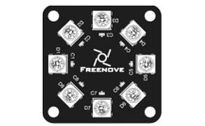
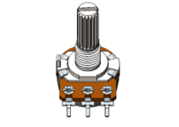
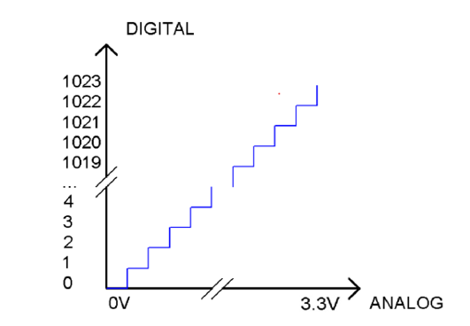
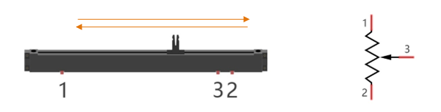
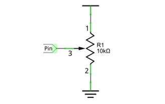
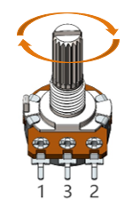
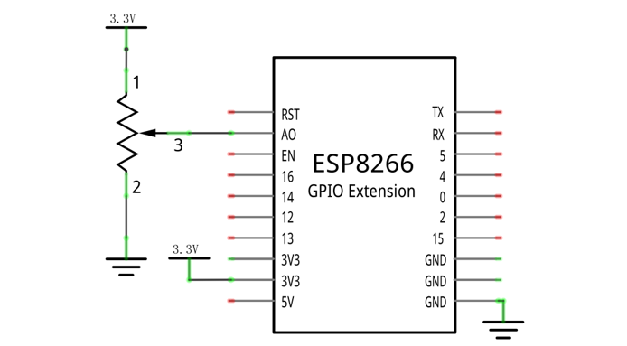
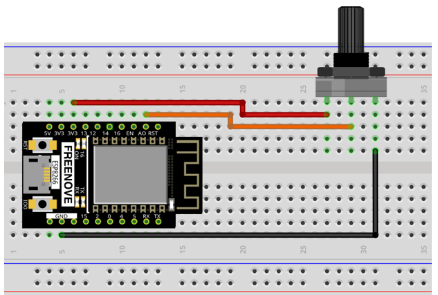
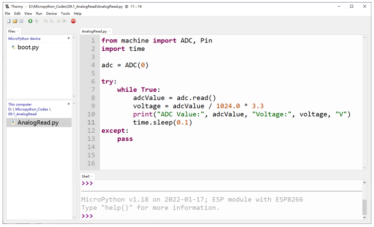
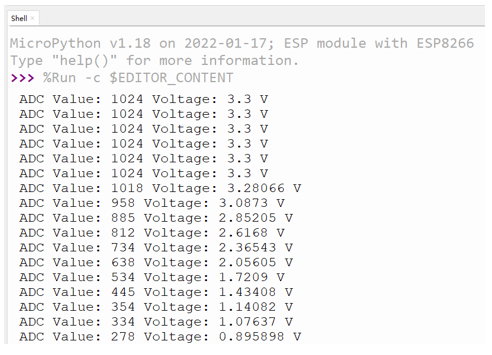

##############################################################################
Chapter ADC Converter
##############################################################################

We have learned how to control the brightness of LED through PWM and understood that PWM is not the real analog before. In this chapter, we will learn how to read analog, convert it into digital. That is, ADC.

Project Read the Voltage of Potentiometer 
*******************************************************

In this project, ADC is used to convert analog signals into digital signals. Control chip on the control board has integrated this function. Now let us try to use this function to convert analog signals into digital signals.

Component List
=============================

+----------------------------------+---------------------------------------+
| ESP8266 x1                       |          USB cable                    |
|                                  |                                       |
| |Chapter01_00|                   |          |Chapter01_01|               |
+----------------------------------+---------------------------------------+
| Breadboard x1                                                            |
|                                                                          |
| |Chapter01_02|                                                           |
+----------------------------------+---------------------------------------+
| Rotary potentiometer x1          | Jumper wire M/M x3                    |
|                                  |                                       |
| |Chapter09_00|                   |          |Chapter06_01|               |
+----------------------------------+---------------------------------------+

.. |Chapter01_00| image:: ../_static/imgs/1_LED/Chapter01_00.png
.. |Chapter01_01| image:: ../_static/imgs/1_LED/Chapter01_01.png
.. |Chapter01_02| image:: ../_static/imgs/1_LED/Chapter01_02.png

.. |Chapter06_01| image:: ../_static/imgs/6_LEDPixel/Chapter06_01.png

Related knowledge
========================

ADC
--------------------------

An ADC is an electronic integrated circuit used to convert analog signals such as voltages to digital or binary form consisting of 1s and 0s. The range of our ADC on ESP8266 is 10 bits, that means the resolution is 2^10=1024, and it represents a range (at 3.3V) will be divided equally to 1024 parts. The rage of analog values corresponds to ADC values. So the more bits the ADC has, the denser the partition of analog will be and the greater the precision of the resulting conversion.

Subsection 1: the analog in rang of 0V---3.3/1023 V corresponds to digital 0;

Subsection 2: the analog in rang of 3.3/1023 V---2*3.3 /1023V corresponds to digital 1;

...

The following analog will be divided accordingly.

The conversion formula is as follows:

ADC on ESP8266
----------------------------

ESP8266 has one digital analog converters with successive approximations of 10-bit accuracy, and a total of 1 pins can be used to measure analog signals. GPIO analog pin definition are shown in the following table. Note that the input voltage on the ADC pins of the ESP8266 module must be between 0V and 1.0V.For the ESP8266 ESP8266 development board designed by us, its input voltage range has been sampled by resistors.The ADC input voltage of the development board is 0V to 3.3V. 

Do not exceed this voltage range when you use the ADC function. Exceeding this voltage range can cause permanent damage to your hardware!

.. list-table:: 
   :width: 30%
   :align: center

   * -  Pin number in ESP8266 
   * -  A0

The analog pin number is also defined in ESP8266's code base. For example, you can use A0 in your code.

Component knowledge
===========================

Potentiometer
-----------------------------

A potentiometer is a three-terminal resistor. Unlike the resistors that we have used thus far in our project which have a fixed resistance value, the resistance value of a potentiometer can be adjusted. A potentiometer is often made up by a resistive substance (a wire or carbon element) and movable contact brush. When the brush moves along the resistor element, there will be a change in the resistance of the potentiometer’s output side (3) (or change in the voltage of the circuit that is a part). The illustration below represents a linear sliding potentiometer and its electronic symbol on the right.

What between potentiometer pin 1 and pin 2 is the resistor body, and pins 3 is connected to brush. When brush moves from pin 1 to pin 2, the resistance between pin 1 and pin 3 will increase up to body resistance linearly, and the resistance between pin 2 and pin 3 will decrease down to 0 linearly.

In the circuit. The both sides of resistance body are often connected to the positive and negative electrode of the power. When you slide the brush pin 3, you can get a certain voltage in the range of the power supply.

 
Rotary potentiometer 
--------------------------

Rotary potentiometer and linear potentiometer have similar function; their only difference is: the resistance is adjusted by rotating the potentiometer.

Circuit
=============================

Use pin A0 on the control board to detect the voltage of rotary potentiometer.

.. list-table:: 
   :width: 100%
   :align: center

   * -  Schematic diagram
   * -  |Chapter09_06|
   * -  Hardware connection. 
    
        If you need any support, please feel free to contact us via: support@freenove.com
   
   * -  |Chapter09_07|

Code
===========================

Move the program folder "Freenove_Ultimate_Starter_Kit_for_ESP8266/Python/Python_Codes" to disk(D) in advance with the path of "D:/Micropython_Codes".

Open "Thonny", click "This computer" -> "D:" -> "Micropython_Codes" -> "09.1_AnalogRead and then click "AnalogRead.py". 

AnalogRead 
---------------------

Click "Run current script" and observe the message printed in "Shell".

"Shell" prints ADC value and the output voltage of potentiometer and other information. From the code, we get the ADC value of pin A0, then convert it into voltage value.

Turn the rotary potentiometer shaft, and you can see the voltage change.

The following is the code:

.. literalinclude:: ../../../freenove_Kit/Python/Python_Codes/09.1_AnalogRead/AnalogRead.py
    :linenos: 
    :language: python
    :lines: 1-13
    :dedent:

Import Pin, ADC and DAC modules.

.. literalinclude:: ../../../freenove_Kit/Python/Python_Codes/09.1_AnalogRead/AnalogRead.py
    :linenos: 
    :language: python
    :lines: 1-2
    :dedent:

Read ADC value once every 100 millisecods, and "Shell" prints ADC value and the output voltage of potentiometer and other information.

.. literalinclude:: ../../../freenove_Kit/Python/Python_Codes/09.1_AnalogRead/AnalogRead.py
    :linenos: 
    :language: python
    :lines: 8-11
    :dedent:

Reference

.. py:function:: Class ADC	

    Before each use of ACD module, please add the statement " **from machine import ADC** " to the top of the python file.

    **machine.ADC(pin):** Create an ADC object associated with the given pin.

        **pin:** Available pins are: ADC0.

    **ADC.read():** Read ADC and return the value.